---
tags:
  - Informática
  - Wind-Server
---
# **Windows server**

**Windows server es un sistema operativo servidor, esto quiere decir que su función es proporcionar servicios a otros sistemas operativos clientes**

**Modelo Cliente servidor**

# **Instalacion Windows server:**

## **Para Sistemas en red:**

**Se ha acordado utilizar la ISO de Window Server 2016, por lo que tenemos que instalar la ISO y hacer la configuración**

**Para instalar Windows Server 2016 mediante la imagen ISO en VirtualBox, seleccionamos Maquina -\> Nueva**

### **Automática:**

**Esto nos abrirá la ventana para crear una nueva máquina virtual, aquí
debemos ponerle nombre a la máquina, especificar donde se van a
almacenar sus archivos y la ubicación de la imagen ISO.**

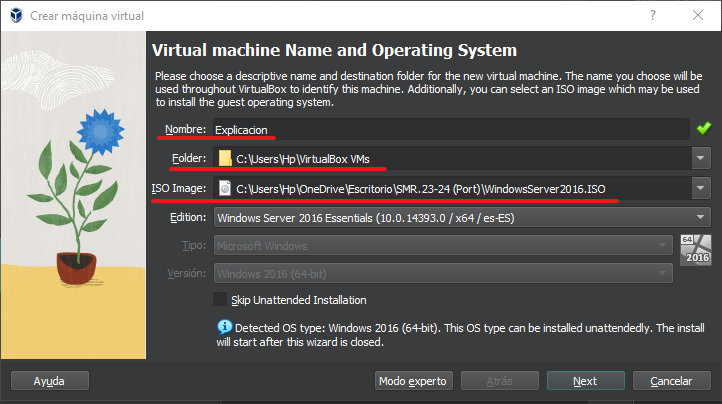

**En el siguiente apartado debemos indicar un Nombre de usuario, su
respectiva contraseña y si queremos instalar las guest adittions**

**En el apartado Hardware debemos indicar la memoria RAM de la maquina y
CPU**

**En el apartado disco duro virtual debemos indicar, si queremos crear
un disco duro virtual o no, la capacidad del mismo, usar uno ya
existente..**

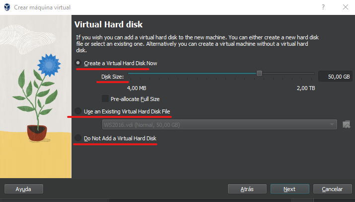

**El apartado de Resumen es el último de configuración de la maquina
antes de iniciarla y proceder a la instalación del sistema, y nos
muestra un resumen de la configuración**

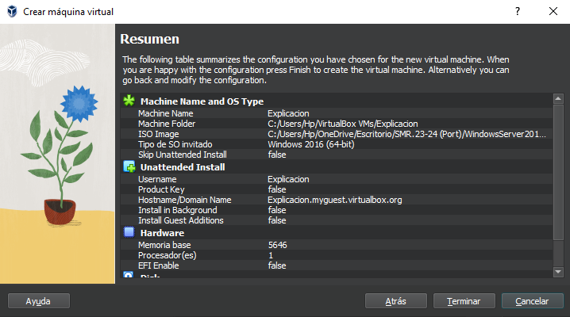

**Tras la configuración de la maquina se abrirá y empezará la
instalación de Windows automáticamente**

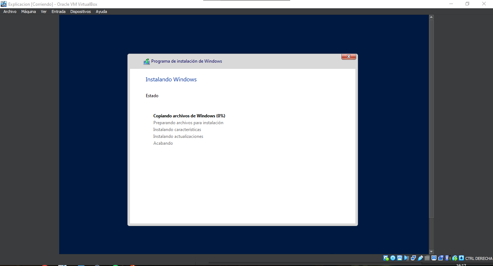

### **Manual:**

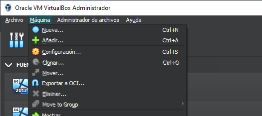

**Esto nos abrirá la ventana para crear una nueva máquina virtual, aquí
debemos ponerle nombre a la máquina, especificar donde se van a
almacenar sus archivos y la ubicación de la imagen ISO, en este caso al
hacer la instalación de forma manual, marcaremos “Skip unattended
Installation”, lo que nos permitirá configurar cosas como las
particiones durante la instalación.**

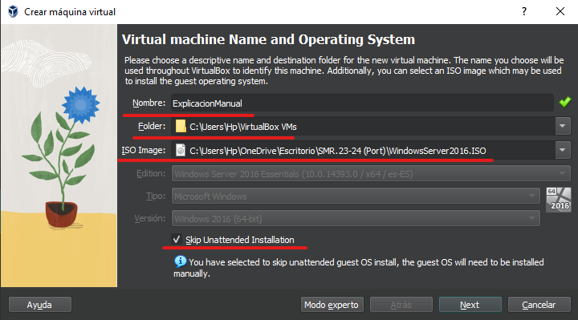

**En el apartado Hardware debemos indicar la memoria RAM de la maquina y
CPU**

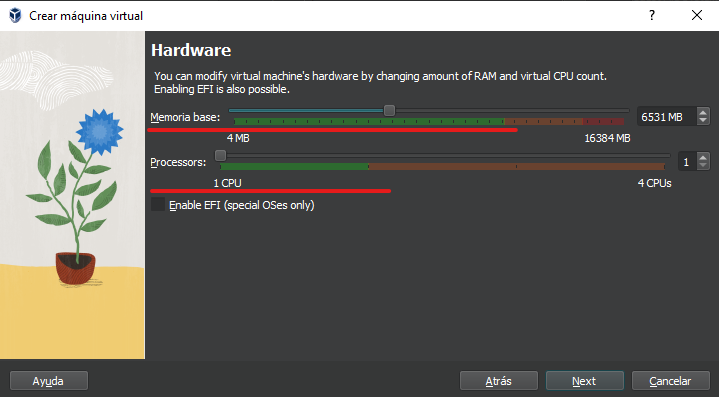

**En el apartado disco duro virtual debemos indicar, si queremos crear
un disco duro virtual o no, la capacidad del mismo, usar uno ya
existente.**

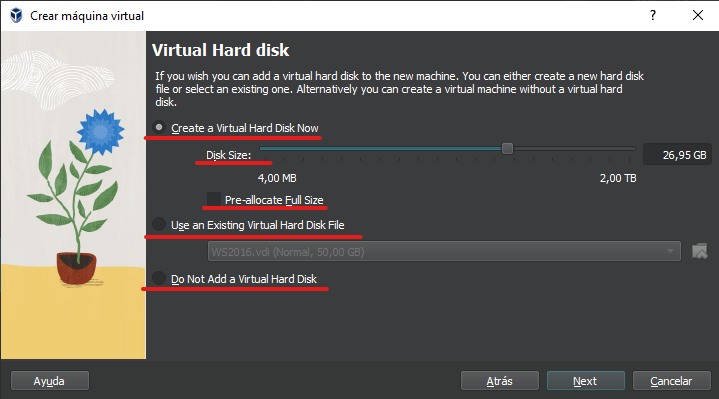

**El apartado de Resumen es el último de configuración de la maquina
antes de iniciarla y proceder a la instalación del sistema, y nos
muestra un resumen de la configuración**

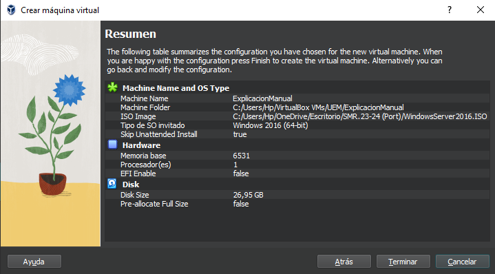

**Tras la configuración de la maquina hay que abril y seleccionar el
idioma y formato de hora antes de iniciar la instalación**

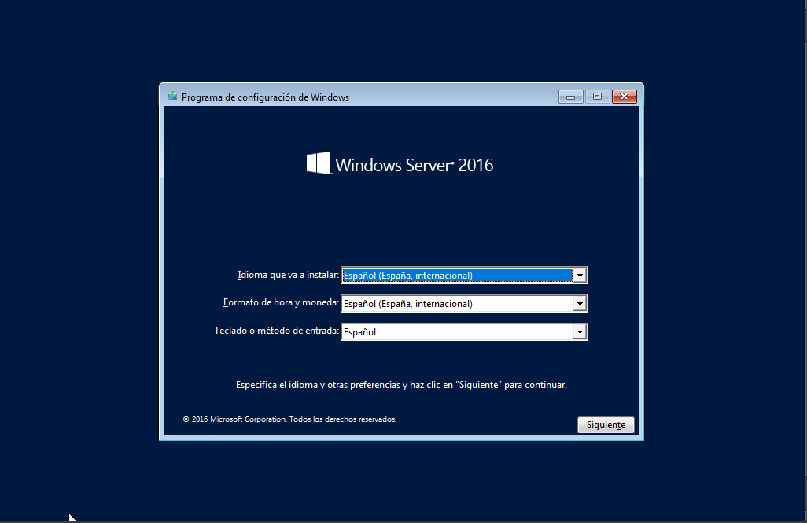

**Le damos a Instalar ahora**

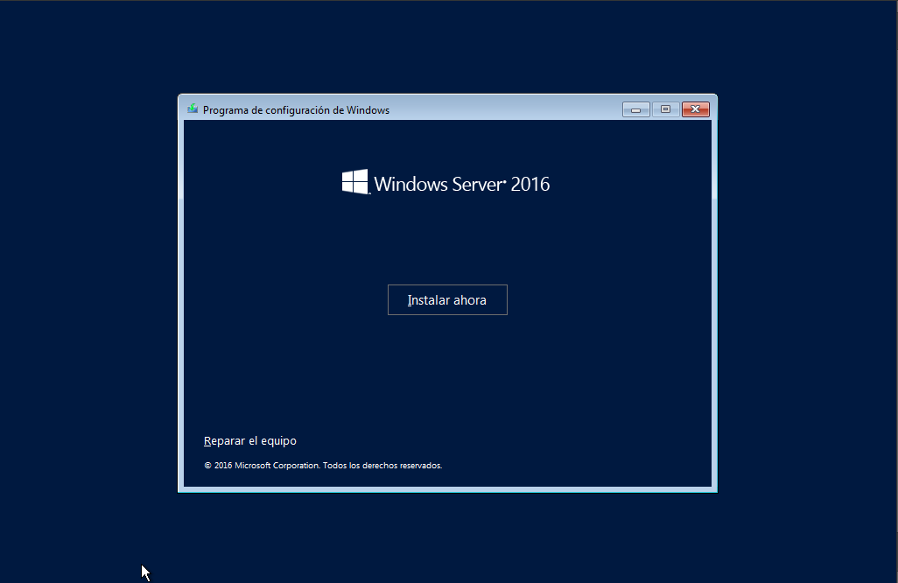

**En el apartado de clave de producto seleccionamos “No tengo clave de
producto” y aceptamos los términos**

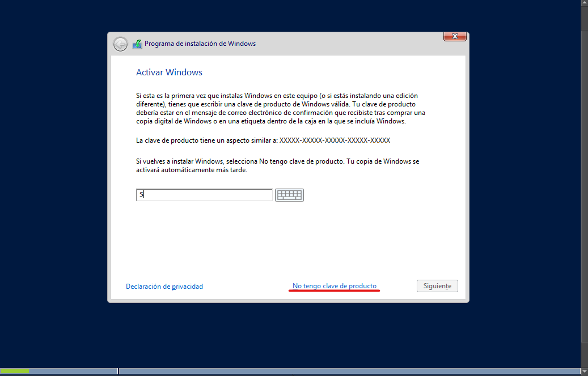

**En el tipo de instalación seleccionamos “Personalizada”**

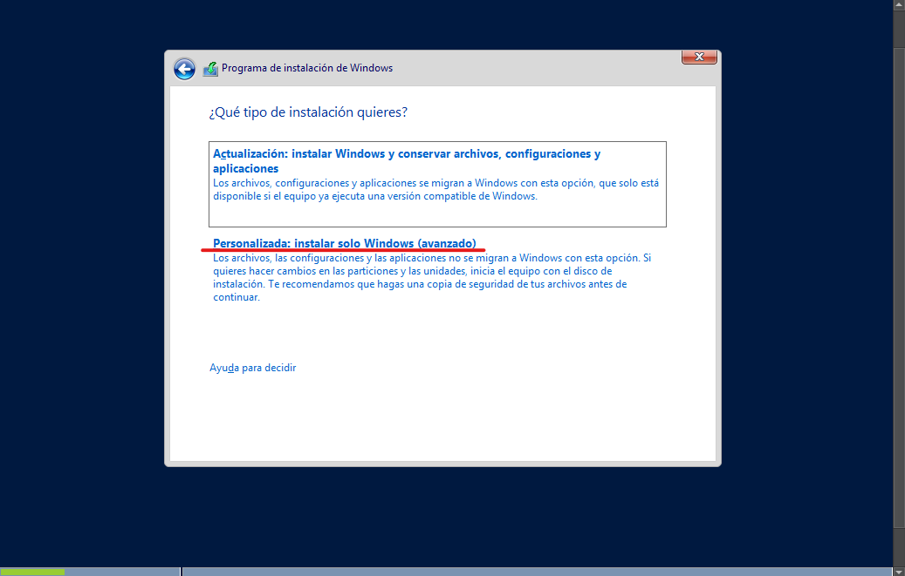

**Para seleccionar un disco en el que instalar el sistema primero
debemos darle formato, seleccionamos el disco que queremos, le damos a
nuevo, especificamos el tamaño que queremos darle y aplicamos.**

**En caso de querer crear una partición deberíamos indicar un tamaño
inferior al tamaño total del disco original para crear dos unidades y
posteriormente darle formato.**

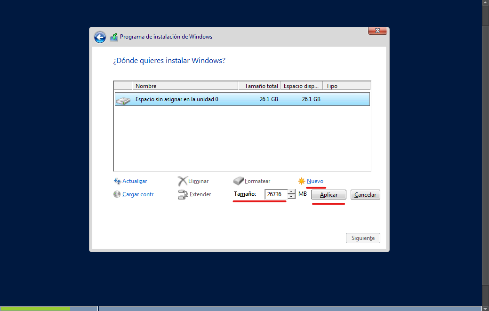

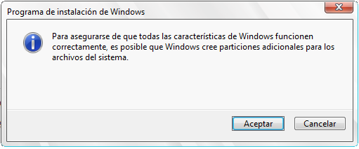

**Tras la configuración manual comenzara la instalación del sistema.**

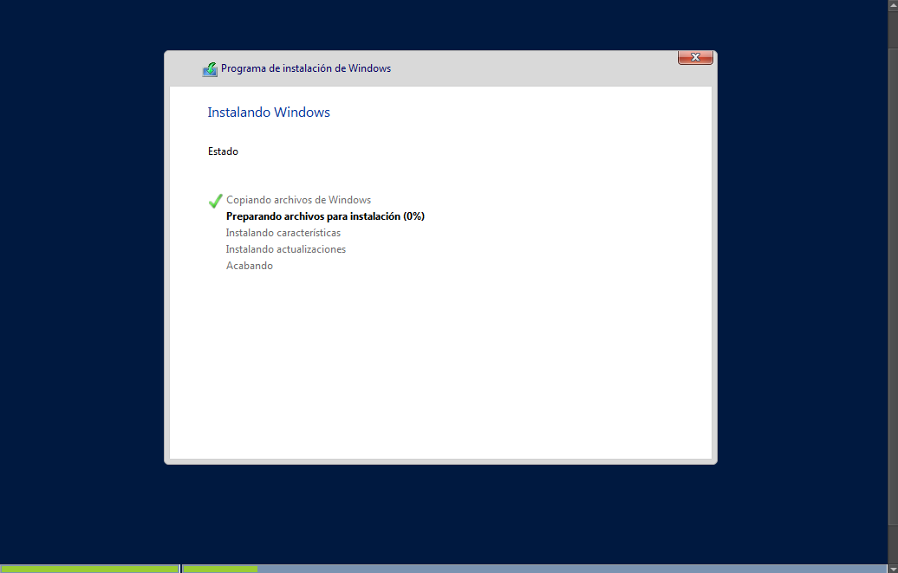

**después debemos seleccionar una contraseña para el usuario
administrador.**

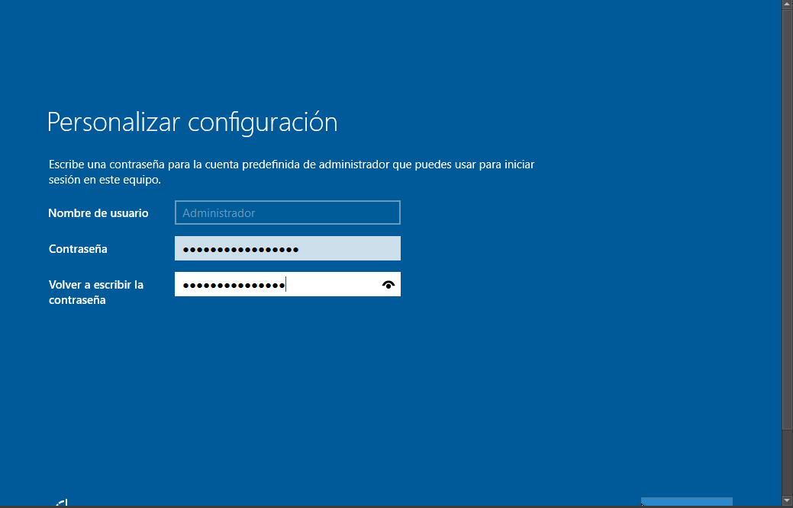

**Después nos va a pedir cambiar la contraseña**

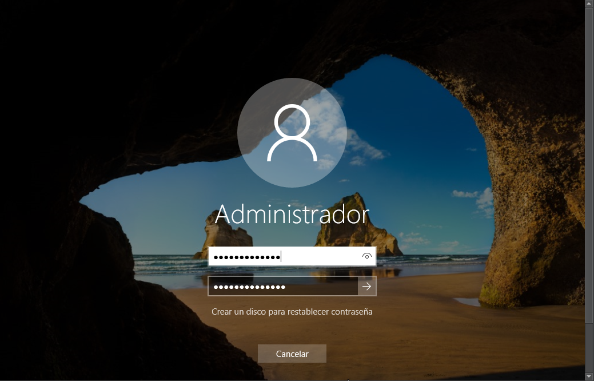

**La primera vez que iniciemos el sistema nos saldrá un aviso que nos
pregunta si queremos que nuestro PC pueda ser visto por el resto de
equipos de la red, marcamos que si**

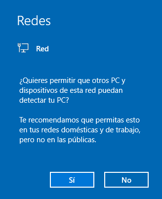

**Es posible que nos pida configurar Windows essentials, en dicho caso
le damos a cancelar ya que algunas ISOs crashean durante la
configuración**
