---
tags:
  - Informática
  - DNS
---
## **DNS: Domain Name Service**

- **Protocolo que traduce nombres de dominio a direcciones IP**

- Aunque el protocolo IP sigue utilizando direcciones, es más fácil para el usuario memorizar el nombre del dominio en lugar de su dirección IP
- Además, la dirección IP puede cambiar mientras que el nombre de dominio es fijo

- Cliente: Le da al servidor el nombre de dominio
- Servidor: Averigua la dirección IP correspondiente y se la devuelve al cliente
- Es empleado en multitud de aplicaciones, navegación web, correo electrónico…

## **Dominios:**

- Un dominio es un nombre único asignado a un área especifica dentro de una red, un contenedor lógico utilizado para administrar usuarios, grupos y computadoras entre otros objetos.

## **Estructura de un nombre de dominio:**

La estructura de un dominio esta formada por varios apartados separados por un punto, cada uno de ellos recibe el nombre de subdominio, siendo el dominio que esta más a la derecha el de carácter más alta dentro de la estructura, además se asemeja a un árbol invertido siendo el tronco
la parte superior y ramificándose hacia

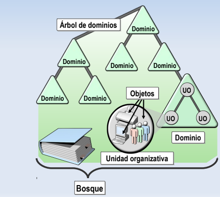

**Ejemplo:** [<u>www.ejemplo.com</u>](http://www.ejemplo.com)

- **Dominio:** COM
- **Subdominio:** Ejemplo
- **Nombre del host:** www

### **Tipos de Dominios:**

**Absolutos:** También conocidos como **FQDN** (Full Qualified Domain Name) en estos se
especifica todo el nombre completo del dominio

**Relativos:** Hacen referencia a un dominio, es decir la ruta no es absoluta

**Ejemplo:**

- Relativa: ejemplo.es
- Absoluta: [<u>www.ejemplo.es</u>](http://www.ejemplo.es)
- Los dominios de primer nivel también pueden ser clasificados por geografía, tipo de organización

<table>
<colgroup>
<col style="width: 50%" />
<col style="width: 50%" />
</colgroup>
<thead>
<tr>
<th colspan="2">Dominios de alto nivel de organización</th>
</tr>
<tr>
<th>Domino</th>
<th>Significado</th>
</tr>
<tr>
<th>com</th>
<th>Organización comercial</th>
</tr>
<tr>
<th>edu</th>
<th>Institución educativa</th>
</tr>
<tr>
<th>gov</th>
<th>Institución gubernamental</th>
</tr>
<tr>
<th>Int</th>
<th>Organización internacional</th>
</tr>
<tr>
<th>mil</th>
<th>Organización militar</th>
</tr>
<tr>
<th>net</th>
<th>Organización de red</th>
</tr>
<tr>
<th>org</th>
<th>Organización sin animo de lucro</th>
</tr>
<tr>
<th>es</th>
<th>Organización española/ Ubicación del host</th>
</tr>
</thead>
<tbody>
</tbody>
</table>

## **Objetos:**

**Representaciones de los recursos de red como usuarios, equipos, impresoras etc…**

## **Arboles:**

Agrupación de uno o mas dominios que comparten un espacio contiguo, es decir están al mismo nivel en la estructura

## **Bosque:**

Agrupación de uno o más árboles que comparten un espacio de nomenclatura contiguo y catalogo global

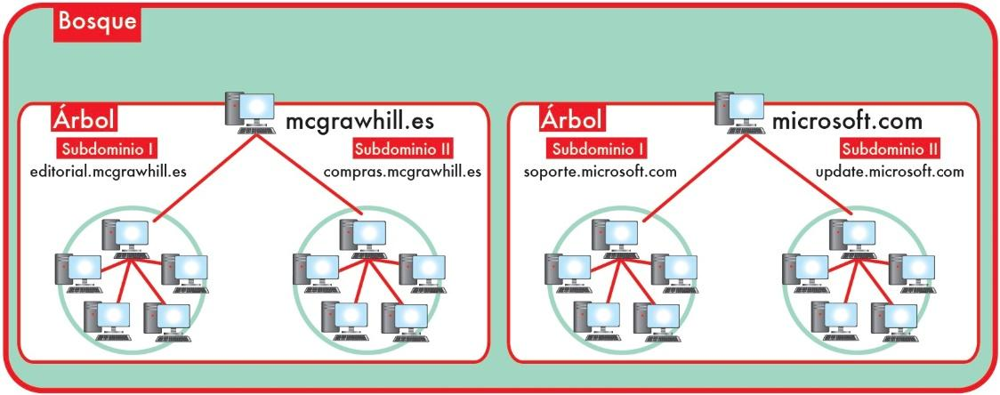

## **Unidades organizativas:**

Una Ud. organizativa vendría a ser una carpeta, en la que hay un conjunto de objetos de dominio tales, equipos, usuarios, impresoras…

El objetivo es administrar el conjunto con las unas directivas diferentes al dominio

## **La configuración de DNS consiste en:**

- **Zona directa:** el servidor resuelve la IP en un nombre de dominio
- **Zona inversa:** el servidor traduce los dominios en IPs
- **Dominio:** Forma de identificar un elemento de una red que no sea su dirección IP
- **Alias**
- **Host**
- **Zonas**
- **Puntero PTR**

## **Instalación servicio DNS**

**Para agregar el servicio DNS en el servidor vamos a Administrar -\> Agregar roles y características:**

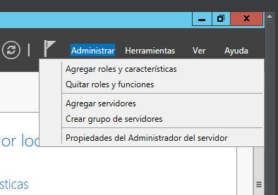

**Una vez dentro del panel seleccionamos Instalacion basada en roles y pulsamos siguiente:**

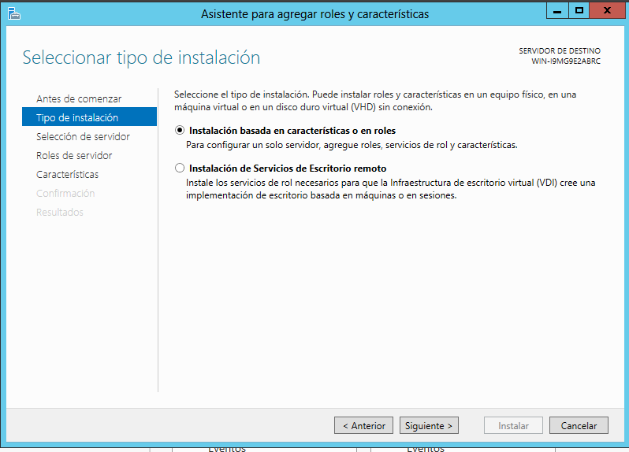

**Seleccionamos el servidor en el que lo queremos instalar y pulsamos en siguiente:**

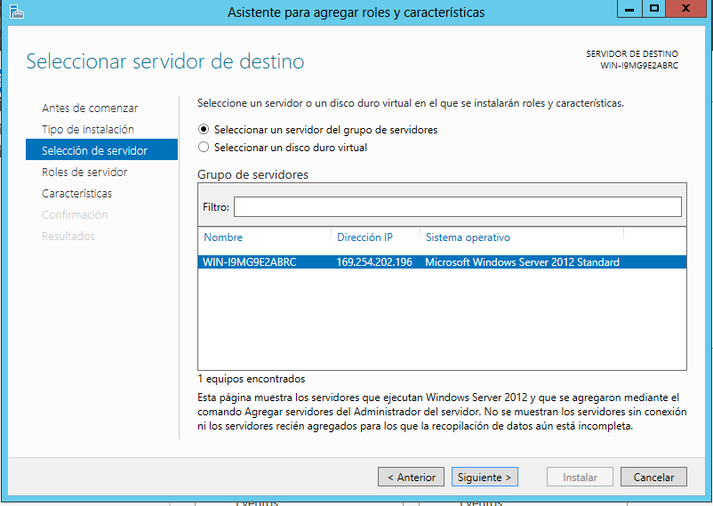

**Seleccionamos el servicio que queremos instalar, en este caso DNS**

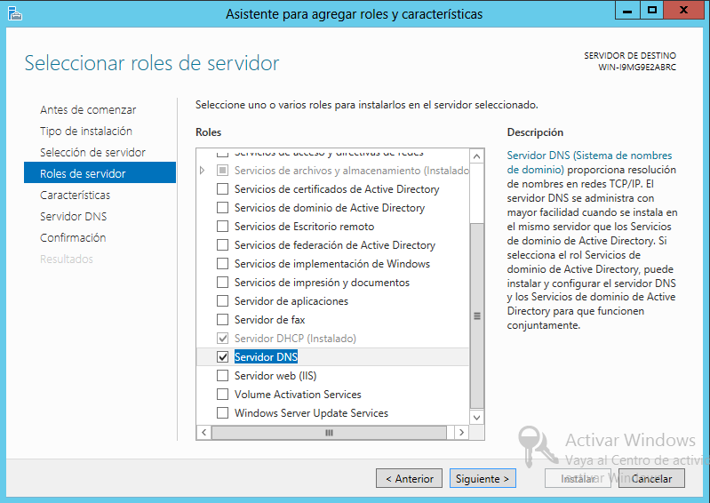

**Puede que nos salte un aviso que indique que la instalación requiere agregar características adicionales, las agregamos y pulsamos continuar**

**En este caso no es necesario el apartado características, lo dejamos como esta y pulsamos continuar:**

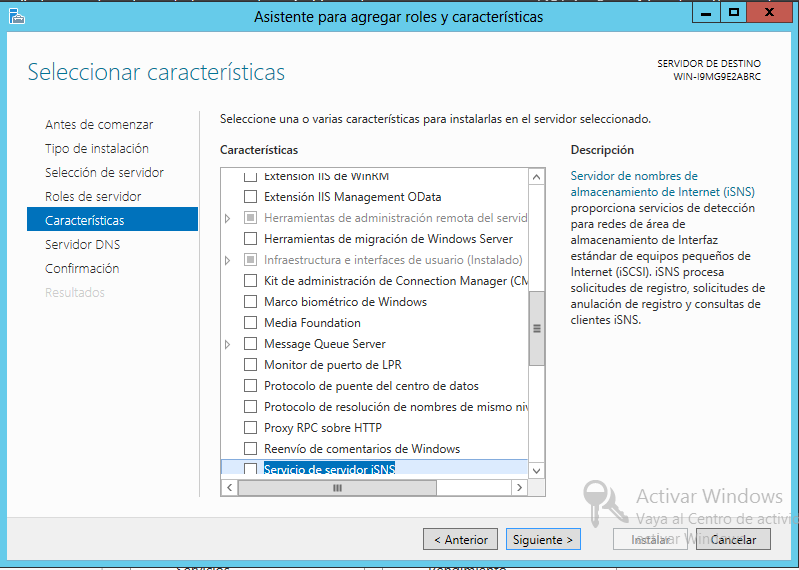

**El siguiente apartado únicamente nos explica el funcionamiento del servicio DNS, lo leemos y pulsamos continuar**

**El apartado confirmación nos muestra los datos de la instalación, nos pregunta si deseamos reiniciar en caso de ser necesario y por último una confirmación de la instalación**

**Por último, el apartado Resultados nos muestra el progreso de la instalación**

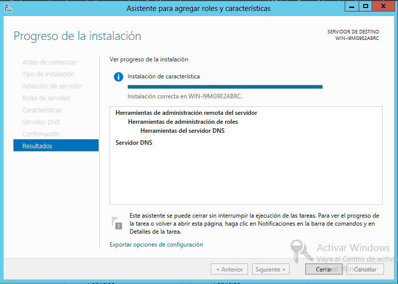

**Una vez terminada la instalación del servicio DNS es posible que nos salga una notificación de que es necesario completar la configuración DNS, Entramos en la notificación**

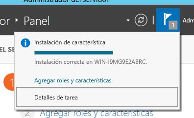

**Al acceder a la notificación esta nos redirigirá al asistente posterior a la configuración de DNS, el cual nos dirá que es necesario crear usuarios y administradores de DNS**

## **Configuración Servicio DNS**

La configuración del servicio DNS en pocas palabras consiste en la creación de zonas directas, creación de zonas inversas, para después crear hosts dentro de ellas, la comprobación consiste en la utilización del comando nslookup para ver si el servidor está resolviendo los dominios en sus respectivas IPs y viceversa

**Antes de configurar el servicio DNS debemos asignar un IP al servidor, para ello vamos al apartado: Servidor local -\> Ethernet -\> Ethernet -\> Protocolo IPv4**

**Y una vez dentro marcamos la casilla “Utilizar la siguiente dirección IP” para establecer una dirección IP de forma manual al servidor e introducimos la IP que le queremos asignar con su respectiva mascara de red, enrutador y DNS en caso de ser necesario y pulsamos en validar al
salir y aceptamos.**

**Es posible que salte un diagnóstico para detectar posibles problemas tras la configuración, cerramos y continuamos.**

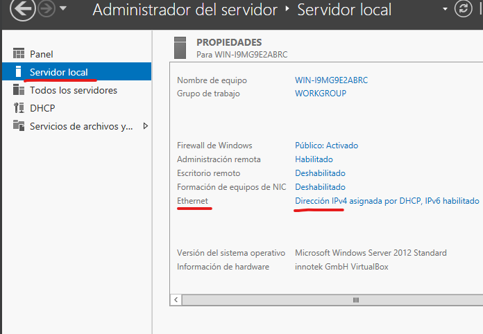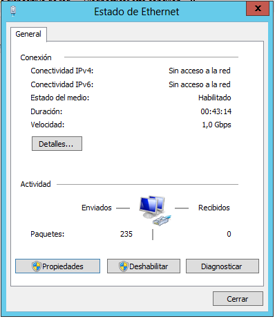

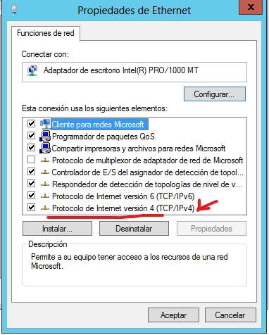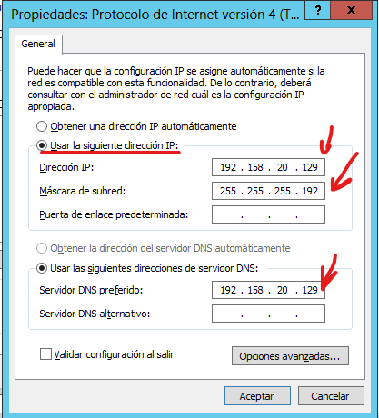

**Una vez instalado procedemos a su configuración desde el apartado herramientas -\> DNS**

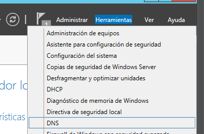

**Una vez dentro de la configuración DNS accedemos al servidor que queremos configurar y hacemos clic en el apartado “Zonas de búsqueda inversa” y seleccionamos “Zona nueva”**

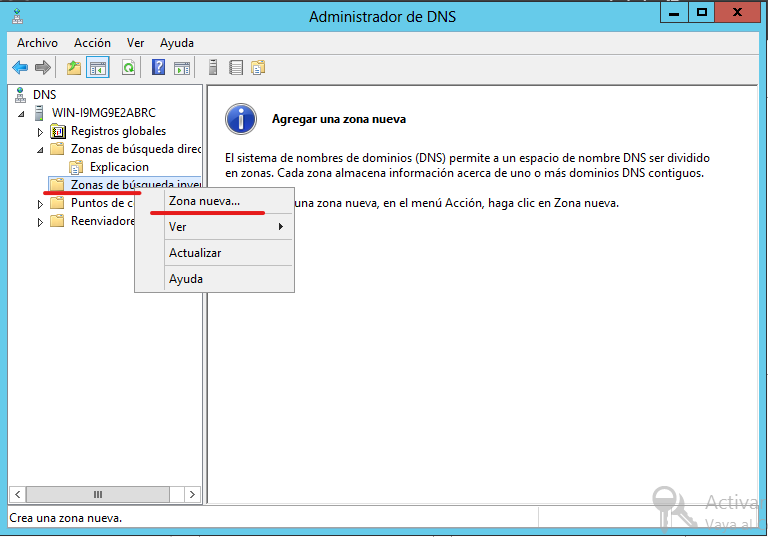

**Esto nos abrirá el asistente para crear una zona nueva, Seleccionamos “Zona principal”**

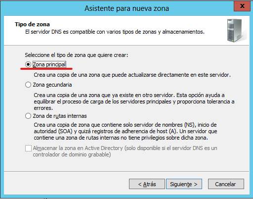

**En este apartado debemos seleccionar IPv4**

**En este apartado debemos indicar la dirección de red que estamos utilizando en nuestro servidor**

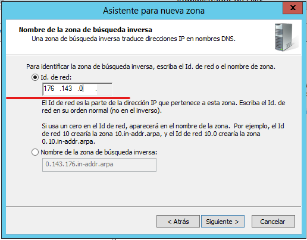

**En este apartado debemos indicar si queremos utilizar un archivo existente de zona o crear otro**

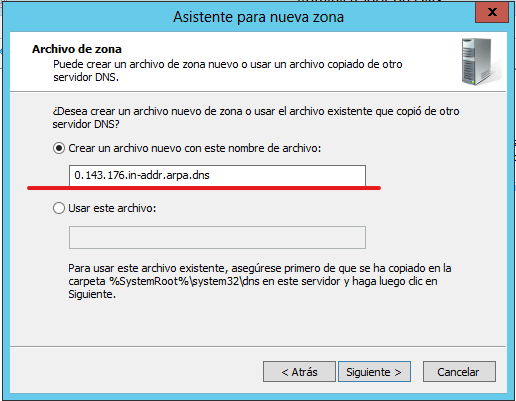

El apartado “Actualización dinámica” debemos indicar si queremos que la zona acepte o no actualizaciones de los registros

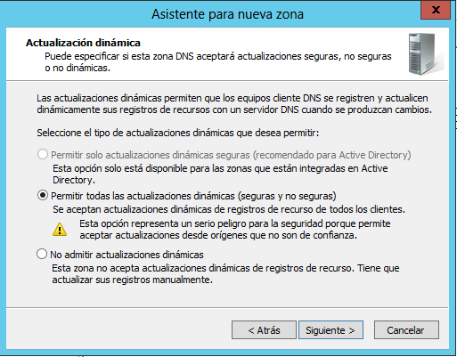

**Finalizamos y tendríamos la zona creada**

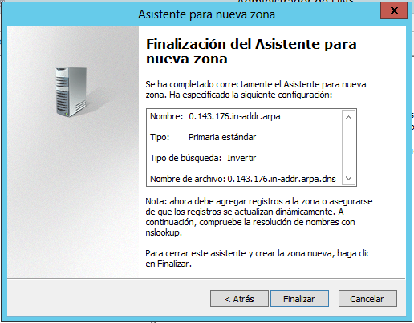

**Una vez dentro de la configuración DNS accedemos al servidor que queremos configurar y hacemos clic en el apartado “Zonas de búsqueda directa” y seleccionamos “Zona nueva”**

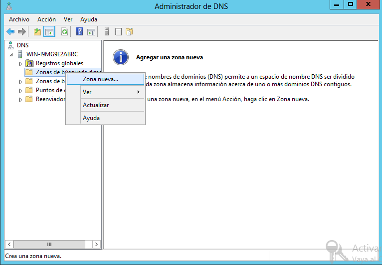

**Esto nos abrirá el asistente para crear una zona nueva, Seleccionamos “Zona principal”**

**En el apartado “Nombre de zona” debemos ponerle un nombre a la zona que queremos crear´**

**En el apartado “Archivo de zona” debemos indicar si queremos utilizar el archivo predeterminado para guardar la información, renombrarlo o utilizar otro distinto**

**Por lo general lo habitual es utilizar el predeterminado**

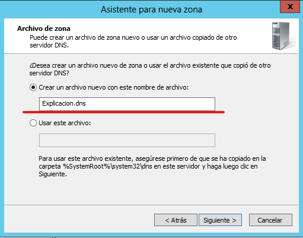

**El apartado “Actualización dinámica” debemos indicar si queremos que la zona acepte o no actualizaciones de los registros**

**Finalizamos y tendríamos la zona creada**

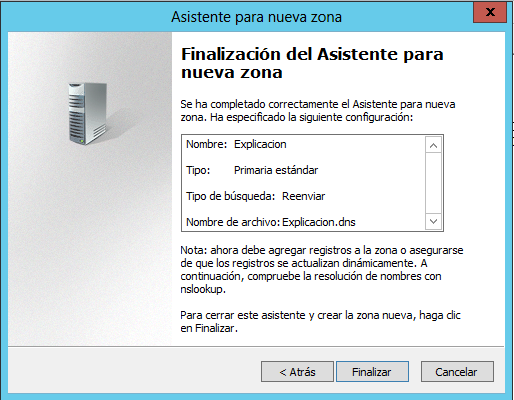

**Después de haberla creado accedemos a ella para crear host dentro**

**En la configuración del Host debemos asignarle un nombre al mismo, una IP y marcar la casilla “Crear registro del puntero (PTR) asociado”**

**Para comprobar que el host ha sido creado con éxito, necesitamos un cliente conectado al servidor**

**Para comprobar que el cliente tiene conectividad con el servidor utilizaremos el comando ping + “IP del servidor”**

**Para comprobar que el servicio de resolución de nombres de dominio funciona utilizaremos el comando nslookup + “nombre completo del dominio”/”IP del dominio”**

**Con este comando**  
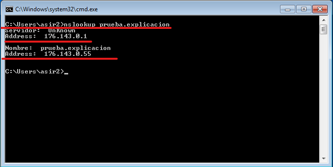

**Para crear un alias debemos ir a la zona en la que esta el host ya sea la directa o inversa, hacer clic derecho y seleccionar el apartado “Nuevo alias”**

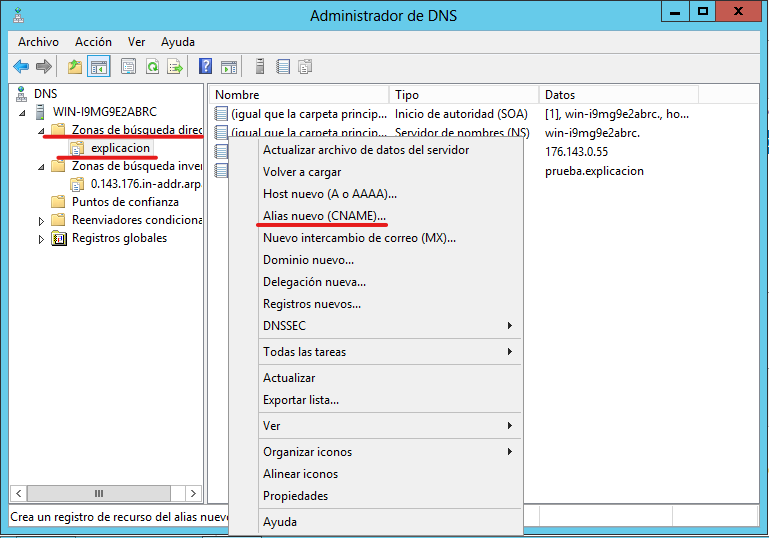

Esto nos abrirá un panel para crear un nuevo registro de alias, en el que debemos seleccionar el nombre que queremos asignar al dominio y el nombre completo del dominio

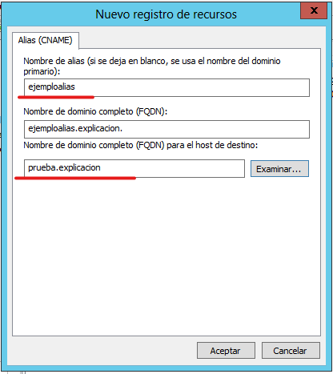
