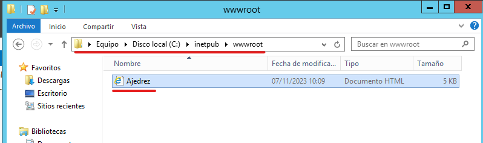
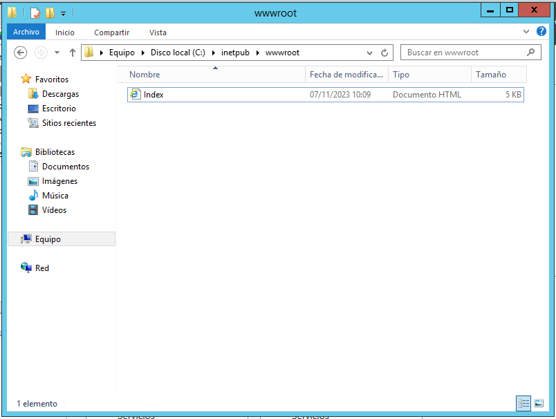
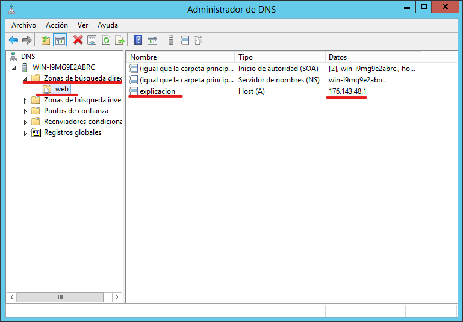
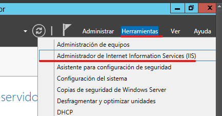
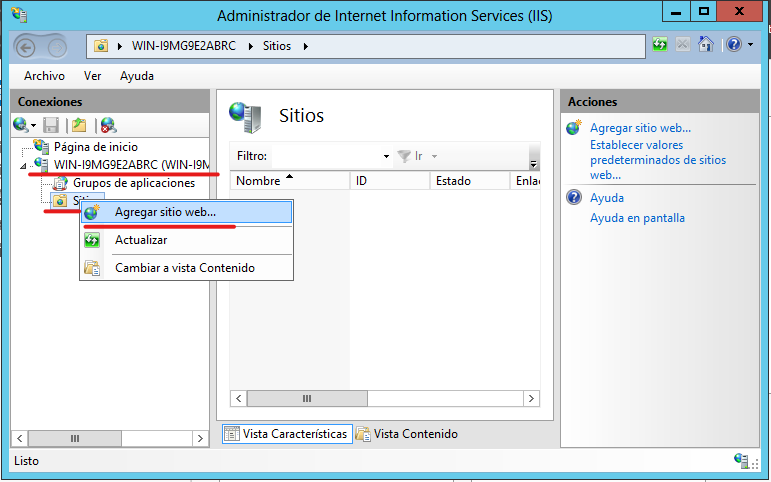
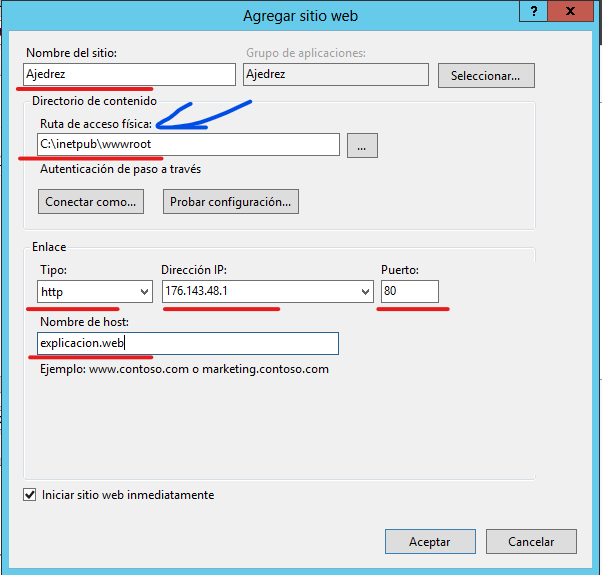
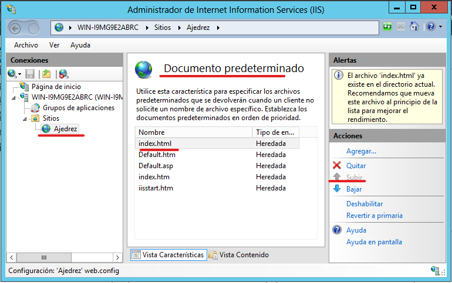

---
tags:
  - Informática
  - Web
---
**Instalacion Servicio WEB**

**Para agregar el servicio WEB en el servidor vamos a Administras -\>
Agregar roles y características:**

**Una vez dentro del panel seleccionamos Instalacion basada en roles y
pulsamos siguiente:**

**Seleccionamos el servidor en el que lo queremos instalar y pulsamos en
siguiente:**

**Seleccionamos el servicio que queremos instalas, en este caso
“Servidor web (IIS)”**

**Puede que nos salte un aviso que indique que la instalación requiere
agregar características adicionales, las agregamos y pulsamos
continuar**

**En este caso no es necesario el apartado características, lo dejamos
como esta y pulsamos continuar:**

**El siguiente apartado únicamente nos explica el funcionamiento del
servicio WEB, lo leemos y pulsamos continuar**

**En el apartado servicios de rol, podemos indicar opciones adicionales
y extensiones que queremos que tenga nuestro servicio, para este ejemplo
y las practicas con los que vienen marcados por defecto es suficiente,
lo dejamos como esta y continuamos**

**El apartado confirmación nos muestra los datos de la instalación, nos
pregunta si deseamos reiniciar en caso de ser necesario y por último una
confirmación de la instalación**

**Por último, el apartado Resultados nos muestra el progreso de la
instalación**

**Una vez terminada la instalación del servicio WEB es posible que nos
salga una notificación de que es necesario completar la configuración
WEB, Entramos en la notificación**

**Al acceder a la notificación esta nos redirigirá al asistente
posterior a la configuración de WEB, el cual nos dirá que es necesario
crear usuarios y administradores de WEB**

