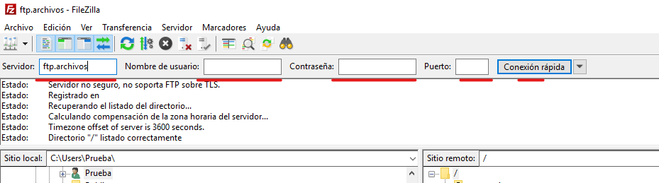
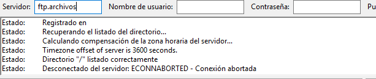
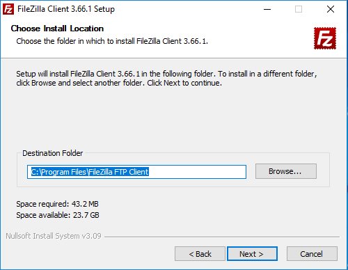
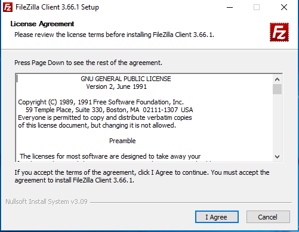
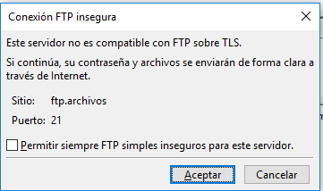
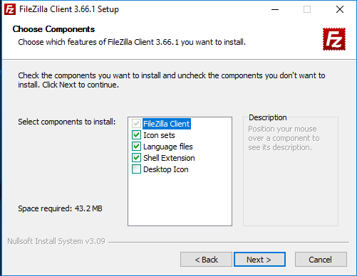
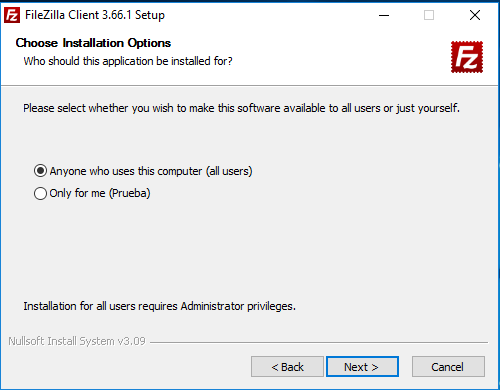

---
tags:
  - Informática
  - FTP
---
# **Configuración servicio FTP**

La configuración del servicio FTP va a consistir en agregar un sitio FTP desde el administrador IIS, el sitio estará vinculado a una carpeta y desde el administrador podremos indicar que protocolo y puerto utilizará el sitio, que usuarios pueden acceder al sitio, para acceder a este sitio podemos hacerlo bien desde un navegador o desde el explorador de archivos

Creamos una carpeta en el directorio en el que están los archivos del servidor web, aunque podría ser en cualquier ruta siempre y cuando luego la especifiquemos

Ahora creamos un sitio FTP, para ello vamos al Administrador del servidor vamos a Herramientas → Administrador de Internet

Information Services (IIS)

Desde aquí podemos administrar sitios FTP y WEB, Agregamos un sitio FTP, seleccionamos el servidor hacemos clic derecho sobre sitios y seleccionamos agregar sitio FTP

Le asignamos un nombre al sitio que estamos creando y especificamos la ruta del fichero que estamos asociando

En este apartado debemos indicar a que dirección y puerto le van a llegar las peticiones al servidor, en este caso solo tenemos una tarjeta de red por lo que es indiferente, en caso de tener más si deberíamos indicar la tarjeta de red que queremos, en este caso dejamos el puerto por defecto de FTP, el 21, aunque podríamos cambiarlo si quisiésemos

Además, podemos indicar si queremos habilitar los nombres de host virtuales y si requiere o permitimos el certificado SSL

Indicamos que queremos iniciar el sitio automáticamente y siguiente

En este apartado debemos indicar que tipo de autentificación es necesaria para acceder a nuestro sitio FTP, autorizar a que permitimos acceder y los permisos que concedemos, en este caso la anónima ya que en este ejemplo no será necesario introducir un usuario, en caso de querer restringir el acceso al sitio a determinados usuarios seleccionaríamos Autenticación Básica y especificaríamos a que les damos acceso y a que usuarios

Rellenamos, damos a finalizar y ya tendríamos nuestro sitio FTP creado.

Para comprobar que hemos configurado y creado correctamente el sitio FTP vamos a un cliente conectado a nuestro servidor y buscamos en el explorador de archivos o un navegador la dirección de nuestro sitio para comprobar que tenemos acceso a el

En el explorador de archivos
Introducimos el protocolo y la dirección IP del servidor que aloja el sitio FTP separados por dos puntos “:”
ftp:176.143.48.1

Los cambios que realicemos tanto desde el cliente como en el servidor con la configuración actual se ve reflejada en el otro lado
Creo un nuevo fichero en el directorio desde el cliente

Compruebo del lado del cliente

La configuración para que no tengan acceso determinados usuarios es posible tanto modificando las propiedades del fichero como en la configuración del sitio FTP y si tuviésemos un servidor AD podríamos gestionar el acceso a los directorios desde el administrador de usuarios
