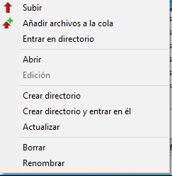
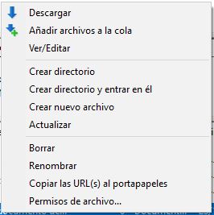
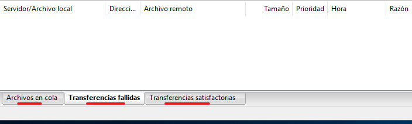

---
tags:
  - Informática
  - FTP
---
# **Servicio FTP vía FileZilla**

FileZilla es una aplicación FTP libre y de código abierto que consta de un cliente y un servidor. Soporta los protocolos FTP, SFTP y FTP sobre SSL/TL S.

Es un cliente FTP que nos permitirá conectar mediante este protocolo (File Transfer Protocol) con nuestro servidor FTP. De este modo, podremos subir, descargar o modificar archivos de nuestro alojamiento de forma remota y sin necesidad de acceder al dominio para ello.

Versiones

## **Instalacion**
Leemos los términos, seleccionamos los usuarios que podrán utilizarlo, los componentes adicionales y la ubicación de la instalación.

## Interfaz y configuración

En la parte superior debemos introducir el servidor (IP o dominio) al que queremos acceder, nombre del usuario con el que queremos acceder y su respectiva contraseña, puerto por el que estableceremos la conexión y por ultimo tipo de conexión

Introducimos el servidor al que queremos acceder, en mi caso al configurar la autenticación anónima, sin contraseña y sin restricciones con introducir el servidor es suficiente,

Al iniciar la conexión nos avisa de que es insegura al no utilizar protocolos de seguridad, sin embargo podemos acceder igualmente

Bajo el panel superior hay un apartado de logs en el que aparecerán todas las acciones

La interfaz esta dividida de tal forma que a la izquierda tenemos el apartado local, en este caso el del cliente y a la derecha el remoto, el del servidor, sus ficheros

Desde la parte **local** podremos, subir, abrir, crear, actualizar, borrar… directorios entre otras cosas

En la parte **remota** podemos descargar, ver/editar, crear, borrar y cambiar permisos de los ficheros y directorios entre otras cosas

En la parte inferior tenemos 3 apartados de información de las transferencias

