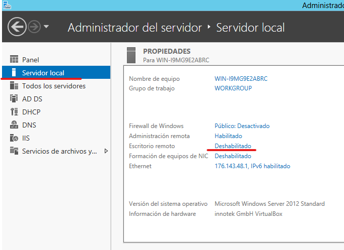
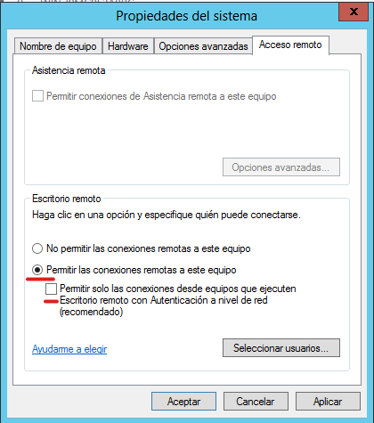
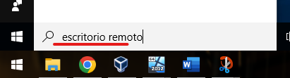
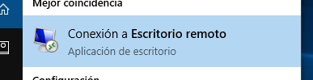
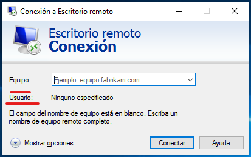
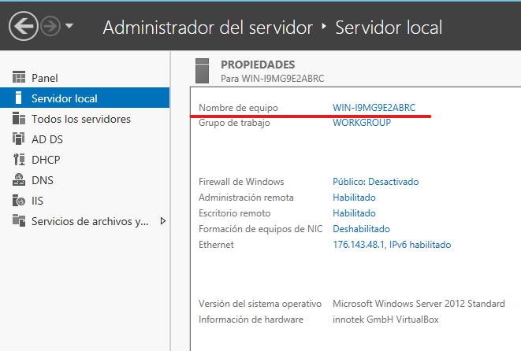
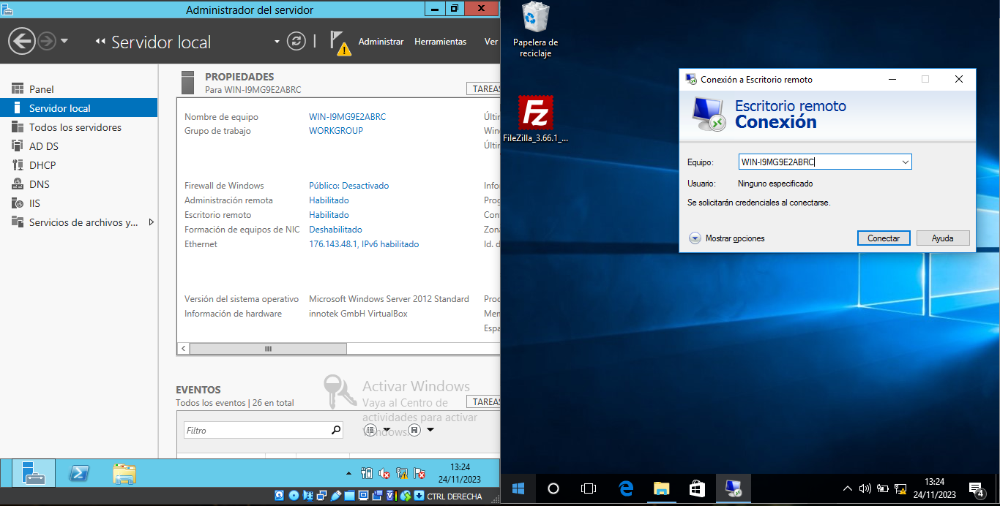
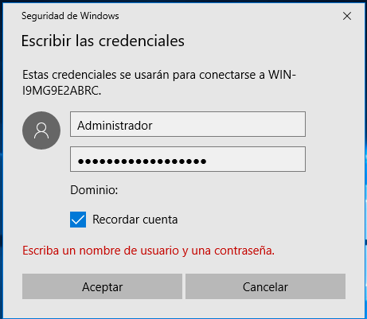
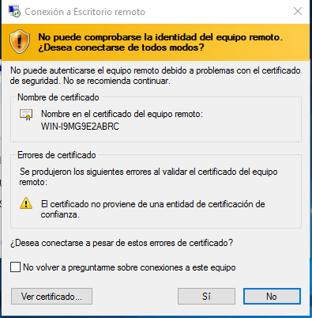
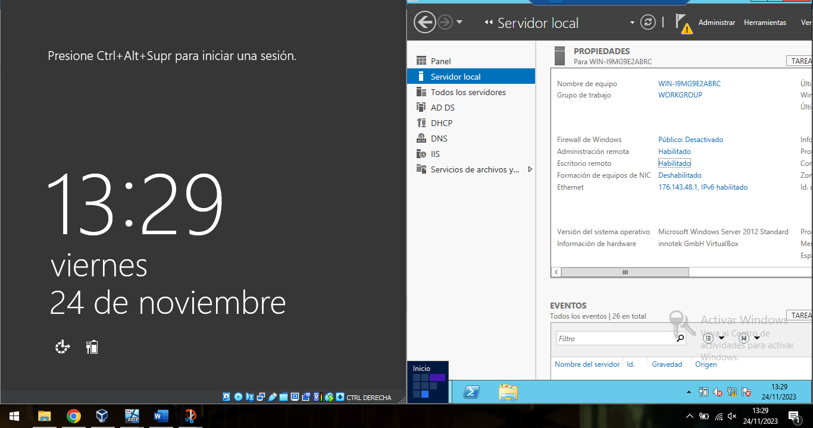

---
tags:
  - Informática
  - Acceso-Remoto
---
# **Escritorio remoto**

Servicio que permite a 1 equipo acceder a otro y controlarlo de forma remota, en el caso del servidor Windows es una

(Para que funcione es necesario un **cliente** y un **servidor** que tengan **conexión**)

Desde el lado del servidor vamos a Servidor local -\> Escritorio remoto, accedemos a el y lo habilitamos

Permitimos las conexiones remotas y desmarcamos la casilla la casilla de únicamente permitir las conexiones las conexiones remotas que ejecuten Autenticación de red, ya que podría dar problemas

Desde el lado del cliente accedemos a la aplicación escritorio remoto, para ello podemos buscarlas en la barra de búsqueda de Windows

Debemos introducir el nombre del equipo al que queremos conectarnos

Para ver el nombre de el servidor podemos verlo desde Servidor local y la información

Introducimos las credenciales del Usuario al que queremos acceder, (Cuenta del servidor)

Este aviso nos indica que la conexión no es segura (ya que no utilizamos certificados de seguridad) y nos pregunta si deseamos conectarnos de todas formas

Al establecer la conexión remota, en este caso desde el cliente al servidor, se suspenderá la sesión en el servidor y pasará a mostrarse en el cliente

Ahora podemos controlar el servidor desde el cliente
