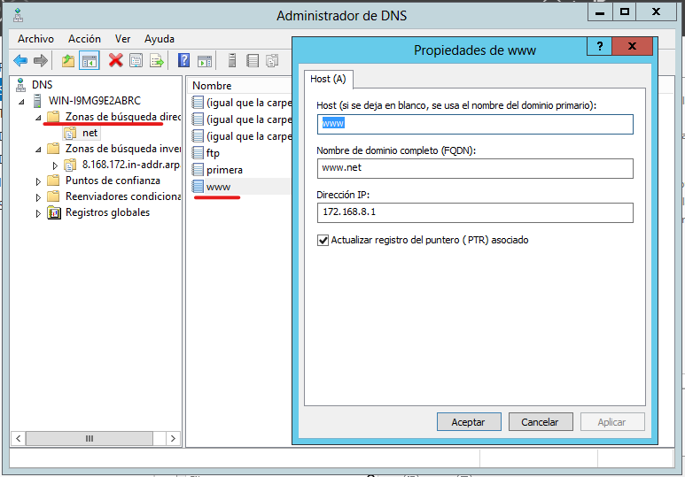
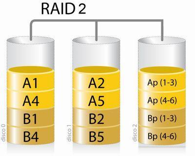
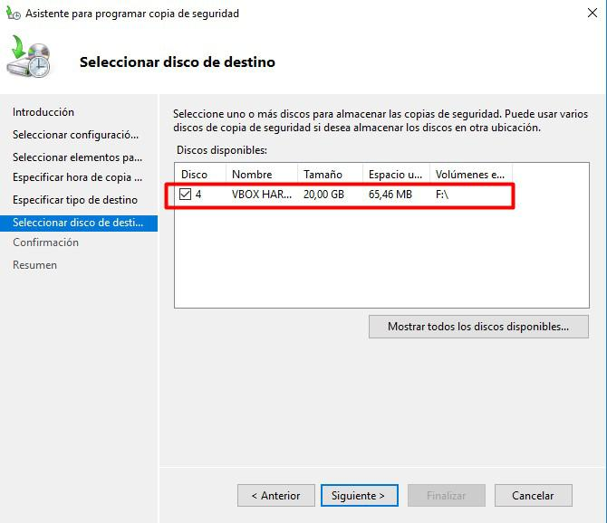

---
tags:
  - Informática
  - Seguridad
---
# **Sistemas de almacenamiento redundantes: RAID**

Uno de los aspectos críticos en la gestión de redes de ordenadores es la fiabilidad y disponibilidad del almacenamiento de la información: es del todo intolerable que una organización pierda datos por una gestión inadecuada de los riesgos tanto hardware como software.

Existen varias técnicas para aumentar la fiabilidad del almacenamiento de los datos; una que debe estar presente en todo entorno empresarial es la tecnología RAID (Redundant Array of Independent Disks). RAID en realidad implementa varias soluciones de varios niveles de tolerancia a fallos que implican el almacenamiento de los datos en más de un disco duro físico (salvo RAID-0, como veremos más adelante). Así, si uno de los discos falla, se seguirá teniendo acceso a la información ya que se mantienen copias de los datos almacenados.

Existen numerosos patrones de almacenamiento RAID, sin embargo, los más habituales en redes pequeñas son los denominados RAID-0, RAID-1 y RAID-5, que examinaremos en las secciones siguientes.

Un sistema adecuadamente protegido frente a posibles desastres implementará diferentes niveles jerárquicos de redundancia, pudiendo establecerse unos niveles en una ubicación física, y otros niveles en otra ubicación física. Sin embargo, estos diferentes niveles jerárquicos (llamados anidados) quedan fuera del alcance de este curso.

**Revisar el video de Naseros***:*
[*<u>https://www.youtube.com/watch?v=x8MXkvgeD0w&ab_channel=NASeros</u>*](https://www.youtube.com/watch?v=x8MXkvgeD0w&ab_channel=NASeros)

### **RAID 0 (Stripped)**
El funcionamiento del RAID-0 consiste en fragmentar la información a almacenar en tantos bloques como discos compongan el volumen RAID y almacenar cada bloque de información en un disco diferente:

Como se observa en la figura, un archivo en un volumen RAID-0, está repartido por los discos que forman el volumen RAID. El RAID 0 se usa normalmente para proporcionar un alto rendimiento de escritura ya que los datos se escriben en dos o más discos de forma paralela, aunque un mismo fichero solo está presente una vez en el conjunto.

### **RAID 1 (Mirrorring)**
Este tipo de volumen RAID consiste en mantener una copia idéntica de un disco duro en un segundo disco duro:

Este esquema de almacenamiento sí es tolerante a fallos, en caso de que uno de los discos duros se averiase, la información seguiría estando disponible en el otro disco duro, sin embargo se perdería la redundancia a partir del momento de la avería del primer disco. Al escribir, el conjunto se comporta como un único disco, dado que los datos deben ser escritos en todos los discos del RAID 1. Por tanto, el rendimiento de escritura no mejora.

### **RAID 2**
Distribuye los datos entrelazados a nivel de bit. El código de error se intercala a través de varios discos también a nivel de bit, el código de error se calcula con el código de Hamming. Todo giro del cabezal de disco se sincroniza y los datos se distribuyen en bandas de modo que cada bit secuencial está en una unidad diferente. La paridad de Hamming se calcula a través de los bits correspondientes y se almacena en al menos un disco de paridad. Este nivel es solo significante a nivel histórico y teórico, ya que actualmente no se utiliza.

### **RAID 5**
RAID-5 incluye, en el proceso de escritura de datos, información de paridad que permite recuperar los datos almacenados en caso de fallo en alguno de los dispositivos físicos de almacenamiento. Para implementar RAID-5 se necesitan al menos 3 discos duros, con un máximo de 32 discos. Otro requisito obvio es que todos los discos deben tener al menos el mismo espacio libre que el primer disco seleccionado al crear el volumen RAID.

El esquema de funcionamiento de un volumen RAID-5, es como se muestra en la figura (con 4 discos). La información a almacenar se divide en n-1 bloques (donde n es el número de discos físicos del volumen). En el disco n se almacena información de paridad que permitiría recuperar un
bloque perdido en caso de que un disco entero fallase:

## **Copias de seguridad**
Al trabajar con estructuras de red profesionales, es imprescindible realizar copias de seguridad tanto de la información generada por los usuarios, como de la configuración del controlador de dominio, para protegernos ante desastres que supongan una pérdida de datos.

**Se debe realizar un plan de copias de seguridad que defina:**

- Qué datos del sistema se copiarán.
- Cuál será la frecuencia de la realización de las copias de seguridad, buscando un equilibrio entre seguridad y rendimiento del sistema.
- Dónde se almacenarán las copias de seguridad: lo habitual es tener una serie de copias próximas para un acceso rápido y otra serie de copias remotas para garantizar su disponibilidad en caso de desastre que afecte a la ubicación del servidor principal.

#### **Tipos de Copias de Seguridad**

**Existen tres tipos de copias de seguridad fundamentales:**

**Normal o total**: Se hace una copia de todos los archivos y carpetas sin considerar si ya
han sido almacenadas en otra copia de seguridad anterior o no. Al realizarse una copia exhaustiva de todos los ficheros seleccionados, este proceso es más lento que los otros dos tipos de copia que veremos posteriormente. Por otra parte, suele ser el tipo de copia habitual en una primera copia de seguridad, para luego ir adoptando tipos de copia como el incremental. Finalmente se recomienda realizar una copia completa cada cierto tiempo (por ejemplo, semanal o mensualmente) para disminuir el riesgo de que haya habido algún error o problema que haya ido heredándose a lo largo de las distintas copias incrementales o diferenciales.

**Incrementa<u>l</u>**: Una copia incremental únicamente almacena los archivos que se hayan modificado desde la última copia de seguridad (del tipo que sea). Para ello utiliza un atributo del que disponen los archivos y carpetas que especifica si este fue copiado previamente en un proceso de copia de seguridad o no. Este tipo de copia de seguridad es más breve que el anterior ya que únicamente almacena los ficheros que se han modificado. Puede ser un tipo perfectamente válido para copias de seguridad programadas con una frecuencia elevada, por ejemplo, diariamente.

**Diferencial**: Una copia de tipo diferencial solo copia los archivos que se hayan modificado desde la última copia de seguridad (sea del tipo que sea). Sin embargo, no modifica el valor del atributo marcador que vimos en el punto anterior, por lo que el archivo queda marcado como no copiado
