---
tags:
  - Informática
  - Seguridad
---
> **Almacenamiento:
> Raids, Cuotas y Copias de Seguridad**

> **Almacenamiento: Raids, Cuotas y Copias de Seguridad**

**Curso a distancia 18FP32CF012**

**Administración centralizada de redes con Windows Server 2016**

**Alberto Aparicio Vila**

> **Índice**

> índice
>
> [<u>Establecer esquemas de almacenamiento redundantes con la
> tecnología RAID (por software).</u>](#bookmark=id.gjdgxs)
>
> <u>[Planificar e implantar las cuotas de almacenamiento de usuario
> para garantizar la disponibilidad de los
> recursos](#bookmark=id.4f1mdlm) [de almacenamiento en
> red.](#bookmark=id.4f1mdlm)</u>
>
> [<u>Garantizar la integridad de la información mediante la
> programación de copias de seguridad</u>](#bookmark=id.3l18frh)
>
> **Sistemas de almacenamiento redundantes: RAID**

Uno de los aspectos críticos en la gestión de redes de ordenadores es la
fiabilidad y disponibilidad del almacenamiento de la información: es del
todo intolerable que una organización pierda datos por una gestión
inadecuada de los riesgos tanto hardware como software.

Existen varias técnicas para aumentar la fiabilidad del almacenamiento
de los datos; una que debe estar presente en todo entorno empresarial es
la tecnología RAID (Redundant Array of Independent Disks). RAID en
realidad implementa varias soluciones de [<u>varios
niveles</u>](https://es.wikipedia.org/wiki/RAID) de tolerancia a fallos
que implican el almacenamiento de los datos en más de un disco duro
físico (salvo RAID-0, como veremos más adelante). Así, si uno de los
discos falla, se seguirá teniendo acceso a la información ya que se
mantienen copias de los datos almacenados.

Existen numerosos patrones de almacenamiento RAID, sin embargo, los más
habituales en redes pequeñas son los denominados RAID-0, RAID-1 y
RAID-5, que examinaremos en las secciones siguientes.

Un sistema adecuadamente protegido frente a posibles desastres
implementará diferentes niveles jerárquicos de redundancia, pudiendo
establecerse unos niveles en una ubicación física, y otros niveles en
otra ubicación física. Sin embargo estos diferentes niveles jerárquicos
(llamados anidados) quedan fuera del alcance de este curso.

**Implementación de un volumen RAID-0: Striped Volume**

El primer tipo de los volúmenes RAID que pondremos en marcha es el
RAID-0 o volumen seccionado (striped). El funcionamiento del RAID-0
consiste en fragmentar la información a almacenar en tantos bloques como
discos compongan el volumen RAID y almacenar cada bloque de información
en un disco diferente:

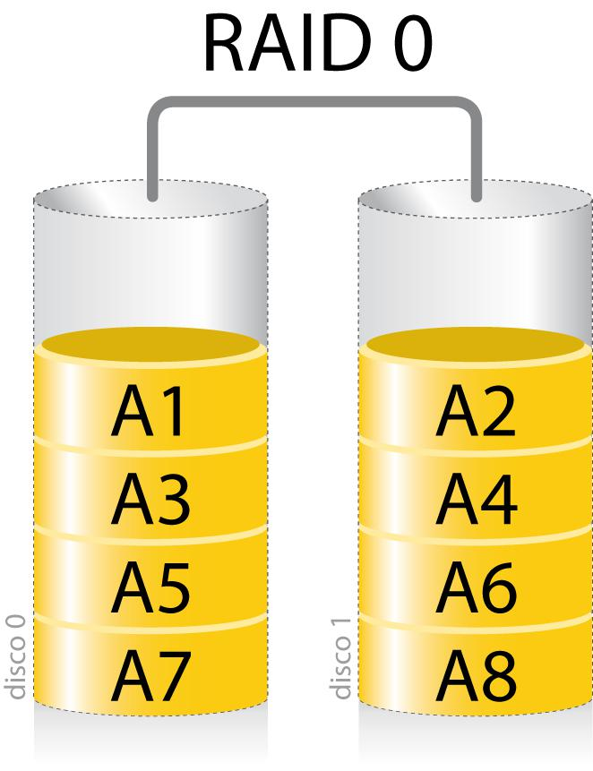

> *RAID-0 Striped Volume*

Como se observa en la figura, un archivo en un volumen RAID-0, está
repartido por los discos que forman el volumen RAID. El RAID 0 se usa
normalmente para proporcionar un alto rendimiento de escritura ya que
los datos se escribe en dos o más discos de forma paralela, aunque un
mismo fichero solo está presente una vez en el conjunto.

**Creación de un Volumen RAID-0**

La puesta en marcha de un sistema RAID-0 necesita al menos de dos discos
duros dedicados a este volumen. Añadiremos a la máquina virtual donde
tenemos creado el controlador de dominio dos discos duros nuevos de 2GB
cada uno, tal y como viene reflejado en las figuras:

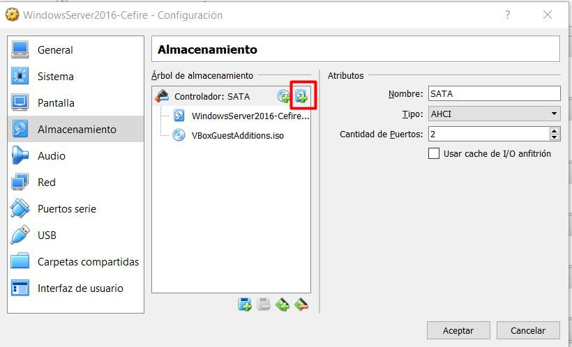

*Añadir disco en VB*

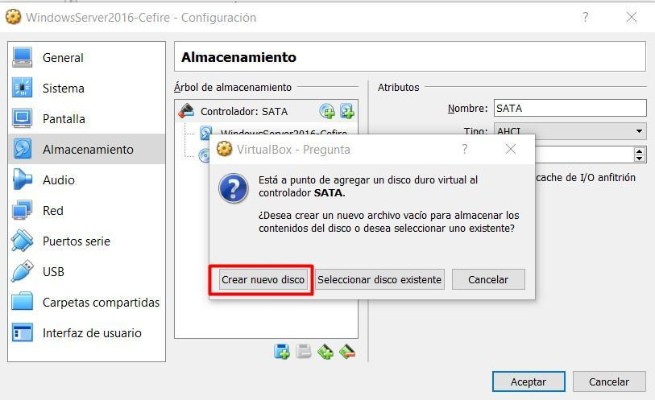

*Añadir disco en VB*

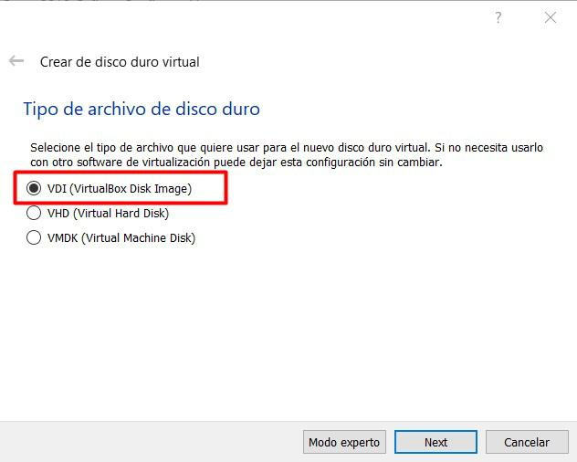

*Añadir disco en VB*

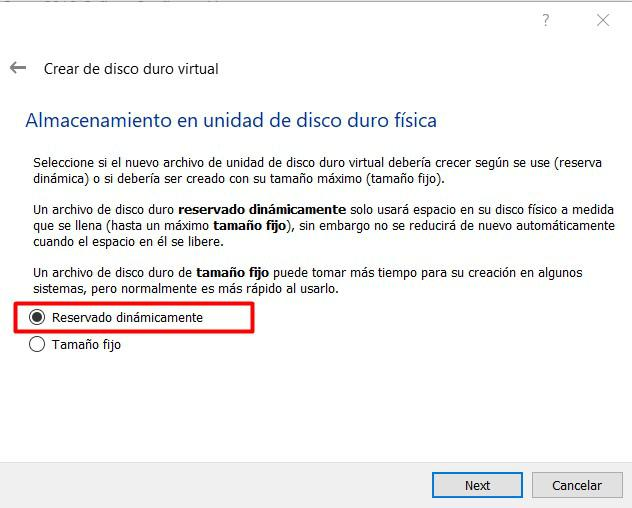

*Añadir disco en VB*

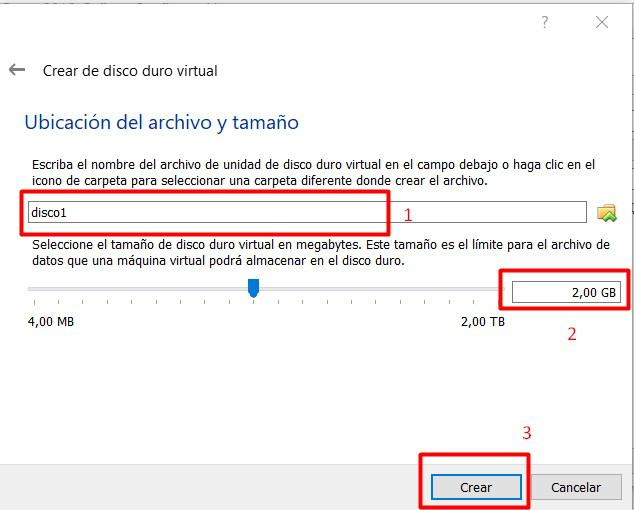

*Añadir disco en VB*

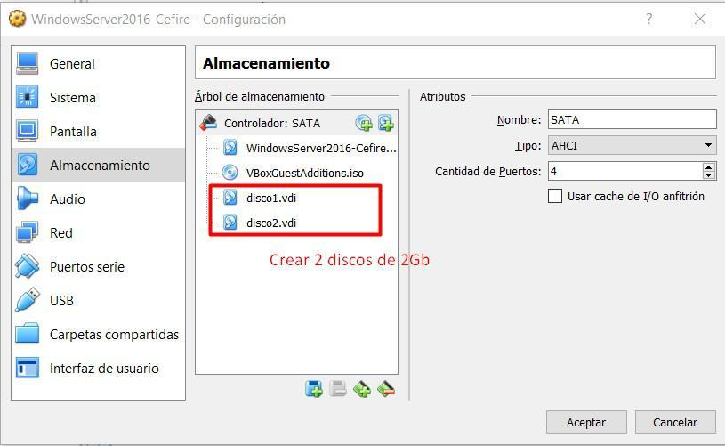

*Crear dos discos en VB*

Tras realizar este proceso, tendremos añadidos los dos discos RAID-0
necesarios.

Una vez arrancado el controlador de dominio, se nos indicará que se han
detectado dos discos duros nuevos que deben ser inicializados como MBR
(basado en registro de arranque maestro) o como GPT (basado en tabla de
particiones). También podemos acceder a ellos a través del Administrador
de discos.

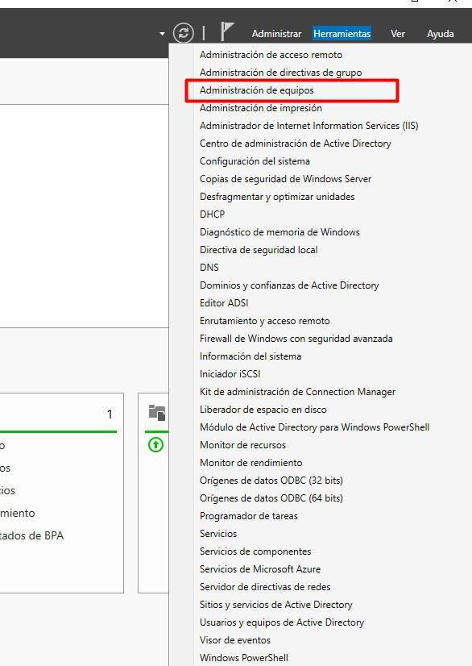

*Administración de discos*

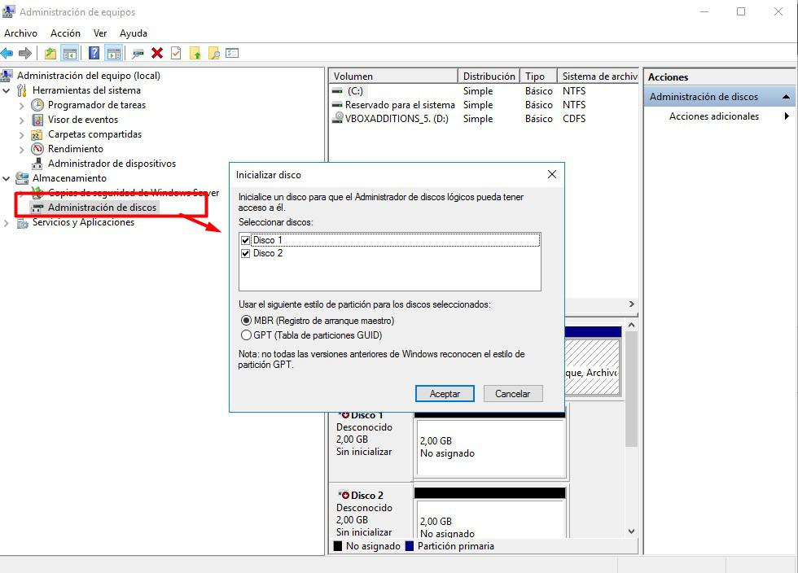

*Administración de discos*

Tras inicializar los discos podremos comprobar que aparecen en el
sistema, como discos duros básicos sin formato.

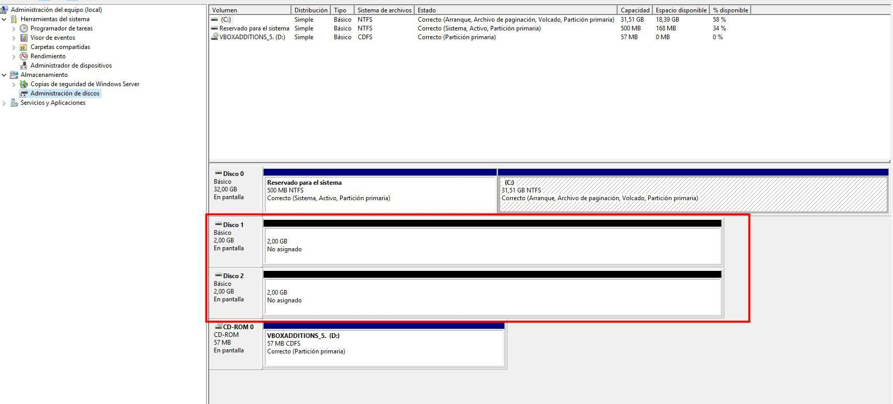

*Discos inicializados sin formato*

Para crear el volumen RAID-0, haremos clic con el botón secundario sobre
el identificador del disco y seleccionaremos la opción 'Volumen
Seccionado' :

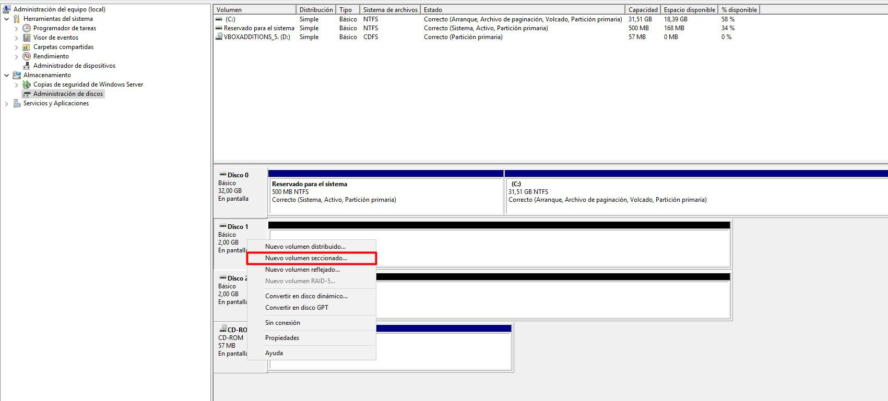

> *RAID-0. Volumen seccionado.*

A continuación se abrirá un asistente que nos permitirá crear el nuevo
volumen:

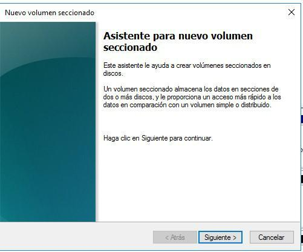

> *Creación de un RAID-0*

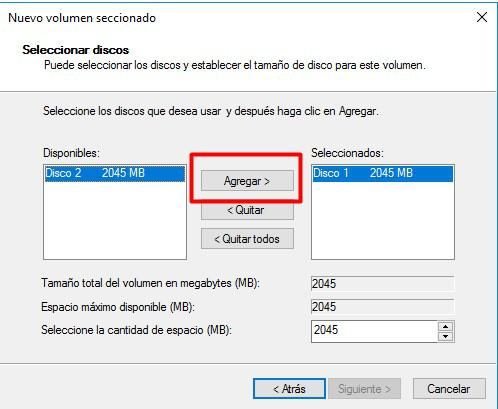

*Creación de un RAID-0*

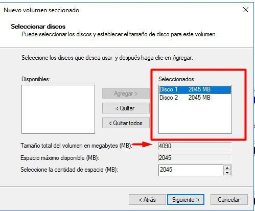

*Creación de un RAID-0*

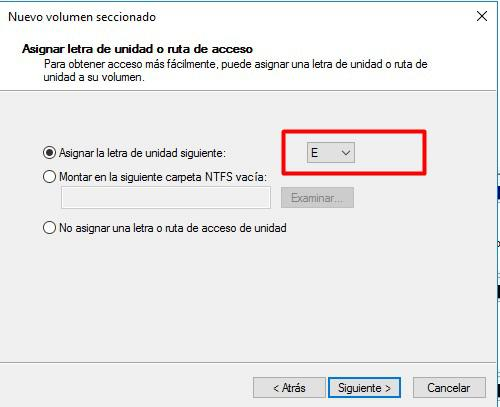

*Creación de un RAID-0*

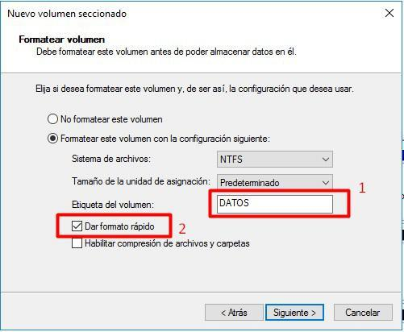

*Creación de un RAID-0*

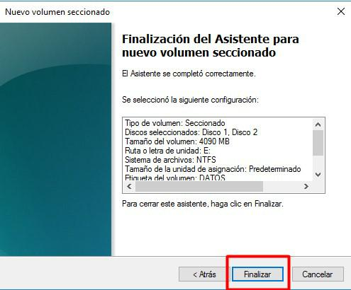

*Creación de un RAID-0*

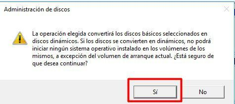

*Creación de un RAID-0*

Finalmente, ya tendremos creado nuestro volumen RAID-0:

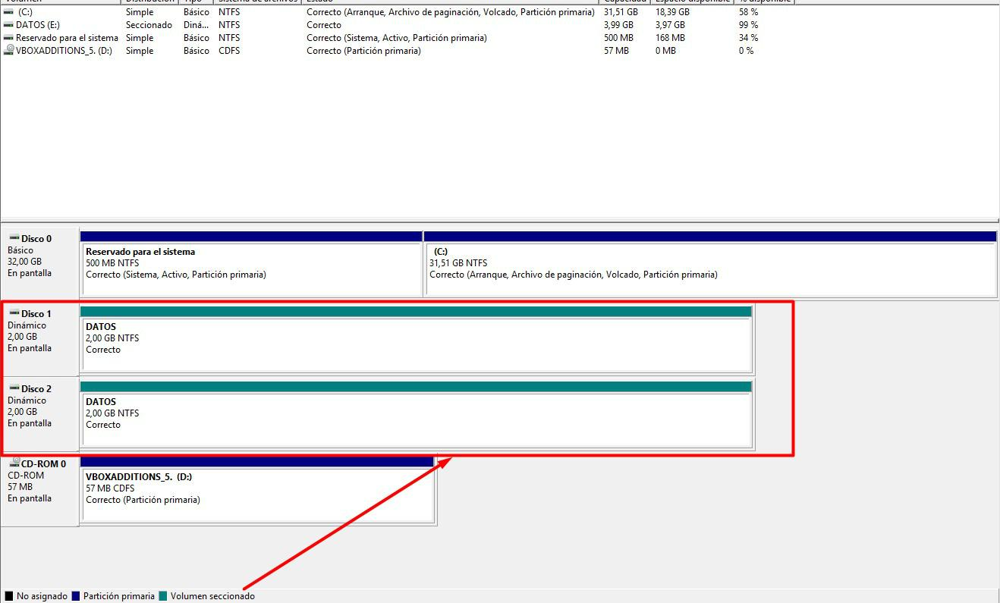

*Creación de un RAID-0*

Ahora ya podemos acceder al nuevo volumen E:. El nuevo volumen tendrá un
tamaño de 4Gb (2Gb + 2Gb):

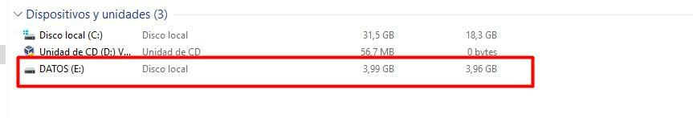

*Creación de un RAID-0*

**Implementación de un RAID-0 por línea de comandos: Diskpart**

A continuación vamos a implementar un volumen RAID-0 por línea de
comandos mediante la herramienta Diskpart de Microsoft. Es cierto, que
esta no es una tarea repetitiva que se vaya a llevar a cabo en
innumerables ocasiones y que por tanto valga la pena ejecutarla por
línea de comandos, pero sí que es cierto que puede sernos muy útil en
entornos de tipo 'Core' como los que hemos visto en temas anteriores,
donde no disponemos de interfaz gráfica.

Para acceder a esta herramienta, abriremos la consola de comandos y
teclearemos diskpart , cambiándose el entorno de ejecución, como se
muestra en la figura:

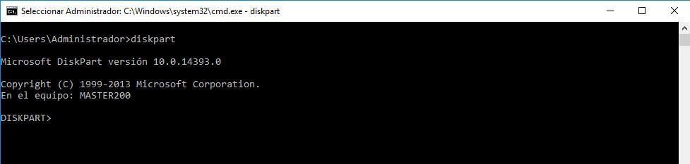

*Comando diskpart*

Para consultar los discos de los que disponemos en el sistema
escribiremos **list disk.** Este comando muestra un listado de los
discos del sistema. Otras opciones que tiene son partition y volume .
Tal y como tenemos configurado el sistema, obtendremos la siguiente
salida:

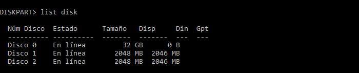

*list disk*

Podemos comprobar que efectivamente aparece el disco donde está
instalado el sistema operativo (Disco 0), y los dos discos de 2 GB que
hemos añadido (Disco 1 y Disco 2).

El primer paso para poner en marcha un volumen RAID-0, será pasar los
discos 1 y 2 de básicos a dinámicos. Para ello habrá que ejecutar las
siguientes secuencias de comandos:

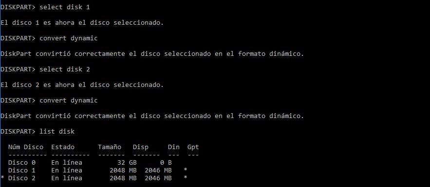

*Diskpart: Convirtiendo discos a dinámicos.*

El comando select selecciona el disco (disk) que se le pase como
parámetro. Las tareas que se realicen a continuación se llevarán a cabo
sobre el disco seleccionado. En este caso la tarea que se ha ejecutado
ha consistido en pasar el disco a dinámico (convert dynamic).

En este punto ya tenemos los discos duros inicializados y convertidos a
dinámicos, solo restará crear el volumen RAID-0, asignarle un formato,
etiqueta y unidad:

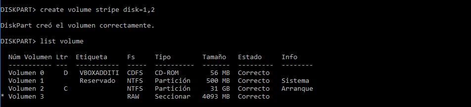

*create volume stripe*

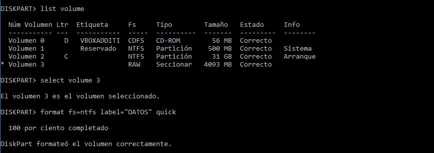

*Formateando disco seccionado*

y finalmente asignamos la unidad:

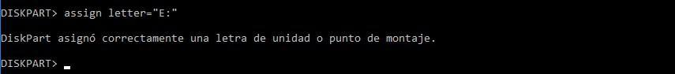

*Asignado unidad al volumen*

Revisemos los comandos anteriores: create volume stripe crea un volumen
de tipo RAID-0 con los discos 1 y 2 (disk=1,2 ). A continuación listamos
los volúmenes del sistema (list volume ), y seleccionamos el que
acabamos de crear (select volume 2 ). Con format formateamos el volumen
como NTFS fs=ntfs , con nombre DATOS ( label="DATOS" ) y formato rápido
quick . Finalmente asociamos el volumen a la unidad E: (assign
letter="E:" ).

En la siguiente figura, podemos comprobar a través del Administrador de
Discos que todo se ha creado tal y como estaba planificado:

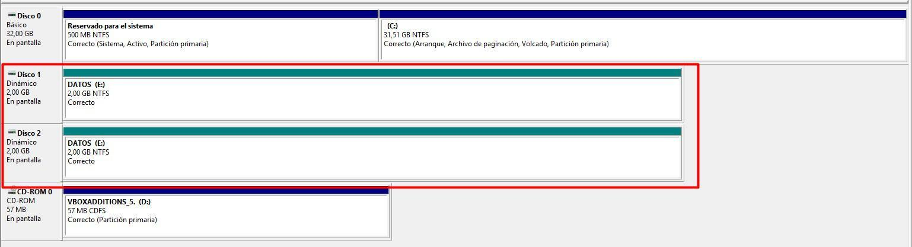

*Creación de un volumen RAID-0 por comandos*

Más información del comando DISKPART en el [<u>sitio oficial de
Microsoft</u>](https://technet.microsoft.com/es-es/library/Cc766465%28v=WS.10%29.aspx?f=255&MSPPError=-2147217396).

**Fallo en disco RAID-0**

Aunque sabemos que un volumen RAID-0 no aporta tolerancia a errores,
vamos a comprobar qué tipo de problemas podemos experimentar, si se
desconecta uno de los dos discos que conforman el volumen seccionado.

En primer lugar, almacenamos un fichero en el volumen RAID-0 que servirá
para comprobar la integridad de la información tras el fallo de disco:

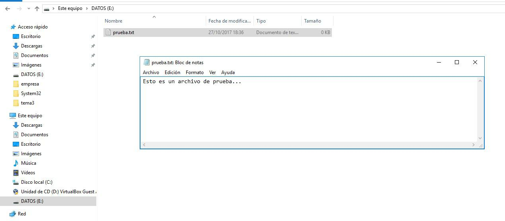

*Creación de un archivo testigo*

A continuación apagamos el controlador de dominio y desconectamos uno de
los dos discos duros del RAID-0:

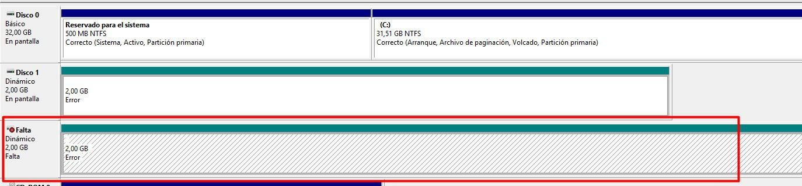

*Error RAID-0*

De hecho, si intentamos acceder a la unidad E: (volumen seccionado en
este caso) a través del Explorador de Windows, vemos que ni tan siquiera
nos aparece el volumen:

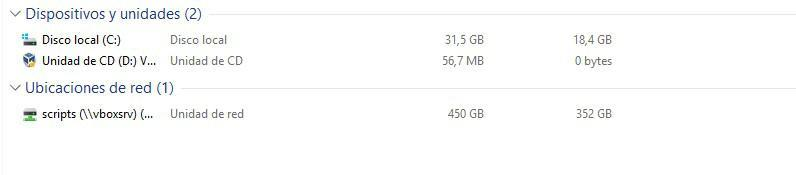

*Error en RAID-0*

**Implementación de RAID-1: Mirrorring Volume**

A continuación pondremos en marcha un volumen RAID-1 o en espejo
(mirroring). Este tipo de volumen RAID consiste en mantener una copia
idéntica de un disco duro en un segundo disco duro:

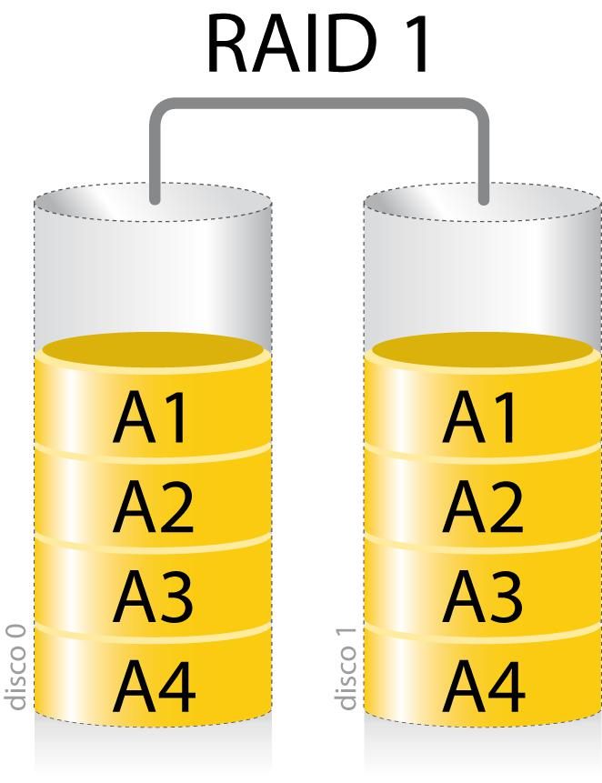

> *Raid-1. Mirrorring*

Este esquema de almacenamiento sí es tolerante a fallos, en caso de que
uno de los discos duros se averiase, la información seguiría estando
disponible en el otro disco duro, sin embargo se perdería la redundancia
a partir del momento de la avería del primer disco. Al escribir, el
conjunto se comporta como un único disco, dado que los datos deben ser
escritos en todos los discos del RAID 1. Por tanto, el rendimiento de
escritura no mejora.

Para poner en marcha un sistema de nivel RAID-1, necesitaremos, como en
el caso anterior dos discos duros. Vamos a utilizar los mismos discos
que habíamos utilizado en el volumen RAID-0. Para ello vamos a volver a
conectar los dos discos al Virtual Box:

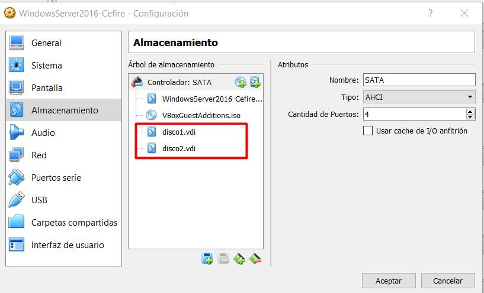

> *Configurar dos discos en VB*

Y ahora iniciamos nuestro controlador de dominio. Eliminaremos el RAID-0
y lo convertiremos a un RAID-1:

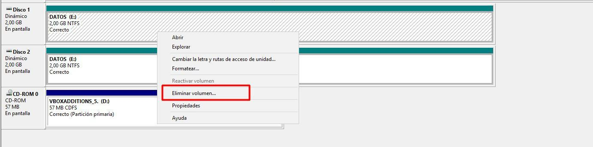

> *Eliminar un volumen*

Una vez eliminado, creamos el nuevo volumen en RAID-1:

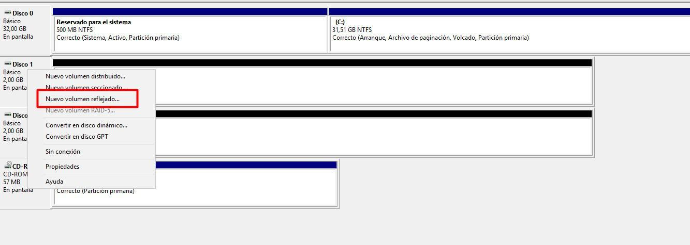

*Nuevo volumen reflejado*

Y comienza el asistente para la creación del volumen reflejado (RAID-1):

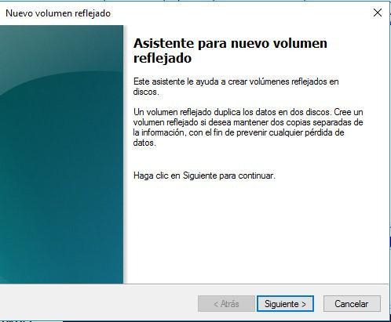

*Asistente creación RAID-1*

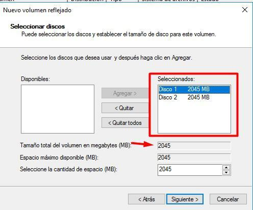

*Asistente creación RAID-1*

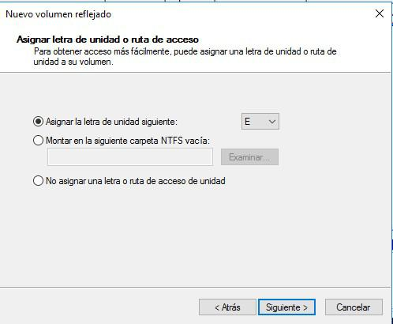

*Asistente creación RAID-1*

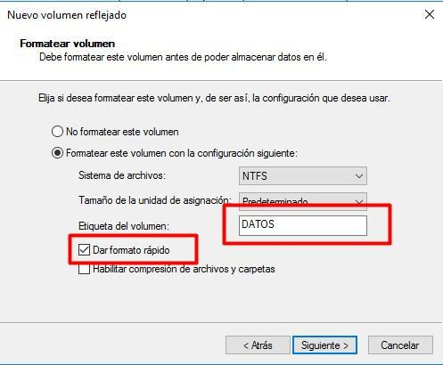

*Asistente creación RAID-1*

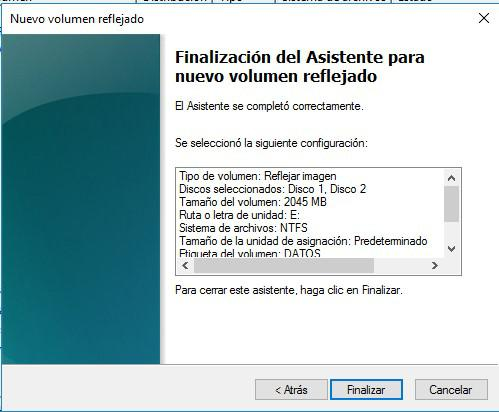

*Asistente creación RAID-1*

Y finalmente, desde el administrador de discos, podemos ver el nuevo
volumen reflejado:

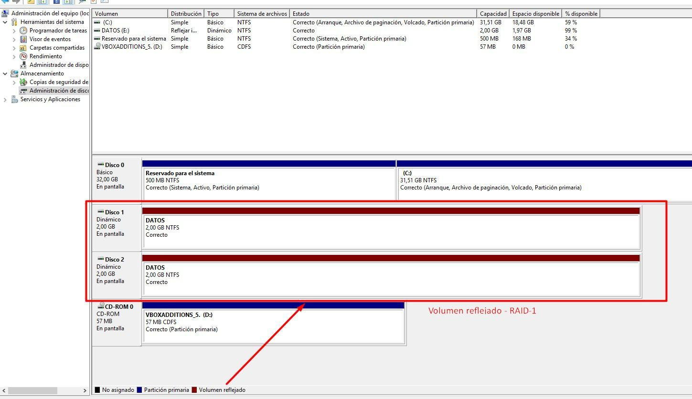

*Volumen reflejado - RAID1*

Y desde el explorador de archivos, podemos acceder al nuevo volumen
(E:), un volumen reflejado con capacidad de 2Gb. Ya que de los dos
discos, uno se usa como disco imagen:

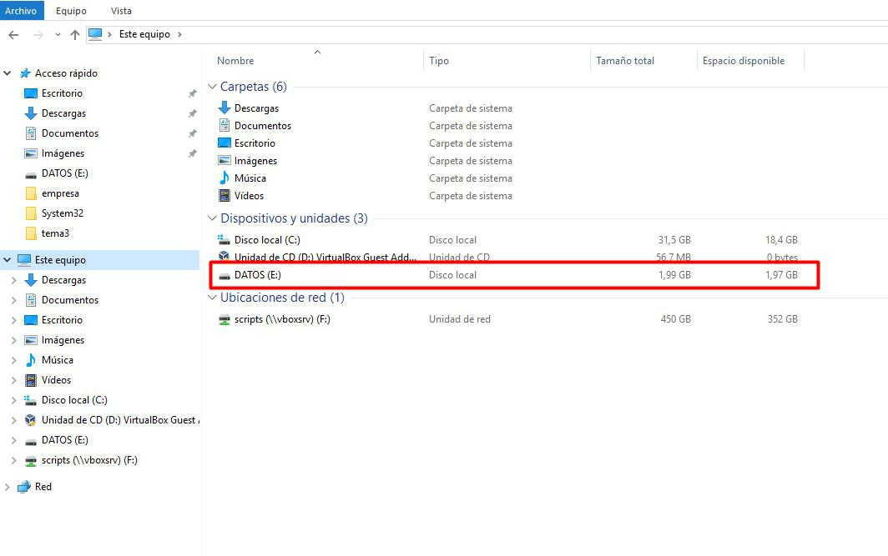

*Volumen RAID-1*

**Implementación de un RAID1 por línea de comandos**

Vamos a crear mediante la línea de comandos un volumen RAID-1 (espejo)
con dos discos duros. Como en el caso anterior abriremos diskpart ,
listaremos los discos para comprobar que todo está correcto y
convertiremos los discos a dinámicos:

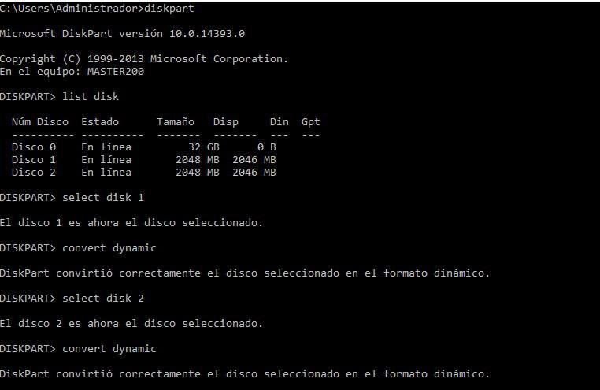

*Diskpart: Convertir discos a dinámicos*

Una vez convertidos a dinámicos, listamos los discos:

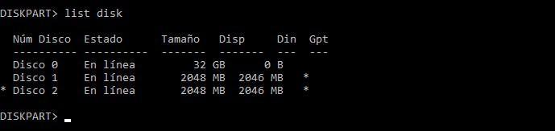

*Diskpart: Listar discos dinámicos*

A continuación crearemos el volumen RAID-1, y le daremos formato rápido
NTFS y etiqueta "DATOS":

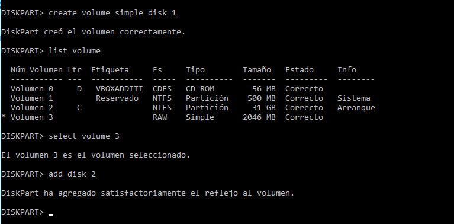

*Diskpart: Crear un volumen reflejado*

Como se puede ver en la secuencia de comandos anterior, no se puede
crear directamente un volumen reflejado con diskpart, hay que crear un
volumen simple (create volume simple ) sobre el disco 1 (disk=1 ). A
continuación hay que añadir un disco que será un reflejo del primero
(add disk 2 ). A continuación le damos el formato y asignamos la letra
del volumen:

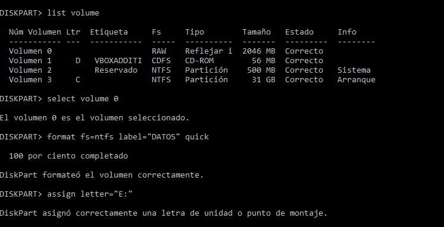

*Diskpart: formatear volumen reflejado*

Comprobemos que se ha creado el volumen reflejado correctamente desde el
Administrador de Discos:

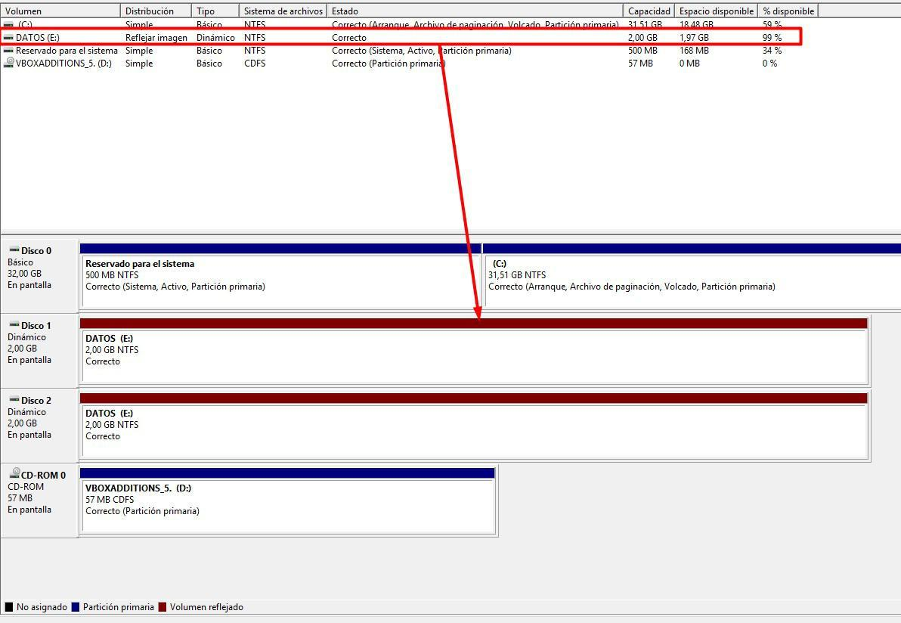

*Comprobar volumen reflejado*

**Fallo de disco en RAID1**

Como hemos visto, los volúmenes RAID-1 son tolerantes a fallos, ya que
la información que se almacena en un disco se replica en el otro miembro
del volumen. Creemos un archivo y almacenémoslo en el volumen RAID-1:

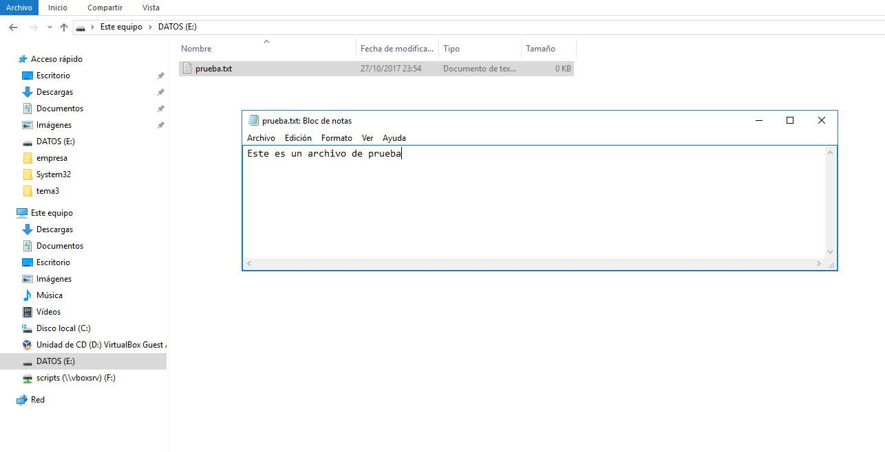

*Fichero almacenado en volumen RAID1*

A continuación apaguemos el controlador de dominio y desconectemos uno
de los dos discos del RAID-1:

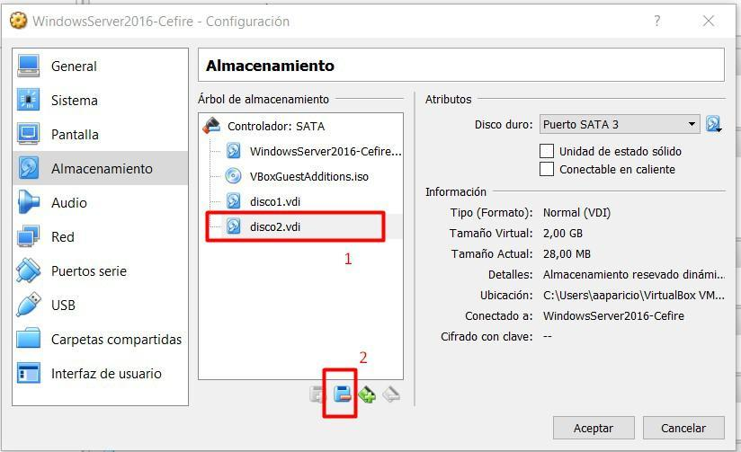

*Eliminar un disco RAID1*

Arranquemos de nuevo el servidor, podremos comprobar que se ha producido
un error, pero que la información sigue estando disponible:

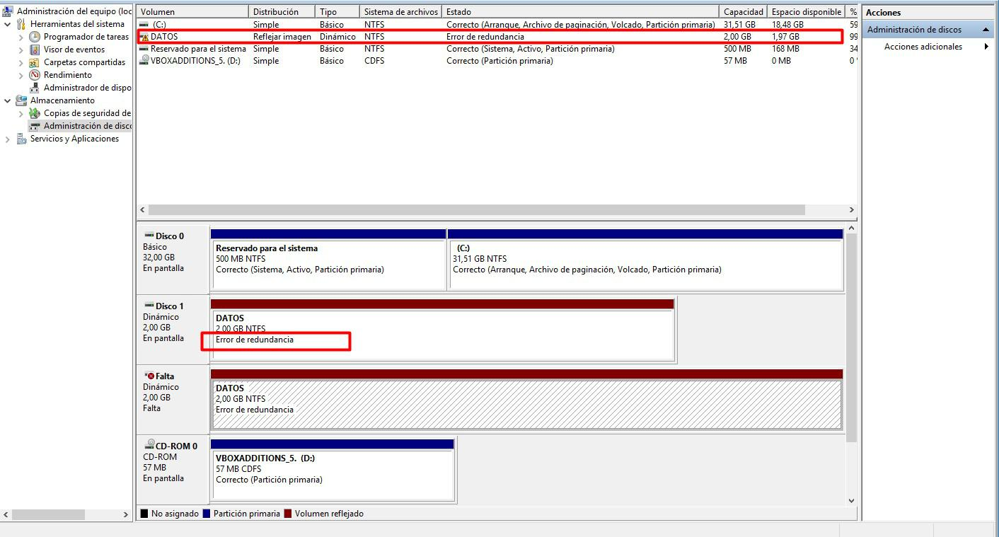

*Error de redundancia RAID1*

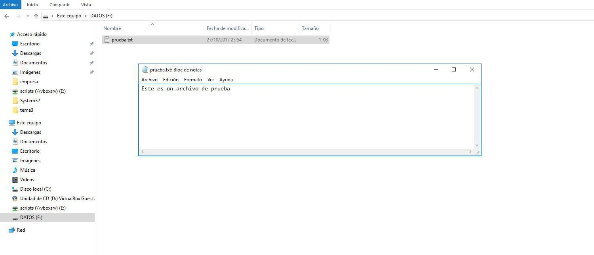

*Acceso a fichero pese al error*

Apaguemos de nuevo el servidor y conectemos un nuevo disco duro
(disco3). Al arrancar configuraremos el nuevo disco como dinámico (bien
a través del Administrador de Discos o bien a través de Diskpart):


*Conectamos nuevo disco a VB*

Y ahora iniciamos el servidor, desde el Administrador de discos,
convertimos este nuevo disco en disco dinámico:


*Convertir nuevo disco en dinámico*

Para poder reconstruir el volumen RAID-1, necesitamos romper el espejo
anterior, ya que uno de los discos originales no existe:

Eliminamos el disco que falta:

*Quitar espejo*


> *Quitar disco*


*Reflejo eliminado*

Ahora el volumen E: aparece como un volumen simple, lo que debemos hacer
es agregar reflejo y añadir el nuevo disco que hemos conectado:


*Agregar reflejo*


*Seleccionar disco para reflejar*


> *Sincronizando discos RAID1*

Una vez sincronizado, vemos que todo queda correcto:


*RAID1 reconstruido*

**Implementación de un volumen RAID5**

RAID-5 incluye, en el proceso de escritura de datos, información de
paridad que permite recuperar los datos almacenados en caso de fallo en
alguno de los dispositivos físicos de almacenamiento. Para implementar
RAID-5 se necesitan al menos 3 discos duros, con un máximo de 32 discos.
Otro requisito obvio es que todos los discos deben tener al menos el
mismo espacio libre que el primer disco seleccionado al crear el volumen
RAID.

El esquema de funcionamiento de un volumen RAID-5, es como se muestra en
la figura (con 4 discos). La información a almacenar se divide en n-1
bloques (donde n es el número de discos físicos del volumen). En el
disco n se almacena información de paridad que permitiría recuperar un
bloque perdido en caso de que un disco entero fallase:


> *RAID5 implementado con 4 discos*

Como se puede observar en la figura anterior, los bloques de paridad no
se almacenan todos en el mismo disco sino que se va desplazando el disco
de almacenamiento de la información de paridad, siempre con la constante
de que no se almacena en un mismo disco más de un bloque correspondiente
al mismo fragmento de información (incluido el bloque de paridad).

Este nivel RAID sí es tolerante a fallos, sin embargo presenta un par de
inconvenientes como son:

> Se reduce el rendimiento del sistema al tener que crear y escribir
> información de paridad en cada ciclo de escritura de información. Para
> paliar en cierta medida este inconveniente existen controladoras
> RAID-5 por hardware que agilizan este proceso.

> Se desaprovecha como máximo un tercio del volumen de almacenamiento
> instalado, ya que es dedicado a albergar información de paridad. No
> obstante, el aprovechamiento del espacio de almacenamiento es superior
> al RAID-1 donde se desperdiciaba el 50%.

**Creación de un volumen RAID5 con 3 discos**

A continuación, vamos a crear un volumen de almacenamiento con una
configuración de redundancia RAID-5. En este caso utilizaremos 3 discos
duros (de nuevo de 2GB cada uno) que conectaremos a la máquina virtual
donde tenemos en funcionamiento nuestro Windows Server 2016.
Reutilizaremos los discos que hemos creados antes. Si creáramos discos
nuevos, nuestro sistema los reiniciaría como se ha hecho en los casos
anteriores:


*RAID5 Añadir 3 discos a VirtualBox*

Iniciamos ahora nuestro server y accedemos al Administrador de discos:


*Preparación del RAID5*

En el administrador de discos haremos clic con el botón derecho sobre el
identificador de cualquiera de los tres discos nuevos y seleccionaremos
la opción 'Nuevo volumen RAID-5...'


*Creación de un volumen RAID5*

Se abrirá el asistente de configuración del nuevo volumen RAID-5 y
seleccionaremos los tres discos que queremos que formen parte de ese
nuevo volumen RAID-5:


*Asistente de creación de RAID5*


*Asistente de creación de RAID5*


*Asistente de creación de RAID5*


*Asistente de creación de RAID5*


*Asistente de creación de RAID5*

Y finalmente vemos desde el administrador de discos nuestro volumen
RAID5:


*Volumen RAID5 creado*

**Implementación de un volumen RAID5 por línea de comandos**

Crearemos un volumen redundante RAID 5 para el que necesitaremos 3
discos extra de 2GB. Abrimos diskpart , y convertimos a dinámicos los
tres discos nuevos que hemos conectado al sistema:


*Creación de RAID5 por línea de comandos*

Hay que convertir a dinámicos los discos 1,2 y 3. Para ello, tal y como
se observa en la figura de arriba, seleccionaremos cada uno de los
discos (select disk) y haremos su conversión a dinámico (convert
dynamic).

A continuación crearemos el volumen RAID-5, le daremos formato rápido
NTFS y etiqueta "DATOS". Para ello utilizaremos los comandos, créate
raid disk, format y assign:


*Creación de un volumen RAID5 por comandos*

Y podemos comprobar desde el Administrador de Discos como nuestro nuevo
volumen está creado y asignado a la unidad E:


*Volumen RAID5 creado*

**Fallo en un disco RAID5**

Como hemos comentado en puntos anteriores, los volúmenes RAID-5 son
tolerantes a fallos. Comprobemos que esto es efectivamente así. Vamos a
almacenar un fichero cualquiera en el volumen E:, a continuación
desconectaremos uno de los discos que conforman el volumen RAID-5 y
corroboraremos que la información sigue disponible, aunque ese volumen
ya no sea tolerante a fallos:


*Fichero de prueba en RAID5*

Ahora desconectamos un disco desde VirtualBox:


*Desconexión de uno de los discos*

Arrancamos de nuevo la máquina virtual, y abriendo el administrador de
discos podemos comprobar que se ha producido un error de redundancia:


*RAID5 Error de redundancia*

No obstante podemos acceder a la información que habíamos almacenado con
anterioridad a la desconexión del disco:


*Acceso al fichero testigo*

Apaguemos de nuevo la máquina virtual y conectemos un nuevo disco duro
de al menos 2GB que reemplazará al que retiramos anteriormente:


> *Conectamos nuevo disco*


> *Nuevo disco de 2Gb*

Arrancamos de nuevo el sistema y en el Administrador de discos,
indicaremos que queremos añadir el nuevo:


*Importar disco nuevo*

Y reparar el volumen para reconstruir el volumen RAID5:


*Reparar el volumen RAID5*

Durante unos instantes (cuya duración dependerá del volumen de
información almacenado) se sincronizarán los discos del volumen RAID-5:


*RAID5 Sincronizado*

Este es un proceso bastante habitual en entornos empresariales, donde
hay cabinas de discos implementando diferentes niveles de RAID anidados
(por ejemplo RAID-51, RAID-50, RAID-10, etc.) con un gran número de
discos. Si uno de estos discos falla, el sistema sigue funcionando pero
en modo degradado, hasta que se sustituya el disco por uno nuevo y se
reconfigure el volumen RAID.

> **Cuotas**

Al crear estructuras de almacenamiento compartido, suele ser necesario
el establecimiento de cuotas de almacenamiento. Estas cuotas consisten
en la configuración de unos límites de almacenamiento asignados a los
usuarios. De esta manera, un usuario no podrá ocupar más espacio del que
tiene asignado, garantizando así el reparto equitativo de los recursos
entre todos los usuarios. Así se evita que alguno de los usuarios del
dominio ocupe una cantidad demasiado grande de espacio de
almacenamiento, impidiendo a los demás usuarios el aprovechamiento del
recurso compartido.

En Windows Server 2016 se pueden crear cuotas de almacenamiento
configurando aspectos, como por ejemplo el espacio máximo que podrá
ocupar un usuario, el límite a partir del cual se registrará un evento
de advertencia, etc.

Para establecer las cuotas de almacenamiento, haremos clic con el botón
secundario sobre el recurso compartido y seleccionaremos la opción
'Propiedades':


*Cuotas*

Y a continuación accedemos a la pestaña de Cuota:


> *Acceso a pestaña de cuota*

Para habilitar las cuotas en un volumen, marcaremos la opción Habilitar
la administración de cuota:


> *Habilitar la administración de cuota*

Vamos a fijar las siguientes características para las cuotas:

> Que se impida al usuario seguir escribiendo una vez que haya
> sobrepasado el límite (1).

> El límite de uso del disco a 10MB (2).

> La generación de una advertencia cuando se sobrepase los 8MB (3).

> Registrar los eventos de superación de límite de cuota (4) y de
> advertencia (5).

Así quedaría pues la configuración de cuota:


> *Definición de cuotas*

**Comprobación del sistema de cuotas**

Vamos a volver a generar nuestra estructura Pistonazo, pero en lugar de
crear las carpetas personales y las carpetas del departamento en el
volumen C:, lo vamos a crear en el volumen E:. Así probaremos a iniciar
sesión con un usuario y comprobaremos realmente los límites que hemos
establecido. Para ello adaptaremos nuestro script, para que genere la
estructura de disco en E:

Podéis descargar el script adaptado desde [<u>este
enlace</u>](https://drive.google.com/open?id=0B7zZjYkWaq2PN3ZxaVJyRllRVzQ).

> Creación de estructura en volumen RAID
>
> Rem Eliminar carpetas
>
> rmdir C:\Pistonazo /s /q
>
> rmdir c:\Pistonazo_users /s /q
>
> Rem Creación de Carpetas en disco
>
> mkdir E:\pistonazo
>
> FOR /F "tokens=1-2 delims=, skip=1" %%a in (secciones.csv) do mkdir
> E:\Pistonazo\\%a FOR /F "tokens=1-2 delims=, skip=1" %%a in
> (departamentos.csv) do mkdir E:\Pistonazo\\%a\\%b
>
> icacls E:\Pistonazo /inheritance:r
>
> icacls E:\Pistonazo /GRANT Administradores:(OI)(CI)F icacls
> E:\Pistonazo /GRANT Pistonazo:RX
>
>  style="width:7.07292in;height:4.65694in" />FOR /F "tokens=1-2 delims=,
> skip=1" %%a in (secciones.csv) do mkdir E:\pistonazo\\%a FOR /F
> "tokens=1-2 delims=, skip=1" %%a in (secciones.csv) do icacls
> E:\pistonazo\\%a /GRANT %%a:RX
>
> FOR /F "tokens=1-2 delims=, skip=1" %%a in (departamentos.csv) do
> mkdir E:\pistonazo\\%a\\%b
>
> FOR /F "tokens=1-2 delims=, skip=1" %%a in (departamentos.csv) do
> icacls E:\pistonazo\\%a\\%b /GRANT %%b:(OI)(CI)F net share Pistonazo
> /delete
>
> net share Pistonazo=E:\Pistonazo /grant:Administradores,FULL
> /grant:Pistonazo,CHANGE
>
> mkdir E:\Pistonazo_users
>
> icacls E:\Pistonazo_users /inheritance:r
>
> icacls E:\Pistonazo_users /grant Administradores:(OI)(CI)F icacls
> E:\Pistonazo_users /grant Pistonazo:RX REM Creacion de carpetas de
> usuarios
>
> FOR /F "tokens=1-3 delims=, skip=1" %%a in (personal.csv) do mkdir
> E:\Pistonazo_users\\%a
>
> FOR /F "tokens=1-3 delims=, skip=1" %%a in (personal.csv) do icacls
> E:\Pistonazo_users\\%a /grant %%a:(OI)(CI)F net share
> Pistonazo_users\$ /delete
>
> net share Pistonazo_users\$=E:\Pistonazo_users
> /grant:Administradores,FULL /grant:Pistonazo,CHANGE

Comprobamos que se han creado las carpetas en el nuevo volumen:


*Comprobación de carpetas en volumen RAID*

Y ahora vamos a iniciar una sesión con uno de los usuarios de nuestra
empresa, por ejemplo con usucomp2. Al iniciar sesión iremos al recurso
compartido que se encuentra dentro de Equipo y comprobamos efectivamente
que la unidad tiene un espacio máximo de 10MB, tal y como hemos definido
en las cuotas:


*Comprobación de cuotas*

Si ahora usucomp2 comienza a guardar información en la unidad personal,
veremos que si el tamaño total de los archivos supera los 8MB se
generará una advertencia en el servidor y si llega a los 10MB no podrá
sobrepasar este límite. Para ello vamos a crear un archivo de mapa de
bits y lo guardaremos en la unidad personal del usuario:


*Tamaño de la cuota*

Si accedemos al servidor, comprobaremos que se ha registrado una
advertencia para este usuario. Para ello accedemos a las cuotas y a
Valores de Cuota:


> *Valores de cuota*

Y comprobaremos que se ha registrado la advertencia para el usucomp2:


*Advertencia de límite sobrepasado*

Si continuamos añadiendo información en la unidad llegará hasta el valor
de cuota máximo, en este caso 10MB, a partir de ahí ya no se podrá
añadir más información:


> *Límite máximo de cuota alcanzado*

**Cuotas por línea de comando**

Para establecer cuotas sobre volúmenes NTFS se utiliza el comando fsutil
quota:


> *Comando fsutil quota*

Por ejemplo , si quisiéramos establecer un límite de quota:

> fsutil quota modify \<nombre ruta volumen\> \<umbral\> \<límite\>
> \<usuario\>

Por ejemplo, si quisiéramos establecer un límite de quota de 15MB y una
advertencia de 10MB haríamos:

> fsutil quota modify E: 10000000 15000000 usucomp1@cefire2017.local

*Estableciendo quota a
usucomp1*

En este caso, se establece el valor de cuota de 15Mb de límite con una
advertencia de 10Mb para el usuario usucomp1@cefire2017.local. Podemos
comprobar los valores de cuota del usuario usucomp1:

> fsutil quota query E:


*Comprobando cuotas con fsutil quota query*

Si iniciamos sesión con el usuario usucomp1 podemos comprobar como
efectivamente los valores de cuota han cambiado:


*Comprobando valores de cuota*

Si queremos que nuestros usuarios de Pistonazo tengan los valores de
cuota de 20Mb y una advertencia a 15Mb, podíamos ejecutar el siguiente
script:

> FOR /F "tokens=1-3 delims=, skip=1" %%a in (personal.csv) do fsutil
> quota modify E:
>
> 15000000 20000000 %%a
>
> fsutil quota query E:

Podemos comprobar desde los Valores de cuota como se ha establecido los
límites correspondientes:


*Valores de cuota*

> Valores de cuota a todo el dominio
>
> Si quisiéramos establecer un valor de cuota a todo el dominio,
> ejecutaríamos el comando:
>
> fsutil quota modify E: 15000000 20000000 CEFIRE2017.LOCAL
>
> **Copias de Seguridad**

Al trabajar con estructuras de red profesionales, es imprescindible
realizar copias de seguridad tanto de la información generada por los
usuarios, como de la configuración del controlador de dominio, para
protegernos ante desastres que supongan una pérdida de datos.

Se debe realizar un plan de copias de seguridad que defina:

1.  Qué datos del sistema se copiarán.

2.  Cuál será la frecuencia de la realización de las copias de
    seguridad, buscando un equilibrio entre seguridad y rendimiento del
    sistema.

3.  Dónde se almacenarán las copias de seguridad: lo habitual es tener
    una serie de copias próximas para un acceso rápido y otra serie de
    copias remotas para garantizar su disponibilidad en caso de desastre
    que afecte a la ubicación del servidor principal.

Habitualmente, al adquirir un sistema especializado en la creación de
copias de seguridad, este viene acompañado de un software (que debe ser
compatible con nuestra versión de Windows Server) para gestionar las
copias a realizar o recuperar.

En este curso introductorio utilizaremos la herramienta de copias de
seguridad propia de Windows Server 2016 que aunque no es tan potente
como otras alternativas presentes en el mercado, ofrece unas
funcionalidades válidas para entornos pequeños como PYMES, especialmente
si no se ha invertido en una infraestructura de backup compleja.

En las próximas secciones revisaremos cómo utilizar la herramienta de
copias de seguridad para garantizar un cierto nivel de seguridad y
disponibilidad de nuestra red.

**Tipos de Copias de Seguridad**

Existen tres tipos de copias de seguridad fundamentales:

<u>***Normal o total***:</u> Se hace una copia de todos los archivos y
carpetas sin considerar si ya han sido almacenadas en otra copia de
seguridad anterior o no. Al realizarse una copia exhaustiva de todos los
ficheros seleccionados, este proceso es más lento que los otros dos
tipos de copia que veremos posteriormente. Por otra parte suele ser el
tipo de copia habitual en una primera copia de seguridad, para luego ir
adoptando tipos de copia como el incremental. Finalmente se recomienda
realizar una copia completa cada cierto tiempo (por ejemplo semanal o
mensualmente) para disminuir el riesgo de que haya habido algún error o
problema que haya ido heredándose a lo largo de las distintas copias
incrementales o diferenciales.

***<u>Incremental</u>***: Una copia incremental únicamente almacena los
archivos que se hayan modificado desde la última copia de seguridad (del
tipo que sea). Para ello utiliza un atributo del que disponen los
archivos y carpetas que especifica si este fue copiado previamente en un
proceso de copia de seguridad o no. Este tipo de copia de seguridad es
más breve que el anterior ya que únicamente almacena los ficheros que se
han modificado. Puede ser un tipo perfectamente válido para copias de
seguridad programadas con una frecuencia elevada, por ejemplo
diariamente.

***<u>Diferencial</u>***: Una copia de tipo diferencial solo copia los
archivos que se hayan modificado desde la última copia de seguridad (sea
del tipo que sea). Sin embargo no modifica el valor del atributo
marcador que vimos en el punto anterior, por lo que el archivo queda
marcado como no copiado.

En Windows Server se utiliza por defecto el tipo de copia de seguridad
completa, sin embargo, como veremos más adelante, esta configuración se
puede modificar para realizar copias incrementales, reduciendo la carga
de trabajo asociada al proceso de la copia de seguridad.

**Creación de una Copias de Seguridad**

**Antes de empezar, crearemos un disco duro de 20GB y lo conectaremos al
controlador de dominio. Ese disco duro extra nos servirá para almacenar
las copias de seguridad que vayamos creando.**


*Crear un disco para backup en VB*

Desde el Administrador de discos, incorporamos el disco, lo formateamos
y le asignamos unidad:


*Añadir un disco de backup*


*Creando un volumen simple para backup*


*Formateando y asignando unidad de backup*

Una vez creado el disco para backup, vamos a acceder a la opción de
Copias de Seguridad, accederemos a la herramienta específica 'Copias de
Seguridad' de Windows Server, la cual se halla en desde el Panel del
Administrador ''Herramientas Administrativas'→'Copias de Seguridad de
Windows Server':


*Copias de Seguridad de Windows Server*

Sin embargo, si no hemos instalado esta herramienta con anterioridad,
nos aparecerá un mensaje como el de la figura:


*Acceso a Copias de Seguridad*

Procederemos a agregar esta característica mediante el 'Asistente para
Agregar Roles y Características' desde el Panel del

Administrador ':


*Agregar la característica de Copias de Seguridad*

Y seleccionamos la característica de Copias de Seguridad:


> *Característica Copias de Seguridad*

Ahora ya podemos volver a acceder a 'Copias de seguridad' donde se nos
muestran todas las funcionalidades de esta herramienta:


*Acceso a Copias de Seguridad*

Si nos fijamos en el panel lateral 'Acciones', podemos observar el
desplegable 'Copias de seguridad de Windows Server'. En ese desplegable
se muestran las distintas opciones de las que disponemos:


*Acciones de Copias de Seguridad*

Seleccionemos en el desplegable anterior la opción 'Programar copia de
seguridad', la cual, realizará copias de seguridad de una manera
desatendida en los instantes que definamos. Se abrirá el asistente para
programar la copia de seguridad, como se muestra en la siguiente figura,
donde se explican algunas funcionalidades de esta herramienta:

*Asistente para las Copias de Seguridad*

En la siguiente pantalla del asistente se nos pregunta acerca de si
queremos realizar una copia completa del servidor o si preferimos
definir los volúmenes de almacenamiento de los que realizaremos la copia
de seguridad:


*Configuración de la Copia de Seguridad*

No es una mala política realizar una copia completa del servidor, pero
en este caso la haremos una copia del Estado del Sistema, del boot y del
volumen E: donde tenemos las carpetas de usuario y carpetas de
departamento. Para ello seleccionaremos Personalizada y Agregaremos esos
elementos:


*Agregar elementos para la copia*

En el siguiente paso del asistente indicaremos la(s) hora(s) a las que
queremos programar la copia de seguridad. En este caso programaremos un
par de copias al día, concretamente una a medianoche, y otra a las
14.30, el cual suele ser un momento de baja carga de la red ya que en
muchas organizaciones suele coincidir con la pausa de la comida:


*Establecer horas para las copias de seguridad*

Una vez que hemos seleccionado los elementos del sistema que queremos
copiar, necesitamos indicar dónde se almacenarán. Utilizaremos el disco
de 20GB que hemos creado y conectado a la máquina virtual con este
objetivo.


*Selección de disco para backup*


*Selección de disco para backup*

*Selección de disco para backup*


*Confirmación de la copia de seguridad*


*Realización de la Copia de Seguridad*

Finalmente, si queremos modificar la configuración de las copias de
seguridad, y en lugar de realizarlas completas, preferimos realizarlas
incrementales, accederemos a 'Configurar opciones de rendimiento' (a
través de la consola de 'Copias de Seguridad') como se aprecia en la
siguiente figura. Es importante destacar que tenemos que alcanzar un
compromiso entre la carga computacional que experimentará el controlador
de dominio al realizar la copia incremental y el aumento del volumen de
almacenamiento que conlleva una copia completa.


*Personalización del tipo de copia a realizar*

**Recuperación de una Copia de Seguridad**

Hemos visto cómo crear una copia de seguridad de unos determinados
volúmenes albergados en el controlador de dominio. A continuación
veremos un caso práctico bastante habitual en las organizaciones: la
recuperación de archivos de los usuarios (almacenados en una unidad en
red) y que se han perdido o borrado, pero de los cuales se han hecho
copias de seguridad.

Para recuperar la información almacenada en una copia de seguridad, hay
que abrir la herramienta 'Copias de Seguridad de Windows', y en el panel
lateral de acciones seleccionar 'Recuperar...'


*Acciones sobre las copias de seguridad*

Se abrirá el Asistente para Recuperación, que nos preguntará el equipo
del que queremos recuperar la copia de seguridad. En este caso del
propio servidor:


*Restauración de una copia de seguridad*

En el siguiente paso tenemos que indicar la fecha de la copia de
seguridad que queremos recuperar, ya que tenemos el sistema programado
para que realice varias copias de seguridad cada día:


*Restaurar una copia de un día y una hora*

En el siguiente paso se nos pregunta si queremos recuperar archivos o
carpetas, o volúmenes enteros. En este caso únicamente queremos
recuperar un fichero eliminado accidentalmente por un usuario:


*Selección de archivos y carpetas para recuperar*


*Selección de archivos y carpetas*

Seleccionamos el fichero imagen.bmp para restaurarlo en la carpeta
personal del usucomp2. Vemos que en esa carpeta se han borrado los
archivos:


*Restaurar archivos y carpetas*

Y ahora restauramos el archivo:


*Restauración de archivos y carpetas*

Y finalmente vemos que se ha restaurado el archivo:


*Restauración de archivos y carpetas*


*Archivo restaurado en ubicación original*

Obra publicada con [<u>Licencia Creative Commons Reconocimiento
Compartir igual 4.0</u>](http://creativecommons.org/licenses/by-sa/4.0/)
