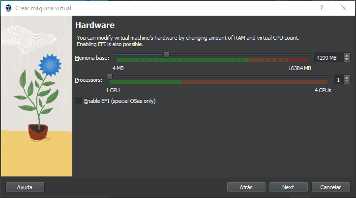
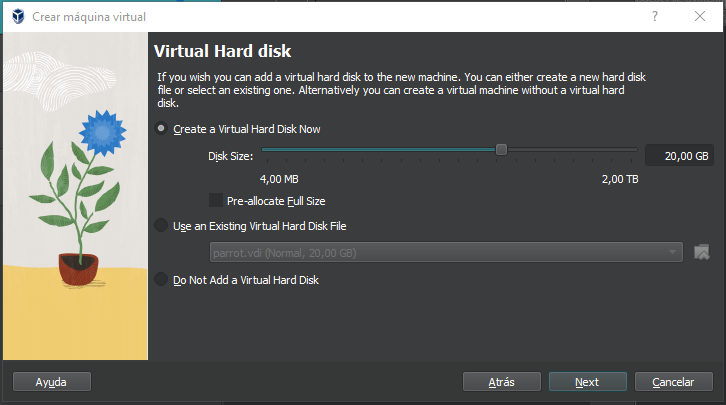
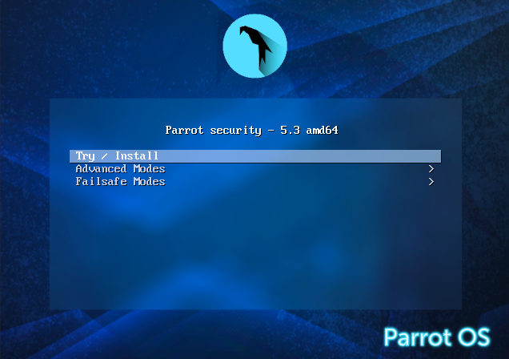
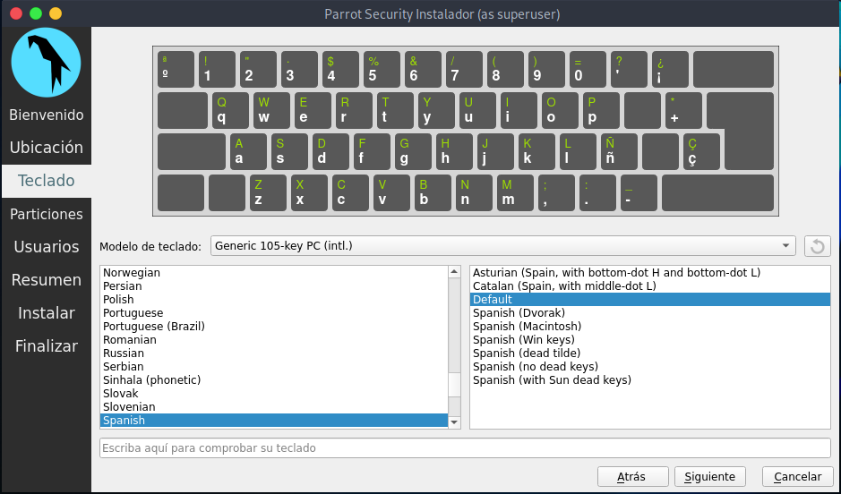

---
tags:
  - Informática
  - Ubuntu-Server
---
# **Tarea comandos 5.1**

1)  **Visualizo la información de todos los usuarios del sistema**
Puedo mostrar el contenido del fichero /etc/passwd
- Cat etc/passwd muestra todo el contenido

- Cut -d: -f1 /etc/passwd, muestra únicamente los nombres de usuarios

2)  **Visualizo la información de todos los grupos del sistema** 
Puedo mostrar el contenido del fichero /etc/group
- Cat etc/group muestra todo el contenido

- Cut -d: -f1 /etc/group, muestra únicamente los nombres de usuarios

3)  **Visualizo la información de todos los usuarios del sistema**
- sudo cat etc/shadow muestra todo el contenido

3)  **creo el usuario Alex desde el entorno gráfico**

5)  **crea el usuario José mediante comandos**
- adduser jose

Enunciado  

