---
tags:
  - Informática
  - DNS
---
# Configuración e instalación de DNS en Ubuntu server

Para instalar y configurar el servicio DNS en Ubuntu server, debemos tener una maquina con la tarjeta de red en NAT, para poder actualizar, upgradear el servidor e instalar el servicio DNS y DHCP, después de esto deberemos cambiar la configuración de la maquina a red interna,

En caso de que la máquina esté recién instalada debemos utilizar los comandos:

1.  sudo apt-get update (para actualizar los paquetes del sistema)
2.  sudo apt-get upgrade (para actualizar los paquetes según los instalados antes)

Para instalar el servicio DNS y DHCP debemos utilizar el comando:
- sudo apt-get install isc-dhcp-server

- sudo apt-get install bind9
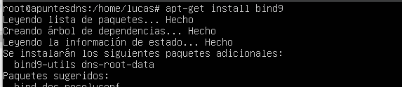

Después de actualizar el sistema e instalar los servicios DHCP y DNS, debemos poner la tarjeta de red en red interna.

Ahora debemos asignar una dirección IP estática al servidor, para ello vamos a la ruta “/etc/netplan” y modificamos el archivo .yaml, antes de modificarlo en recomendable copiarlo por si cometemos cualquier error, para modificarlo utilizamos el comando:
- cp “nombre del archivo que queremos copiar” “ruta/nombre de la copia”
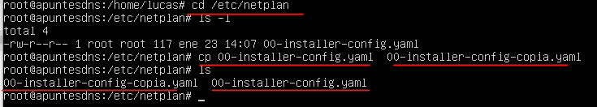

- sudo nano 00-installer-config-yaml”\`

Y escribimos los siguientes apartados cambiándolo por vuestra configuración.
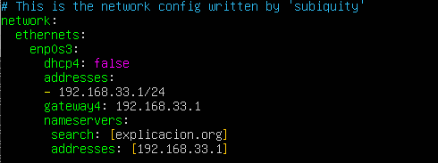

Guardamos (ctrl + o)y salimos (ctrl + x), ahora debemos aplicar la configuración con el comando:
- netplan apply
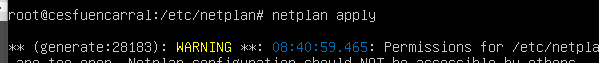

si esta bien configurado lo más probable es que aparezcan varios avisos indicándonos que no es recomendable que todos los usuarios tengan acceso a ese archivo, en caso de que esté mal configurado nos indicará qué línea está mal para que la cambiemos

Una vez hemos configurado una IP estática al servidor vamos a configurar el servicio DHCP, para ello vamos a la ruta /etc/dhcp, y copiamos para evitar problemas el archivo dhcpd.conf, una vez hemos hecho la copia lo abrimos con nano
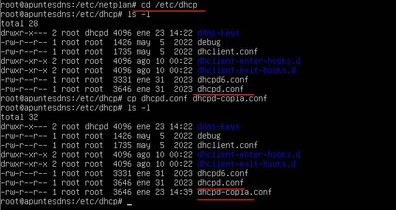

Dentro del archivo buscamos la la siguiente línea, eliminamos los comentarios y rellenamos con la configuración de DHCP que queremos aplicar
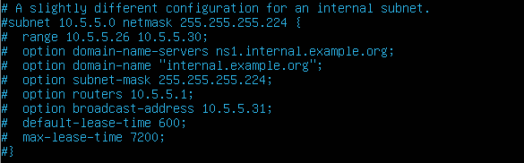

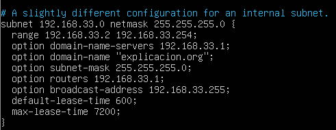

**Ahora reiniciamos el servicio DHCP con el comando:**
- service isc-dhcp-server restart
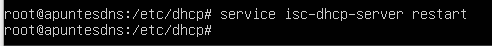

**Comprobamos el estado del servicio con el comando**
- Service isc-dhcp-server status
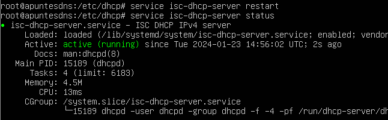

**Ahora vamos a configurar el servicio DNS, para ello vamos a la ruta /etc/bind,**

**La configuración consiste en crear las zonas en el archivo named.conf.local, las cuales apuntaran a un archivo, después de crear las zonas crearemos los archivos a los que apuntan copiando el archivo db.local renombrándolo para usarlo como plantilla. Dentro de esta ruta deberemos escribir las zonas que queremos crear, tanto las directas como las inversas y al archivo al que van a apuntar, en este caso voy a crear 2 zonas directas una llamada explicacion.org y otra llamada cesfuencarral.com, ambos apuntaran a un archivo diferente y una sola zona directa la cual apuntará a otro archivo.**

**La estructura es la siguiente**

**En rojo las zonas directas asignándoles un nombre de dominio, tipo master y asignando la ruta y nombre del archivo que configuraremos después**

**Y en verde la zona inversa poniendo los tres primeros octetos ordenados inversamente seguido de “.in-addr.arpa”, tipo master y especificando la ruta donde lo configuraremos**

**Nos aseguramos de la sintaxis, guardamos y salimos**
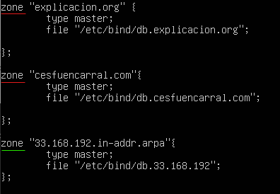

**Ahora vamos a crear los archivos de configuración que hemos asignado antes en el archivo “named.conf.local”, para ello copiamos el archivo db.local y lo renombramos con el mismo nombre que asignamos anteriormente**
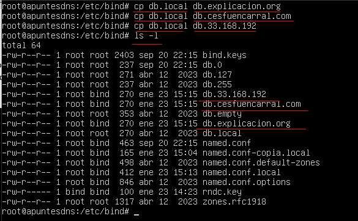

**Ahora los vamos a configurar uno a uno con el comando nano**

**En ellos deberemos reemplazar los apartado “localhost” con el nombre del dominio que estamos configurando, en este caso “explicacion.org”, (es importante dejar el “.” final)**

**En caso de querer añadir un host lo haremos como aparece en la imagen, poniendo el** nombre del host “www” “IN” “A” y la ip del servidor
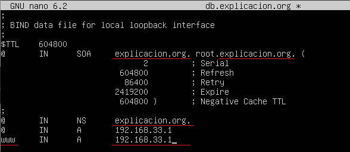

**En la siguiente imagen configuro la zona directa de “cesfuencarral.com”, en ella creo el host “ftp” y le pongo el alias transferencia con la siguiente estructura**
“alias” “IN” “A” “nombre del host”
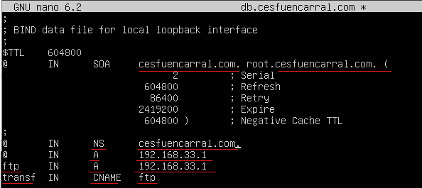

**Ahora vamos a configurar el archivo de la zona inversa, en el debemos como siempre reemplazar el apartado “localhost” por el dominio, luego para añadir el puntero PTR debemos especificar el último octeto de la dirección del servidor,**

en este caso la “1” “IN” “PTR” “dominio.”

**Tal y como aparece en la imagen, estoy añadiendo dos punteros PTR que apuntan a los dos dominios que creamos antes cuya dirección es la acabada en 1**
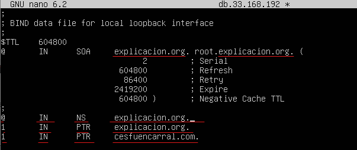

**Comprobamos que las zonas están bien creadas con el comando named-checkzone, (es un comando útil, pero no siempre nos dice todos los errores)**
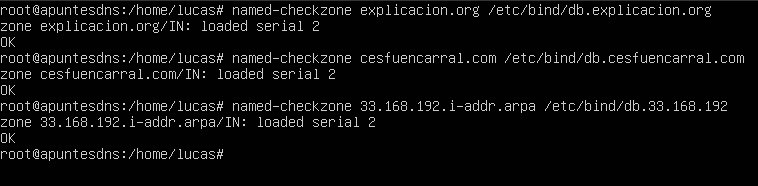

**Ahora debemos reiniciar los servicios y comprobar su estado**

**DHCP**
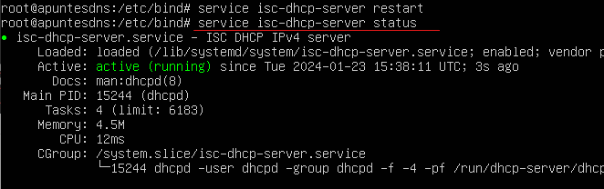

**DNS**
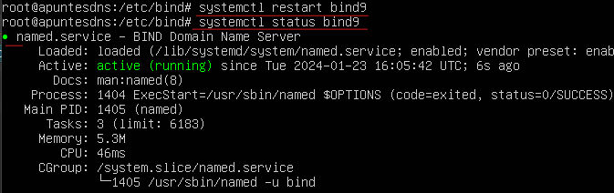

**Ahora para terminar la comprobación vamos a un cliente que tenga  conexión con el servidor y hacemos el comando:**

- nslookup “dominio”

**Windows, comprobación de la asignación con ipconfig y resolución de nombres con nslookup**
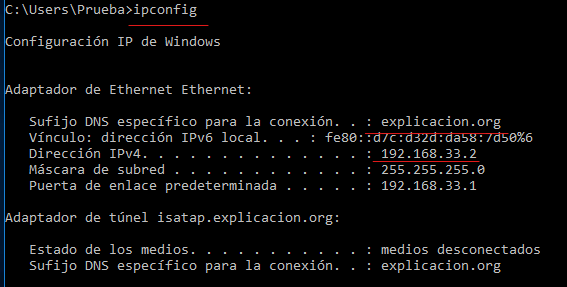

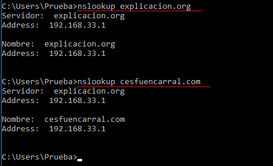

**Linux**
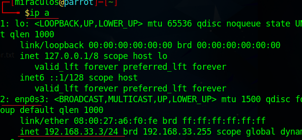

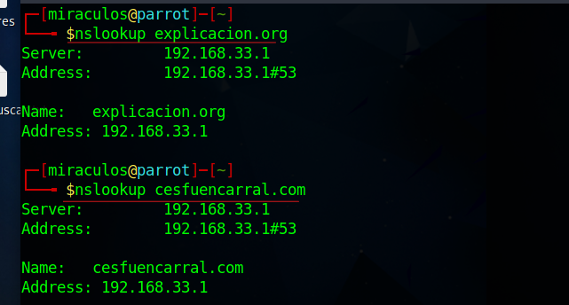
