# **Configuración e instalación de Correo en Ubuntu server**

Para instalar y configurar el servicio Correo en Ubuntu server, debemos tener una máquina con la tarjeta de red en NAT, para poder actualizar, upgradear el servidor e instalar el servicio DNS y DHCP y Correo.

**Debemos asegurarnos que el nombre de nuestro servidor es el mismo que el de nuestro dominio por el cual va a funcionar correo.**

**Para saber el nombre de nuestro servidor utilizamos el comando:**
- **hostname**
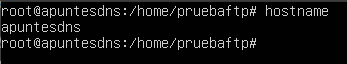

**Para saber el nombre de nuestro dominio vamos a al archivo de configuración de DNS “db.ejemplo”**
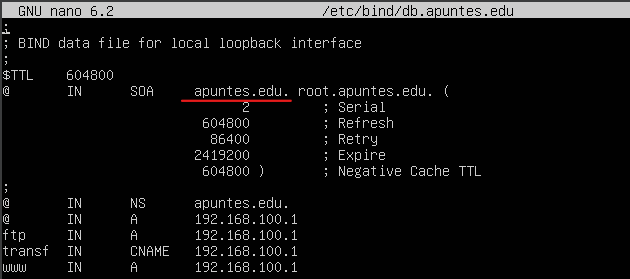

**En caso de que no coincidan podemos cambiar el nombre de nuestronservidor con el comando:**
- hostname “nuevo nombre”

**En este caso mi servidor se llama “apuntesdns” y mi dominio “apuntes.edu” así que cambio el nombre de mi servidor**
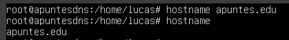

**Para instalar el servicio de correo utilizamos el comando**
- apt-get install Postfix
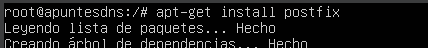

**Después de ejecutar el comando e instalar los paquetes nos saldrá el siguiente panel, en el debemos seleccionar sitio de internet**
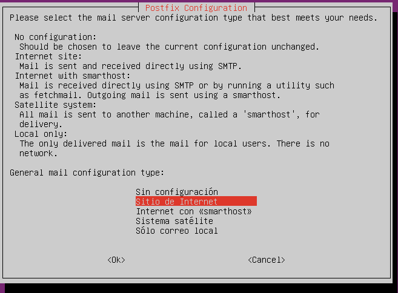

**En el siguiente apartado nos saldrá el nombre de nuestro servidor/dominio, comprobamos que está bien y continuamos**
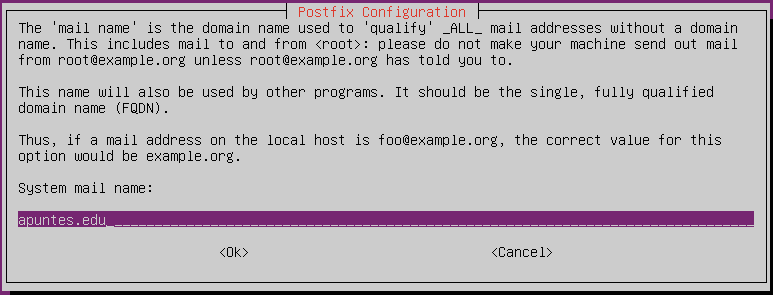

**Podemos comprobar el nombre de nuestro dominio en Postfix podemos verlo haciendo cat en el archivo “/etc/mailname”, en caso de querer cambiarlo simplemente hacemos un nano**
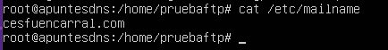

**Ahora creamos los usuarios con el comando:**
- adduser

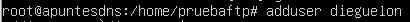

**Con esto ya funciona el servicio de correo, podemos comprobarlo instalando un cliente de correo vía comandos, en este caso mailx**

**Instalamos mailx:**
- apt-get install bsd-mailx

**cambiamos de Usuario con el comando**
- su “nombre del usuario con el que queramos enviar el correo”

**Enviamos el correo a otro usuario con el comando**
- mail “usuario destinatario”

**En este caso se lo estoy enviando al usuario dieguelon, con el concepto “prueba bsd-mailx”, con el mensaje “ola” y poniendo como Cc (copia del correo) mi propio el mail de “miguel”, para poner el Cc pulsamos ctrl+d, rellenamos todos los campos y pulsamos enter para enviar el correo**
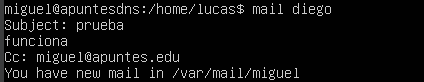

**Podemos comprobar que hemos enviado el mensaje con el comando:**
- mail
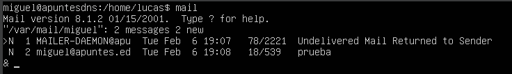

**Si queremos ver el mensaje completo pulsamos “1”**
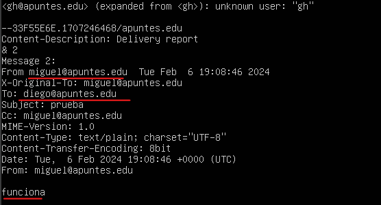

**Ahora instalaremos un servidor de correo, en este caso Dovecot, con el gestionaremos el acceso a buzones de correo**
**Instalamos Dovecot con el comando:**
- apt-get install dovecot-pop3d

**Ahora vamos a configurar el servidor pop, para ello vamos a la ruta (/etc/postfix), y modificamos el archivo (main.cf)**

En este archivo deberemos asegurarnos que en la línea mydestination, está nuestro dominio correctamente y en la línea mynetworks deberemos indicar la dirección IP de nuestra red

Además, deberemos añadir dos líneas, home_mailbox, en la que indicaremos la ubicación predeterminada de los buzones de correo de los usuarios y con mailbox_command indicamos que utilice una configuración predeterminada
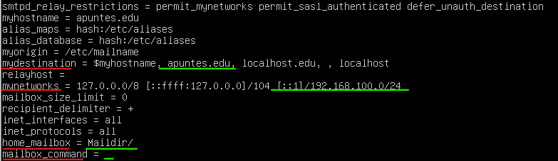

**Guardamos la configuración y hacemos un restart al servicio Postfix**
- Service postfix restart
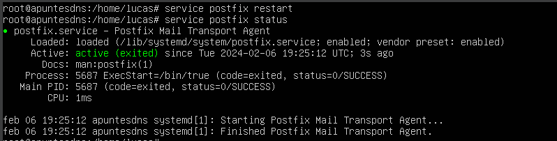

**Ahora para evitar problemas debemos permitir que los clientes puedan enviar sus contraseñas en texto plano a través del servidor Dovecot para la autenticación, para ello vamos al archivo /etc/dovecot/conf.d/10-auth.conf y modificamos la siguiente línea cambiando el “yes” por “no”**
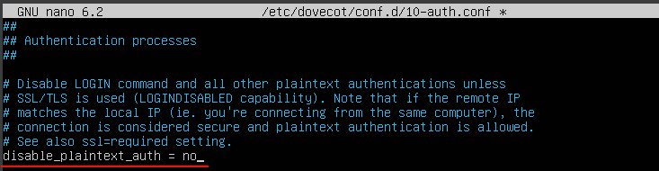

Guardamos y salimos
**Ahora debemos modificar el archivo /etc/dovecot/conf-d/10-mail.conf, este archivo debemos modificarlo ya que previamente modificamos la ubicación del maildir, asi que descomentamos la línea en verde y comentamos la línea en rojo**
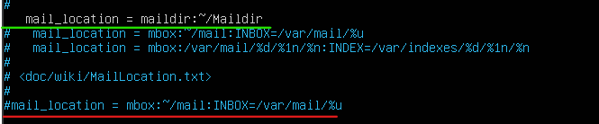

**Ahora reiniciamos el servicio**
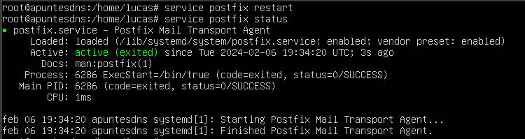

**Ahora deberemos configurar el DNS para especificar el intercambiador de correo y configurar las direcciones smtp y pop3 para que los clientes puedan resolver correctamente**

**Empezamos modificando la zona directa**

**Añadimos:**
- pop3 IN CNAME “IP del servidor”
- smtp IN CNAME “IP del servidor”
- “dominio” IN MX correo.”dominio”

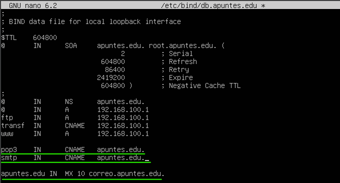

**Con estas líneas he creado un alias para pop3 y smtp que apuntan a la dirección del servidor y el intercambiador de correo, con el luego me conectare al servicio**
Ahora reiniciamos el servicio dns
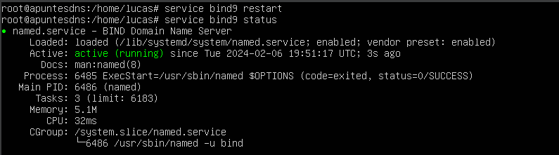

**Comprobamos que hemos configurado correctamente el DNS, desde el cliente utilizando el comando**
- host smtp
- host pop3
- dig -t MX “dominio”
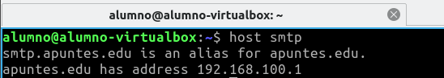

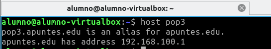

**En caso de no funcionar correctamente, es probable que debas borrar la cache del DNS, para ello utiliza el comando:**
- sudo resolvectl flush-caches
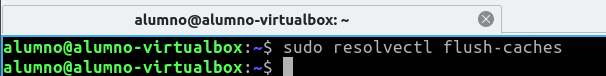

**Ahora debemos instalar el servicio IMAP, para ello necesitamos mysql para que gestione la base de datos de los usuarios**
**Instalamos mysql con el comando:**
- apt-get install mysql-server
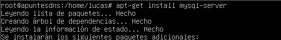

**Después de instalar mysql no debemos configurar nada sobre él, ahora vamos a instalar IMAP:**
- apt-get install dovecot-imapd
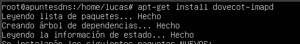

Al contrario que pop3, Imap nos permite alojar los correos en el servidor y poder visualizarlos desde los clientes sin la necesidad de descargarlos

**Ahora simplemente deberíamos comprobar desde un cliente de correo en una maquina cliente con conexión al servidor que podemos iniciar sesión y enviar y recibir correos, utilizaremos Thunderbird.**

**Introducimos las credenciales de uno de los usuario de nuestro sistema y en la dirección de correo pondremos “nombre”@”dominio”**
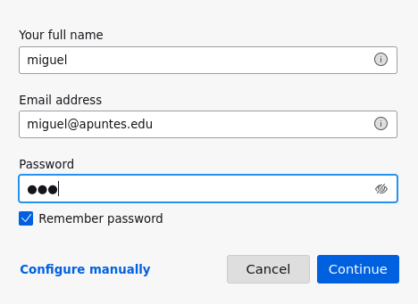
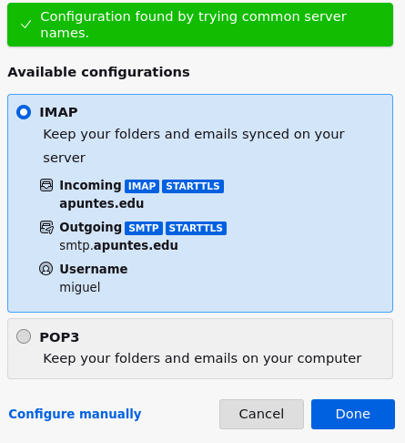

Confirmamos que no utilizara opciones de seguridad y continuamos
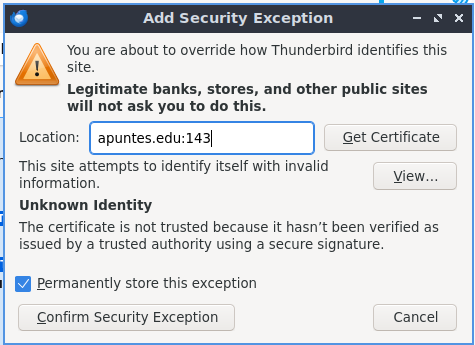

Enviamos un correo a otro usuario de nuestro sistema
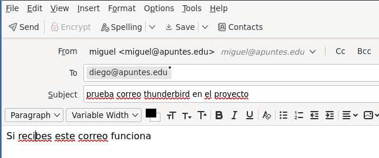

**Iniciamos sesión con el otro usuario y comprobamos**
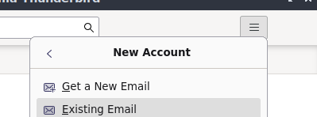

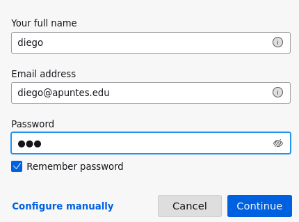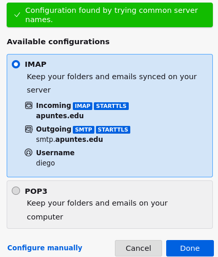

**Nada mas iniciar sesion ya nos llegaria una notificacion del correo que enviamos previamente**
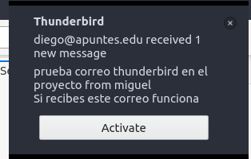

**El correo que enviamos antes:**
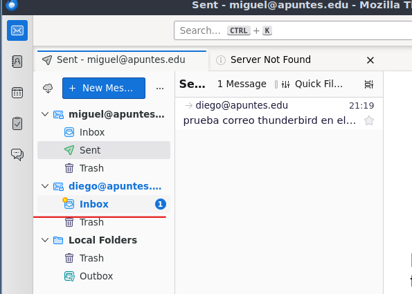
