---
tags:
  - Informática
  - LDAP
---
# **Instalacion y configuracion Servicio LDAP Account manager**

**Para instalar el servicio LDAP utilizamos el comando:**
- apt-get install slapd ldap-utils
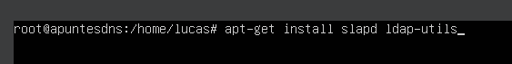

**Cuando se instale deberemos introducir una contraseña al administrador ldap**
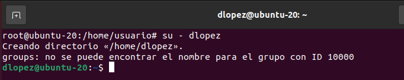

**Para comprobar que el servicio se ha instalado correctamente utilizamos el comando:**
- slapcat
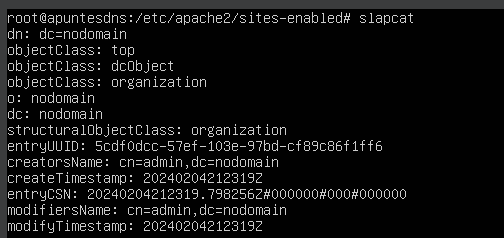

**Para empezar la configuración del servicio utilizamos el comando**
- dpkg-reconfigure slapd

**En esta opción marcamos que no**
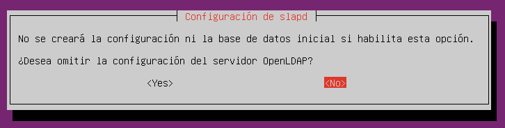

**En esta opción debemos introducir el FQDN de nuestro dominio**
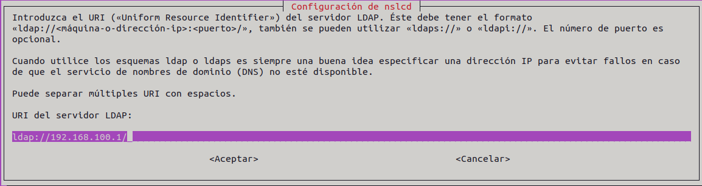

**En el siguiente apartado la netbios/dominio principal**
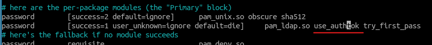

**Volvemos a introducir la contraseña**
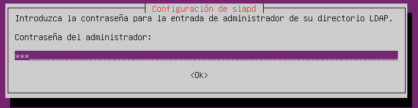

**Marcamos que si en los siguientes apartados**
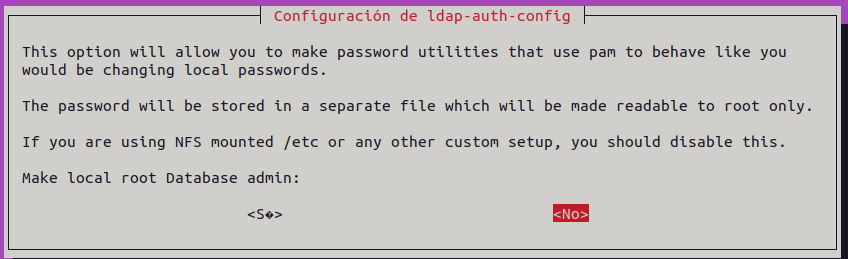

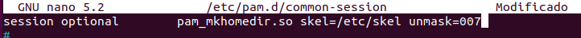

**Para comprobar que se ha configurado correctamente utilizamos el comando que utilizamos anteriormente:**
- slapcat
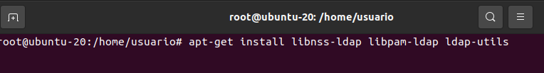

**Ahora deberemos crear unos archivos de configuración con la extensión “ldif”**
- nano base.ldif
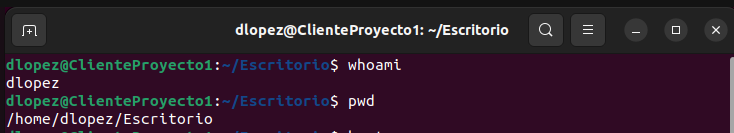

**Dentro de este archivo deberemos introducir la siguiente estructura poniendo en dc nuestro dominio y subdominios**
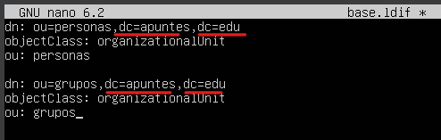

**Para añadir los datos del archivo anterior a LDAP utilizamos el comando:**
- ldapadd -x -D cn=admin,dc=apuntes,dc=edu -W -f base.ldif
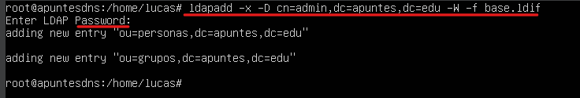

**Volvemos a comprobar que se ha configurado correctamente con el comando**
- slapcat
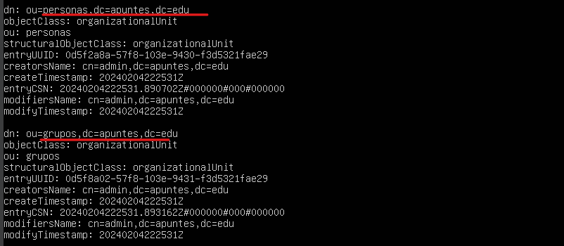

**Para crear un usuario debemos crear un archivo ldif**
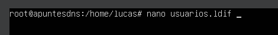

**Dentro deberemos introducir la siguiente estructura**
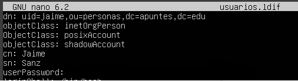

**Para asignar una contraseña al usuario que hemos creado en el archivo anterior utilizamos el comando:**
- slappasswd \>\> usuarios.ldif
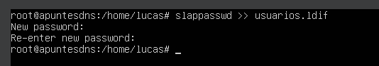

**Con este comando se añadirá la contraseña que hemos introducido encriptada al usuario, podemos comprobarlo abriendo de nuevo el archivo donde hemos creado el usuario**
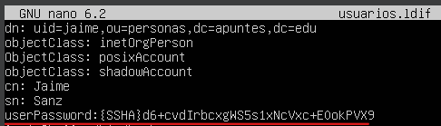

**Colocamos la contraseña en la misma línea del apartado e introduciremos los siguientes apartados al archivo**
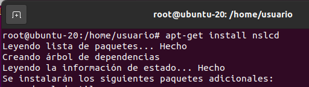

**En ellos especificamos la id del usuario, su grupo y ubicación de su directorio personal**
**Volvemos a añadir los datos que hemos creado utilizamos el comando:**
- ldapadd -x -D cn=admin,dc=apuntes,dc=edu -W -f usuarios.ldif
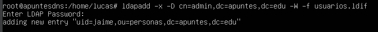

**Comprobamos que se ha creado correctamente con el comando**
- slapcat
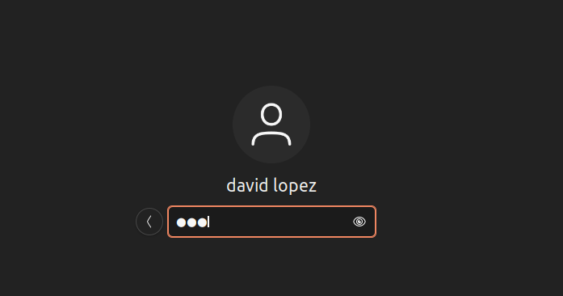

**Para crear grupos utilizamos lo crearemos un archivo “ldif “ e introduciremos la siguiente estructura**
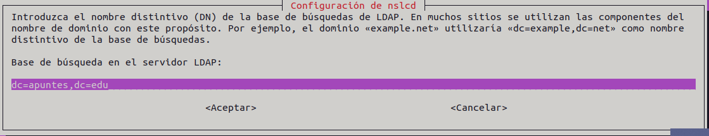

**Guardamos y añadimos la configuración como con los anteriores archivos**
- ldapadd -x -D cn=admin,dc=apuntes,dc=edu -W -f grupo.ldif
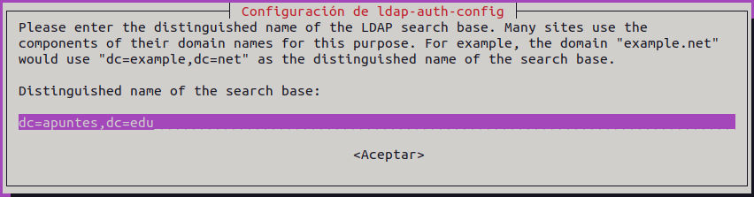

**Podemos ver que se ha añadido correctamente con el comando**
- slapcat
- 
**Ahora deberemos instalar php y apache2 en caso de no tenerlo instalado**
- Apt-get install php php-cgi libapache2-mod-php php-mbstring php-common php-pear
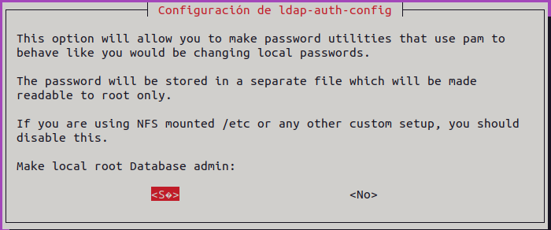

**Ahora debemos saber que version de php tenemos, para ello utilizamos el comando;**
- php -v
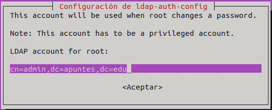

**Ahora debemos utilizar el siguiente comando**
- a2enconf php”version de php”-cgi
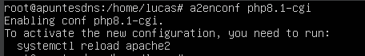

**Ahora debemos hacer un reload al servicio apache**
- service apache2 reload
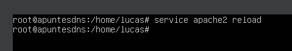

**Para poder conectarnos de forma gráfica desde otro equipo deberemos instalar el servicio ldap-account-manager**
- apt-get install ldap-account-manager
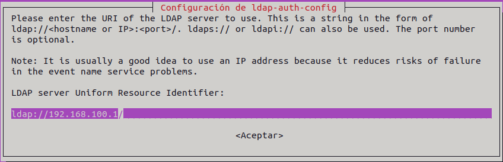

**Ahora para configurar el servicio vamos a la ruta (/etc/apache2/conf-enabled/) en ella está el archivo “ldap-account-manager.conf” que deberemos modificar con nano**
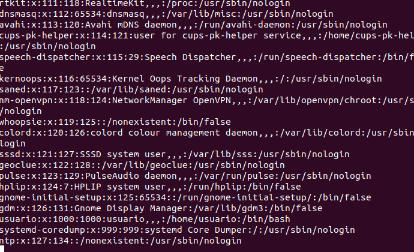

Antes de modificarlo es recomendable hacer una copia de seguridad por si acaso

**Dentro de este archivo deberemos modificar la siguiente línea, en ella estamos indicando desde qué equipos permitimos el acceso, en este caso el local (127.0.0.1) y los quipos de mi red, guardamos y cerramos**
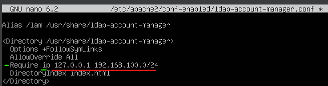

**Después de modificar el archivo de configuración en el que indicamos lo equipos que pueden conectarse al servicio, reiniciamos y comprobamos el estado del servicio apache y ldap:**
- service apache2 restart

Recomiendo reiniciar todos los servicios para evitar problemas

**Ahora si vamos a un cliente y en el navegador introducimos la ip del servidor/lam podremos entrar al panel de configuración del servidor LDAP**

**(Para comprobar todo esto deberemos tener el servidor con una ip estática y con conexión a un cliente en la misma red interna, igual que con el resto de servicios)**
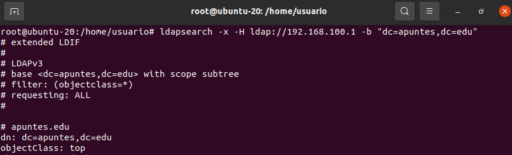

**Si vamos al apartado superior derecho “LAM Configuration” accedemos al apartado “Edit general settings” podemos iniciar sesión con la contraseña por defecto “lam”**
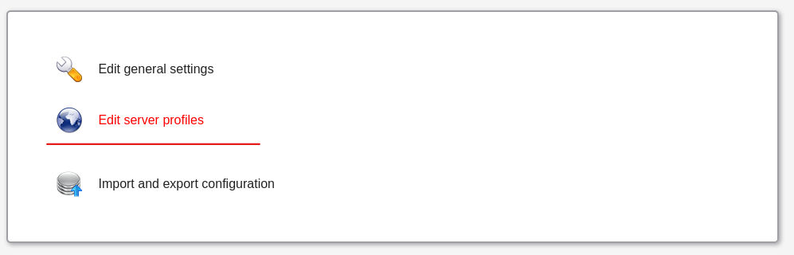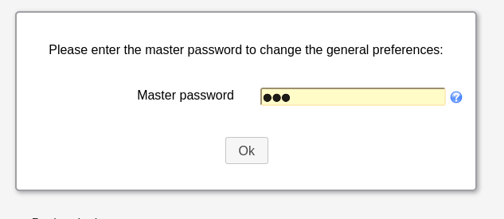

**En los apartados dc ponemos nuestro dominio**
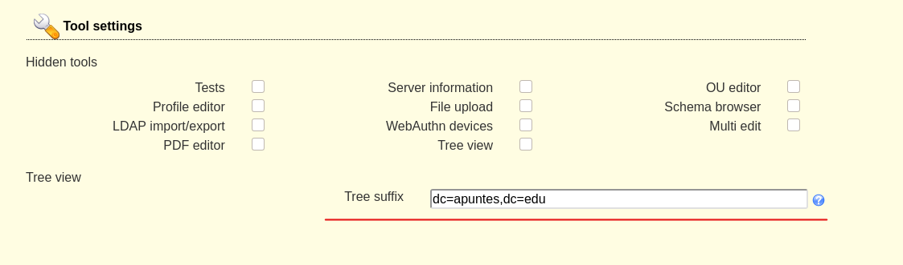

**Cambiamos manager por admin y especificamos nuestros componentes de dominio en dc**
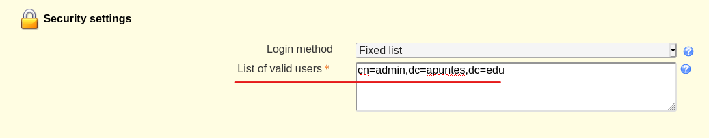

**Cambiamos la contraseña por defecto por una nueva**
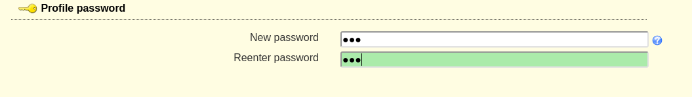

**En el siguiente apartado introducimos nuestros componentes dominio y especificamos donde se crearán los usuarios y grupos**
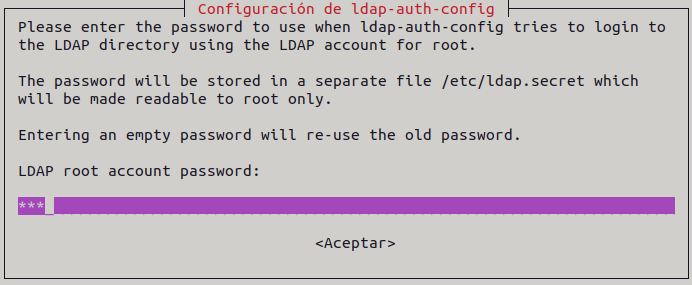

**Guardamos los cambios y nos logueamos con la contraseña que hemos cambiado**
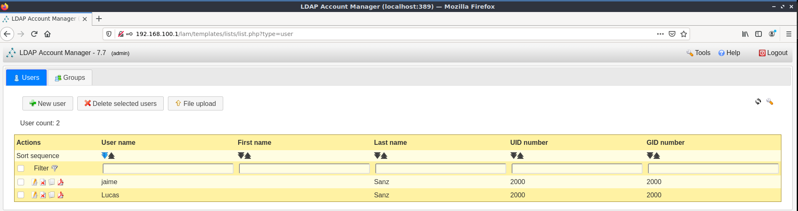

**Desde aquí podríamos gestionar todo el servidor de forma gráfica**

**Webgrafía:**
- [<u>https://www.youtube.com/watch?v=X3wsoPIiVCc&ab_channel=JuanAlonsoColete</u>](https://www.youtube.com/watch?v=X3wsoPIiVCc&ab_channel=JuanAlonsoColete)

- [<u>https://www.youtube.com/watch?v=mL7g35tTZY8&list=TLPQMDQwMjIwMjRAOU-OL29XjA&index=2&ab_channel=ClockworkComputer</u>](https://www.youtube.com/watch?v=mL7g35tTZY8&list=TLPQMDQwMjIwMjRAOU-OL29XjA&index=2&ab_channel=ClockworkComputer)

- [<u>https://www.youtube.com/watch?v=6HkIDr3QF8Y&list=PL_cMwPRE4VsqnInOHFjFnsazA2GinYpZw&index=1&ab_channel=MarcVenteo</u>](https://www.youtube.com/watch?v=6HkIDr3QF8Y&list=PL_cMwPRE4VsqnInOHFjFnsazA2GinYpZw&index=1&ab_channel=MarcVenteo)
