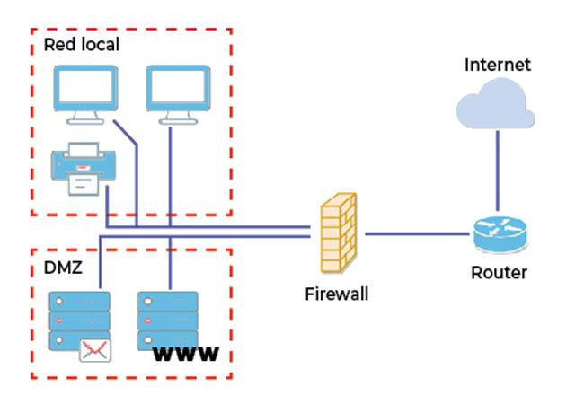
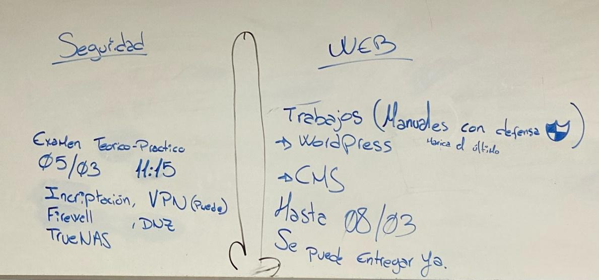

---
tags:
  - Informática
  - Seguridad
---
# **Teoría Seguridad**

**Encriptación**
- La encriptación es el proceso de codificación por el cual ciframos la información, asegurando principalmente tres **factores fundamentales de la seguridad informática**, la **confidencialidad**, **integridad** y **disponibilidad**, existen dos **tipos de cifrado**, de clave **simétrica** y clave **asimétrica**

**Confidencialidad:**
- La información únicamente será accesible a los usuarios autorizados

**Integridad:**
- La información no se perderá o modificará durante el proceso

**Disponibilidad:**
- La información será disponible a los usuarios autorizados

**Cifrado simétrico:**
- La información se cifra y descifra con la misma clave, ejemplos: cesar, AES, RC5…

**Cifrado asimétrico:**
- La información se cifra con una clave por el emisor y el receptor la descifra con otra clave diferente

**Firewall**
- Un corta fuegos o firewall, es una herramienta de software que permite bloquear el tráfico de la red, pudiendo evitar las conexiones no deseadas.

**Proxy**
- Un proxy es una herramienta de software similar a un firewall, pero mientras un firewall únicamente permite bloquear o permitir el tráfico, el proxy nos permite filtrar y administrar el tráfico de la red más a fondo, pudiendo filtrar el tráfico sin tener que bloquear un puerto completamente.

- Mientras que el firewall funciona en las capas de red y transporte el proxy funciona únicamente en la capa de aplicación, de tal forma que el firewall analiza información como direcciones IP, puertos… y el proxy filtra el contenido de la capa de aplicación

**DMZ**
- DMZ o Zona Desmilitarizada, es una medida de seguridad informática, que consiste en una red intermediaria entre la red interna y el exterior, dentro de esta red se sitúan servicios como Servidores DNS, WEB, de correo… etc, los cuales deben ser accesibles por el exterior, al colocarlos en la DMZ en lugar de la red interna se consigue que los servicios sean accesibles por el exterior sin necesidad de que accedan a la red interna y así evitando ponerla en riesgo.

- Desde el exterior se puede acceder a la DMZ, pero no a la red interna

**VPN**
- Una VPN o Red Privada Virtual, es una tecnología de seguridad informática que permite crear una conexión segura y cifrada entre dos puntos de dos redes, algo así como un túnel entre dos redes por el cual la información pasa de una red a otra cifrada de un extremo al otro.

**Algunos usos que se les da a las VPNs son:**

- Obtener una ubicación virtual, esto se consigue mediante la conexión a un servidor VPN el cual puede estar ubicado en cualquier parte del mundo.

- Acceder a recursos de una red como archivos, aplicaciones o servicios de forma remota y segura.

**TrueNas**
- TrueNas es un sistema operativo enfocado a gestionar redes de almacenamiento proporcionando herramientas destinadas a dicho propósito

##### **Sistemas de almacenamiento:**

**NAS**, (Network Attached Storage), almacenamiento conectado en red, es una tecnología de almacenamiento dedicada a compartir la capacidad de almacenamiento de un ordenador servidor
con equipos personales o servidores clientes a través de una red.

**SAN** (Storage Area Network), **red de área de almacenamiento**, es una red de almacenamiento integral que se utiliza en entornos empresariales. La cual está dividida principalmente en dos
redes, una para la comunicación entre clientes y servidores y otra para los dispositivos de almacenamiento

**DAS** (Direct Attached Storage), consiste en una conexión directa del ordenador a los datos en lugar de conectarlo con un Router o NAS

He basado la información del repaso en función de lo que pusieron en la pizarra que entraba de seguridad en la segunda evaluación.

