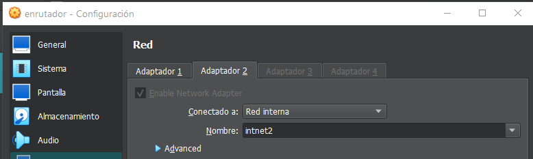
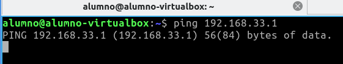
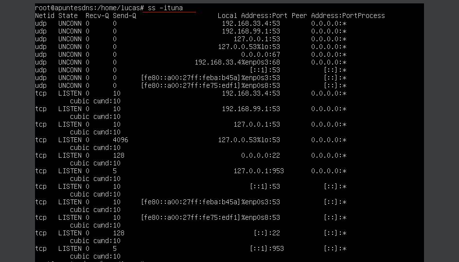
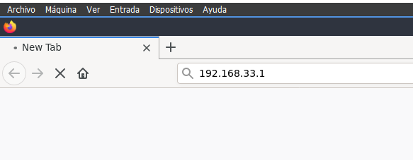
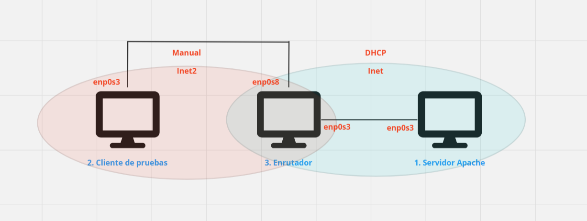
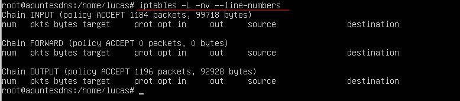
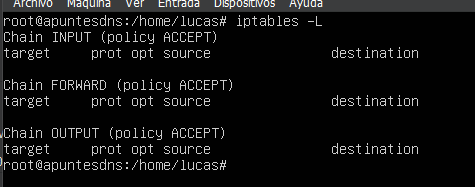
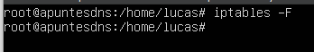
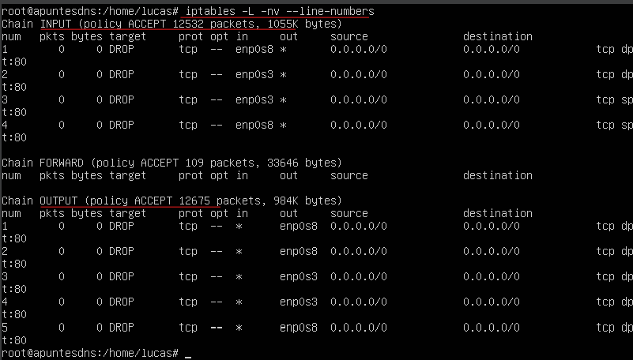

---
tags:
  - Informática
  - Seguridad
---
Resumen:

La práctica consiste en utilizar cifrado simétrico y asimétrico con
openssl para simular un caso en el que alguien cifra un mensaje y un
receptor lo descifra, openssl es una herramienta que permite cifrar y
descifrar mensajes, generar claves semilla/públicas/privadas, creación
de certificados x509, CSRs y CRLs entre otras funciones

**Índice:**

1.  **Cifrado simétrico**

    1.  **Crear archivo texto plano**
    2.  **Codificar el archivo en base64**
    3.  **Cifrar el archivo codificado en base64**
    4.  **Descifrar el archivo**
    5.  **Decodificar el archivo descifrado**

2.  **Cifrado asimétrico**

    1.  **Crear archivo de texto plano**
    2.  **Crear clave semilla**
    3.  **Crear clave privada a partir de la clave semilla**
    4.  **Crear clave publica a partir de la clave semilla**
    5.  **Cifrar el archivo de texto plano con la clave publica**
    6.  **Descifrar el archivo cifrado con la clave publica con la clave privada**

Parámetros de los comandos de openssl a tener en cuenta

- **enc** = encriptar
- **-in** = archivo de entrada del comando
- **-out** = archivo de salida del comando
- **cbc/ebc** = modos de cifrado
- **-d** = desencriptar
- **Archivo pem**: los archivos pem están codificados en base64 por defecto lo que nos evita tener que crear un archivo de texto plano y luego codificarlo
- **des3** = algoritmo de cifrado
- **pubout** = clave pública como (Aquí no se termino la oración)

### **Cifrado simétrico**

**Validó la versión de openssl con el comando**
- Openssl version

**1.1 Creó un archivo de texto con el comando**
- Nano

**1.2 Codifico el archivo de texto con el comando**
- **o**penssl enc -base64 -in lucas.txt -out lucas.base64

**Con esto tengo dos archivos uno en texto plano y otro codificado en
base64**

**1.3 Ahora ciframos el archivo codificado en base64 con el comando:**
- openssl enc -aes-256-cbc -in lucas.base64 -out lucascifrado

**Asignamos una contraseña al cifrado y listo**

**1.4 Para descifrar el archivo primero hay que decodificarlo con el comando:**
- openssl enc -aes-256-cbc -d -in lucascifrado -out lucasdecodificado

**Utilizamos la contraseña anterior para ello y listo**

**1.5 Después de decodificar el archivo podemos descifrarlo con el siguiente comando:**
- openssl enc -base64 -d -in lucasdecodificado -out lucasdescifrado

**Podemos comprobar que el contenido del archivo es el mismo que escribimos al principio**

***En esta última foto podemos apreciar el proceso en orden de izquierda a derecha de como hemos creado un archivo de texto plano, luego lo hemos codificado en base64 para después cifrarlo con una contraseña la cual es supuesto receptor debería utilizar para descifrarlo y finalmente decodificarlo para obtener de nuevo el texto plano.***

***Esto es cifrado simétrico, se ha utilizado la misma clave para codificarlo y decodificarlo***

### **Cifrado asimétrico**
**2.1 Creamos un archivo de texto plano con el comando**
- nano

**2.2 Ahora vamos a crear la “Clave semilla” para generar la clave publica y privada, para ello utilizamos el comando:**
- openssl genrsa -out lucasseed.pem

**2.3 Una vez hemos creado la clave semilla, generamos la clave publica a partir de ella con el comando:**
- openssl rsa -in lucasseed.pem -des3 -out lucasprivkey.pem

**Asignamos una contraseña a la clave y listo**
**2.4 Ahora generamos la clave publica a partir de la clave semilla con el comando:**
- openssl rsa -in lucasseed.pem -pubout -out lucaspublickey.pem

**En esta foto podemos ver la Clave “semilla” y las clave publica y privada creadas a partir de ella**

**2.5 Una vez tenemos generadas ambas claves (publica y privada), vamos a cifrar el archivo de texto que creamos antes con la clave publica con el comando:**
- openssl rsautl -encrypt -in lucas.txt -inkey lucaspublickey.pem -pubin
  -out lucastextcifrado

**2.6 Después de cifrar el archivo con la clave publica lo desciframos con la clave privada con el comando:**
- openssl rsautl -decrypt -inkey lucasprivkey.pem -in lucastextcifrado
  -out lucastextdescifrado

**Introducimos la contraseña de la clave privada y listo**

**En esta foto podemos ver el archivo de texto original, el cifrado con la clave publica y el descifrado con la clave privada, y comprobar el contenido no ha cambiado**

***Esto es cifrado asimétrico, hemos utilizado una clave para cifrar y otra para descifrar***
