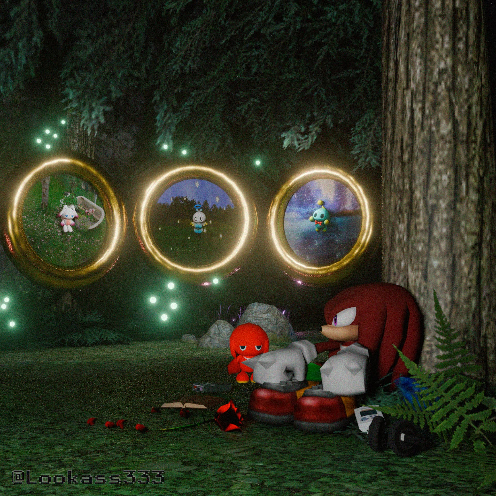
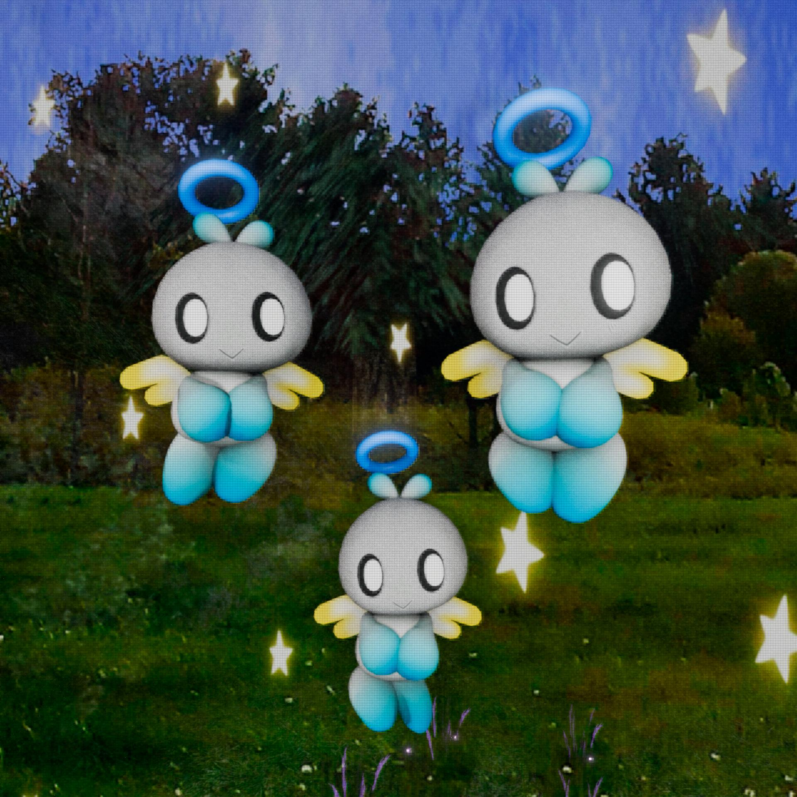
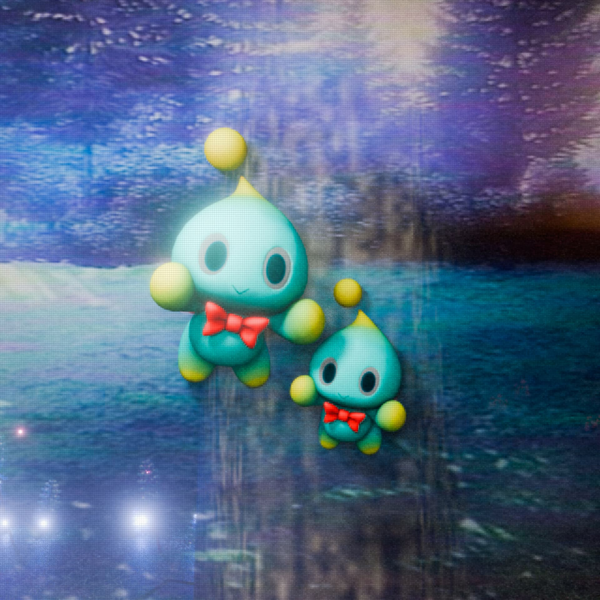
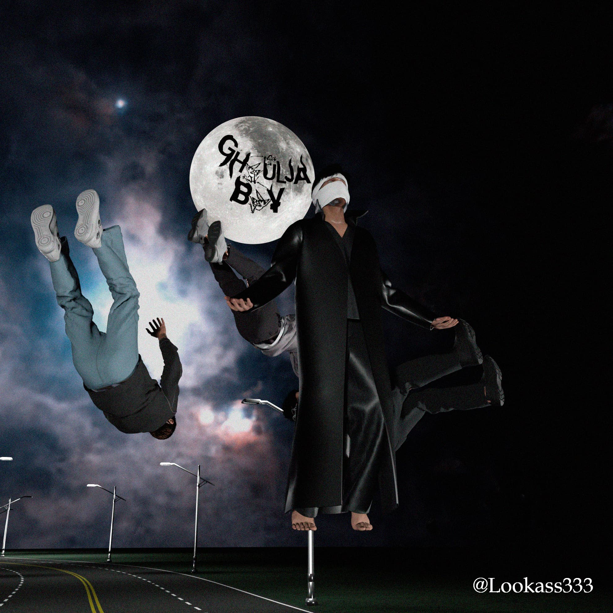
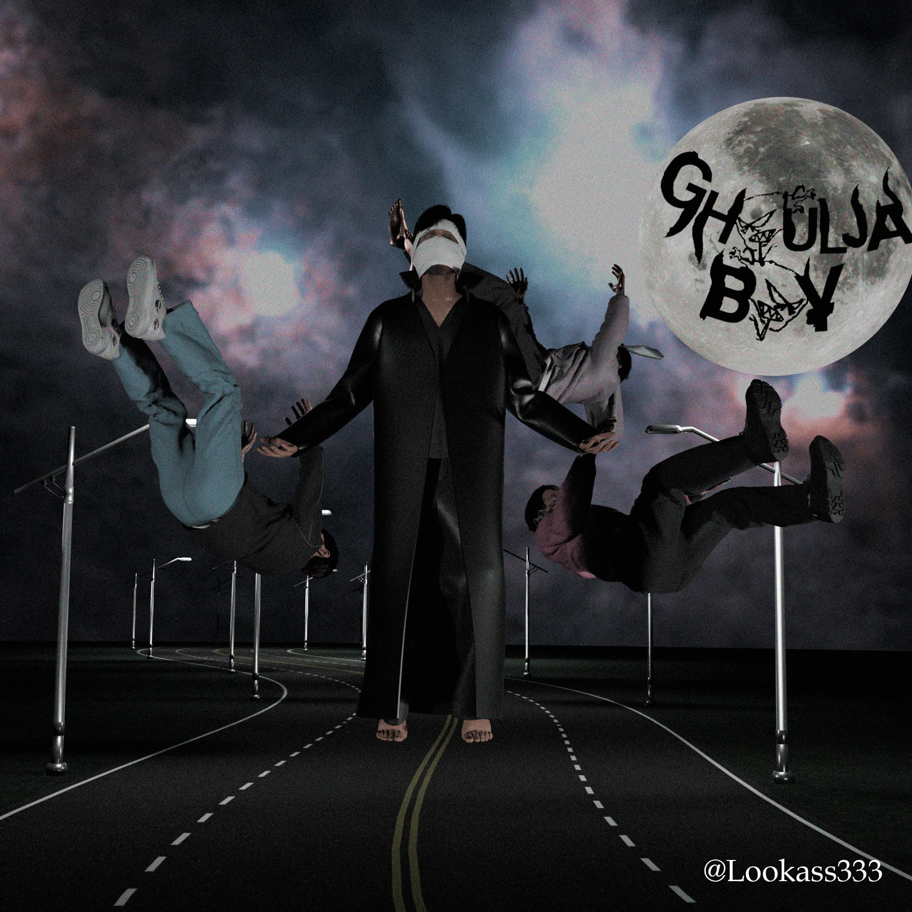
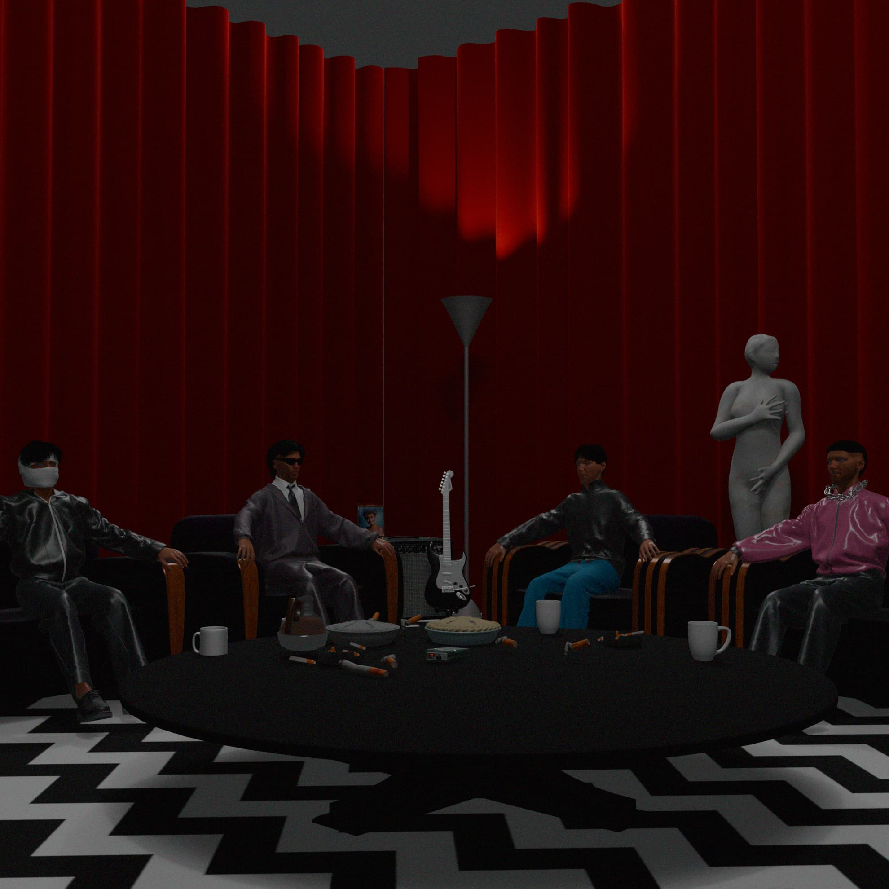
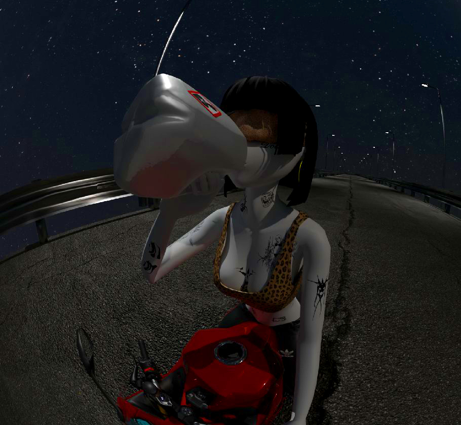
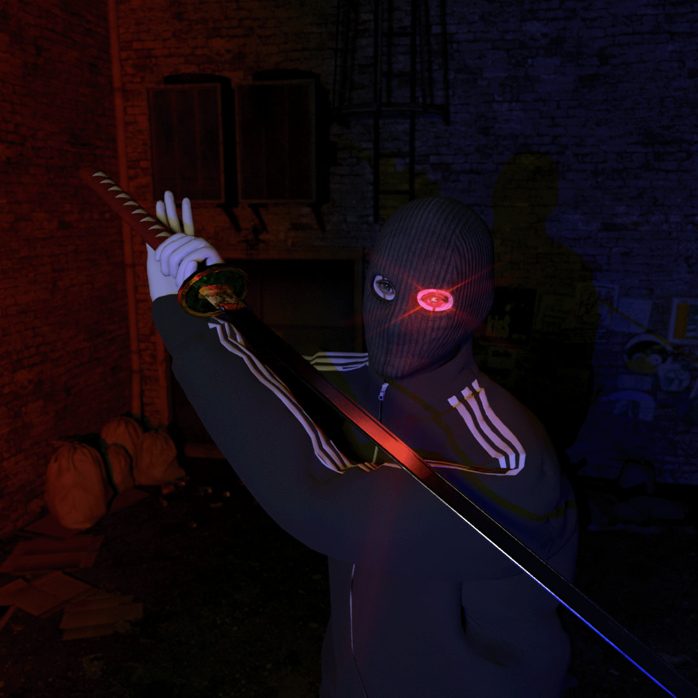
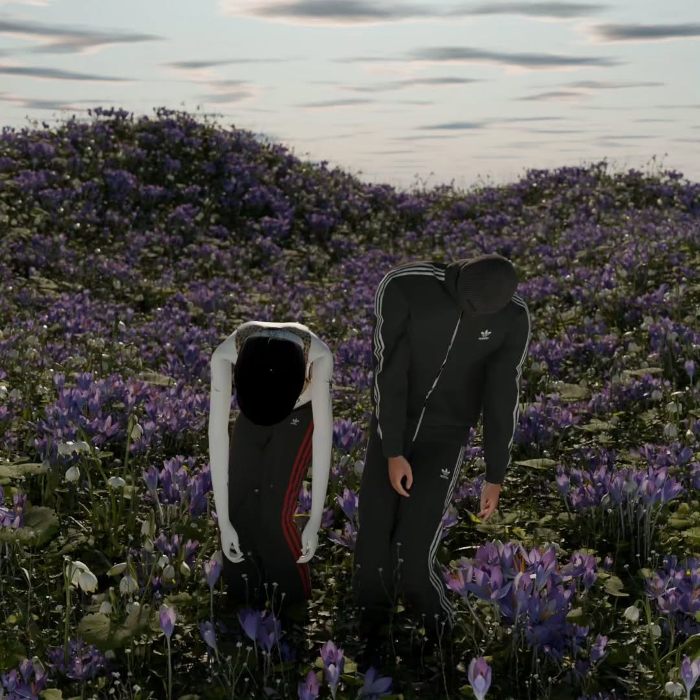

---
tags:
  - Proyectos
---
# 9ckles
___

>[!info] Esta escena 3D está inspirada en el artista musical 9Ckles, el concepto surge de su seudónimo e imagen utiliza en redes, la cual hace referencia al personaje Knuckles de la saga de los videojuegos Sonic, por ello utilice elementos del universo del videojuego para asociar elementos de su discografía al imaginario del personaje.
  

# Ghouljaboy
___

>[!info]Esta escena 3D está inspirada en el personaje Dante del universo musical del artista Ghouljaboy, la escena representa el alzamiento del personaje en su canción homónima, exactamente al momento en el que dice “estoy flotando con los pies descalzos en medio de una autopista creo que me va a dar algo”.   Para la creación de esta escena utilice Metahuman creator de Unreal engine 5 para crear avatares digitales de Ghouljaboy, para la creación del vestuario de los personajes utilice Clo3D, para el escenario y la composición de los elementos hice uso de Blender y de Photoshop para los detalles finales de la imagen.

  
# VitaCora x OpiumBulgaria
___

>[!info]Estas son algunas de las escenas en las que colabore con @Opiumbulgaria mi rol principal fue la creación del vestuario de los personajes y la postproducción de los renders.