---
tags:
  - Signos-Símbolos
---
**Escudos de armas, uso simbólico, emblemático y reglamentación estética de la heráldica.**

# **Definición, origines y evolución de la heráldica como sistema de comunicación**
La heráldica es la es la ciencia del blasón, y el blasón es el arte de explicar y describir los escudos de armas, de cada linaje ciudad o persona.

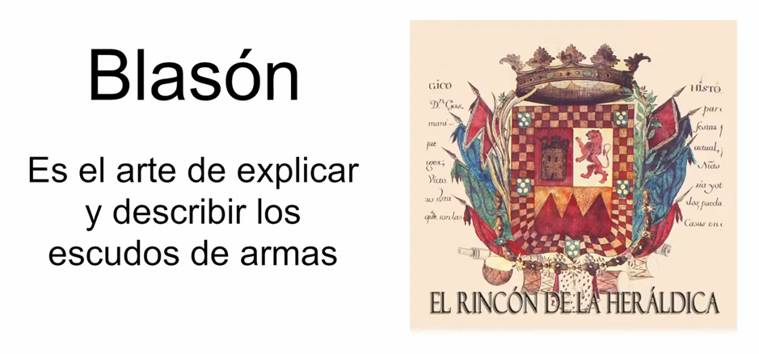

Tiene su propio lenguaje que es la lengua vernácula y puede ser oral o escrito, esto es un sistema de comunicación visual que se desarrolló durante la edad media en toda Europa occidental para convertirse en un código de identificación de personas.

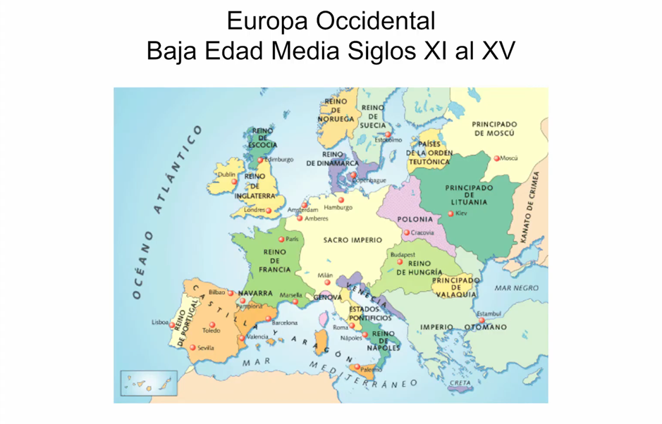

La investigación histórica concluye que su origen comienza en el siglo 11 cuando se vuelve necesario pintar los escudos de los caballeros para identificar en batalla a qué bando pertenecían también en torneos y justas ya que la evolución del equipamiento militar ocultaba sus cuerpos completamente y esto hacía imposible el reconocimiento.

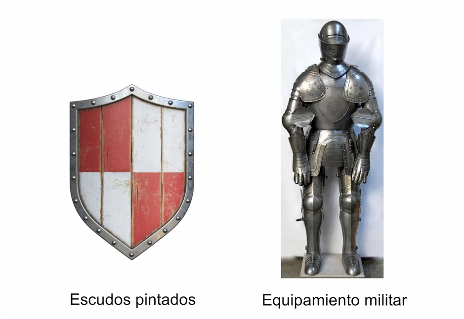

Este lenguaje nacido en el seno de una clase social militar progresivamente se fue incorporando dentro de la nobleza y la iglesia católica para identificación de linajes y miembros de la jerarquía más tarde se expande de tal manera que toda familia persona noble o no noble territorios ciudades y más poseían un escudo de armas.

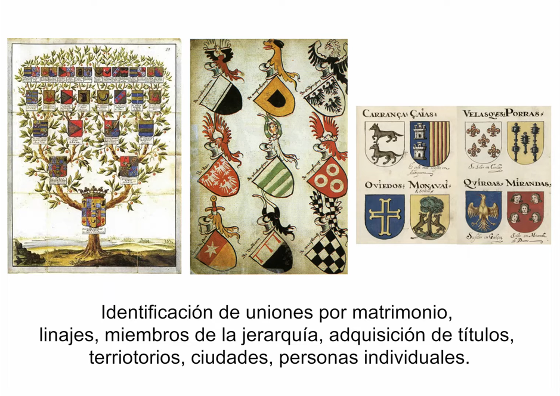

podríamos definir al escudo de armas como una representación gráfica con forma de escudo que contiene los emblemas y a veces también los lemas que representan simbólicamente una nación una ciudad un linaje entre otros.

Este escudo cumplía la función de búsqueda afirmación y proclamación de la identidad de individual familiar o feudal.

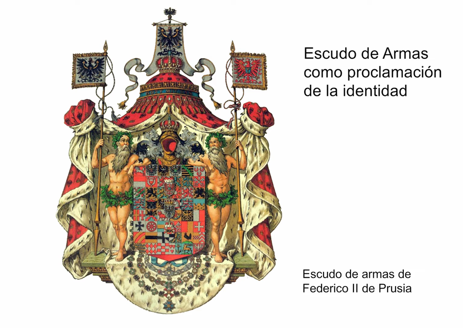

## **Función de los heraldos**
El blasónamiento es la descripción de los escudos de armas, estaba a cargo de los heraldos, quienes inicialmente actuaban de mensajeros e identificadores de los emblemas de las caballerías en batalla y eran también los encargados de anunciar en torneos y justas a los caballeros describiendo las imágenes que portaban en sus escudos.

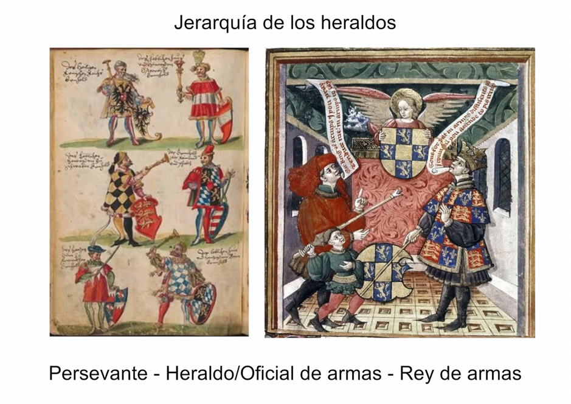

Con el pasar de los siglos su rol se volvió fundamental y se posicionarán dentro de la nobleza con sus propias jerarquías siendo su mayor rango reyes de armas, sus funciones son las que determinan a la heráldica como una verdadera ciencia,

como expertos lectores constructores y recopiladores de los escudos de armas establecieron una estricta reglamentación para la simbología heráldica.

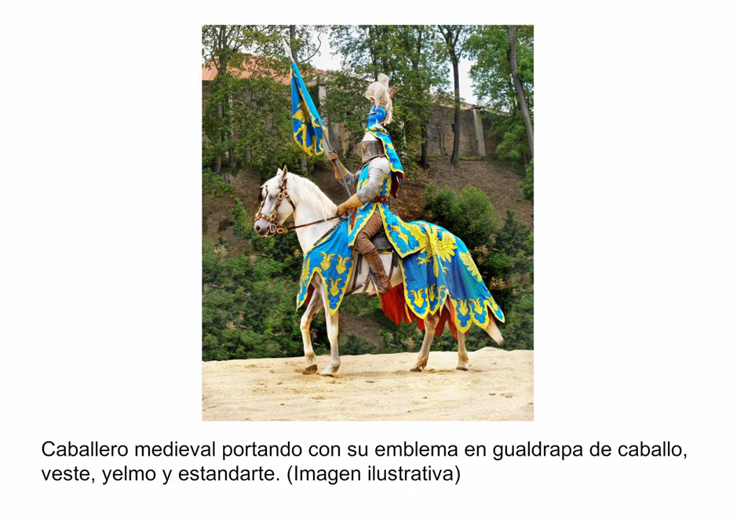

## **Elementos de la simbología**
Si bien no todos los escudos tienen figuras si tienen colores y se dividen en dos grupos, el primer grupo para los colores rojo verde azul negro y el púrpura que era utilizado sólo por la nobleza, el segundo grupo representa metales siendo el amarillo para el oro y el blanco para la plata era una severa condición no superponer ni yuxtaponer colores del mismo grupo ni mezclar oro y plata el escudo de la iglesia católica es la única excepción a la regla de los metales.

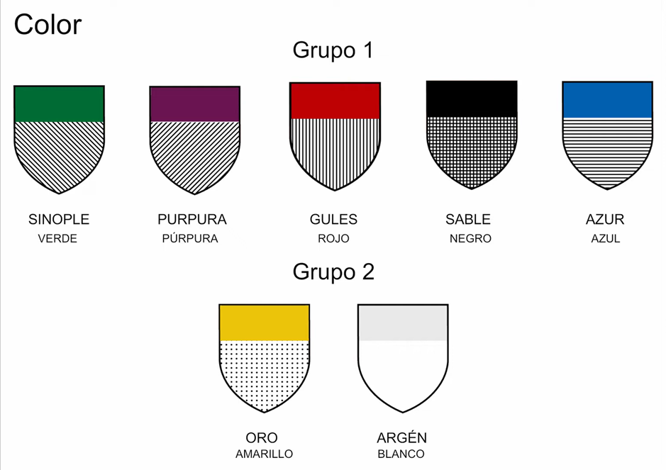

Respecto de las figuras se observan simples vegetales de construcciones objetos armas animales imaginarias y menos frecuentemente humanas.

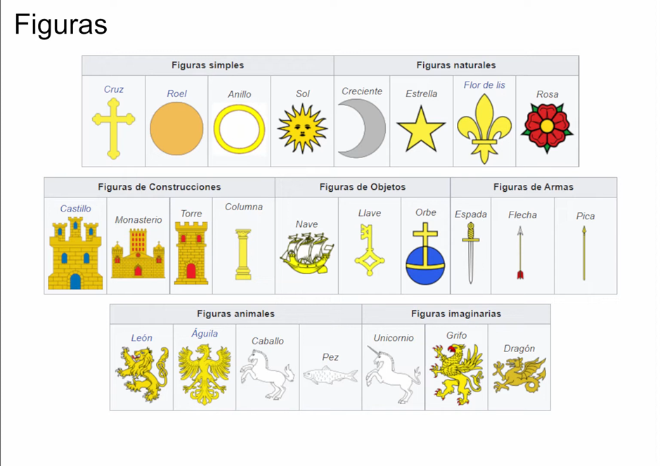

Otro rasgo de los escudos es la presencia de la geometría que tiene que ver con las piezas honorables estas son las insignias de la orden de caballería.

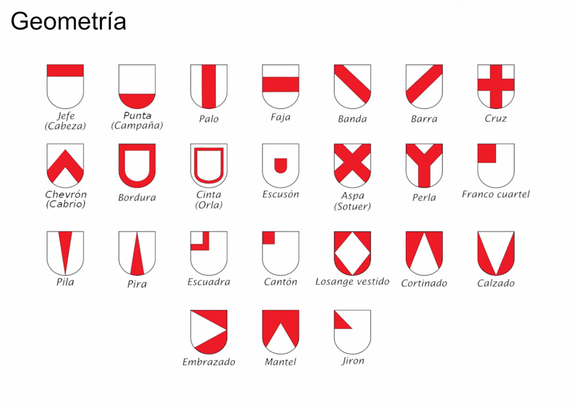

Cada región adopto también su propia morfología en sus escudos.

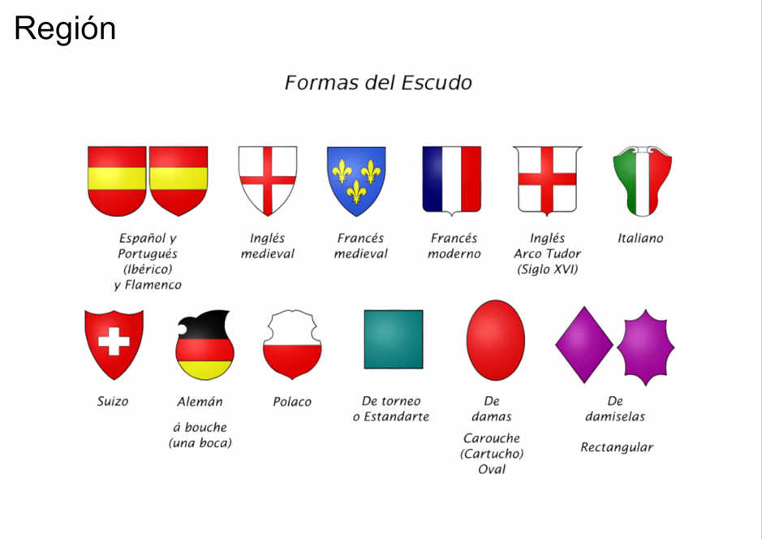

A partir del siglo 15 los reyes de armas empleaban la confección de los armoriales, registros ilustrados de los escudos de diversos linajes con su ornamentación y también incluyendo las ciudades.

En un inicio lo hacían en rollos de pergamino y luego en libros llamados códices miniados.

Los escudos originales eran hereditarios solo al primogénito e hijas mujeres que al contraer matrimonio se fusionaban con el del esposo, los siguientes hijos y familiares debían hacerle una grisura es decir una modificación.

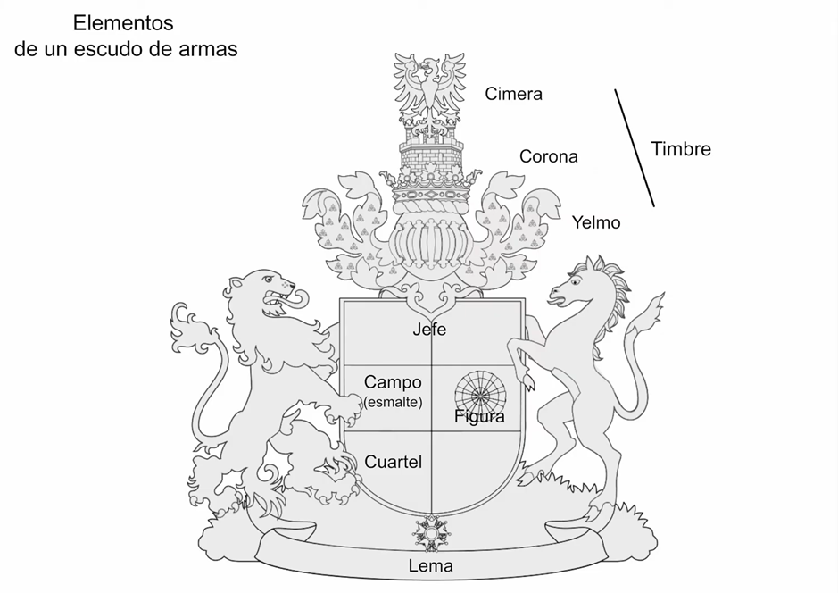

## **Estudio de caso: Escudo de armas del linaje Aragón**
Como ejemplo, el escudo de armas del linaje Aragón producto del matrimonio entre Petronila de Aragón y el conde ramón Berenguer cuarto de Barcelona.

El primer escudo posee una cruz roja con cuatro cabezas con turbantes representando el territorio y la expansión tras la conquista de Huesca en el año 1096

El segundo representa las cintas de seda roja que colgaban de los documentos que se enviaban entre el reino y la santa sede

El tercero de campo azul con cruz patada para representar el espíritu de resistencia ya que durante una batalla contra los musulmanes apareció una cruz de plata en el cielo.

El último con cruz latina sobre la labor de encina representa a los habitantes pirenaicos, orientales y occidentales que fueron aliados contra los musulmanes
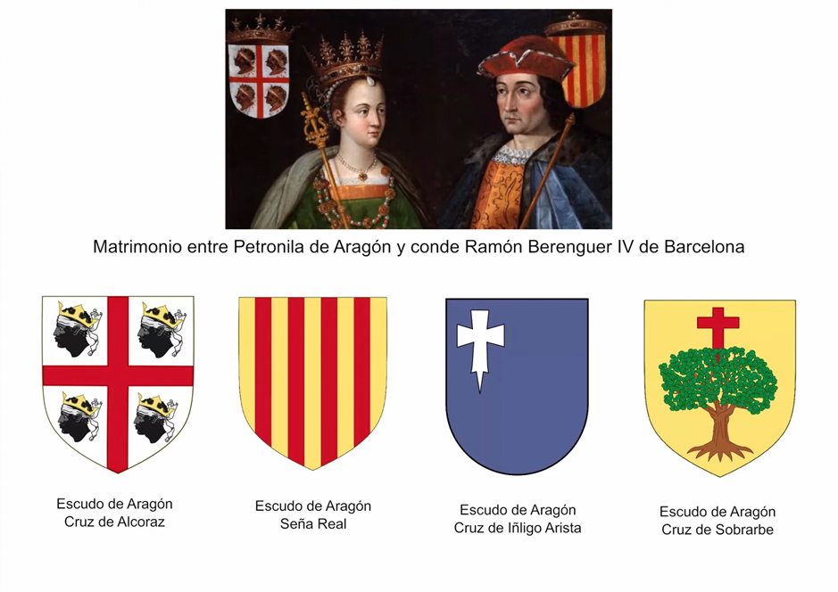

finalmente, sobre el escudo se encuentra una corona real que representa la antigüedad del reino Aragón existente durante más de dos siglos

La descripción heráldica es escudo cuartelado en cruz formado por cuatro cuarteles:

primer cuartel sobre campo de oro una encina desarraigada con siete raigones en sus colores naturales coronada por la cruz latina cortada de gules.

segundo sobre campo de azul cruz patada de plata apuntada en el brazo inferior y adiestrada en el cantón del jefe

tercero sobre campo de plata una cruz de san Jorge de gules cantonada de cuatro cabezas de moro de sable y encintada de plata

cuarto sobre campo de oro, cuatro para los goles iguales entre sí y a los espacios del campo todo el escudo timbrado de corona real abierta de ocho florones cuatro de ellos visibles con perlas y ocho flores de lis cinco visibles con rubíes y esmeraldas en el aro en proporción con el escudo medio de dos y medio a seis.
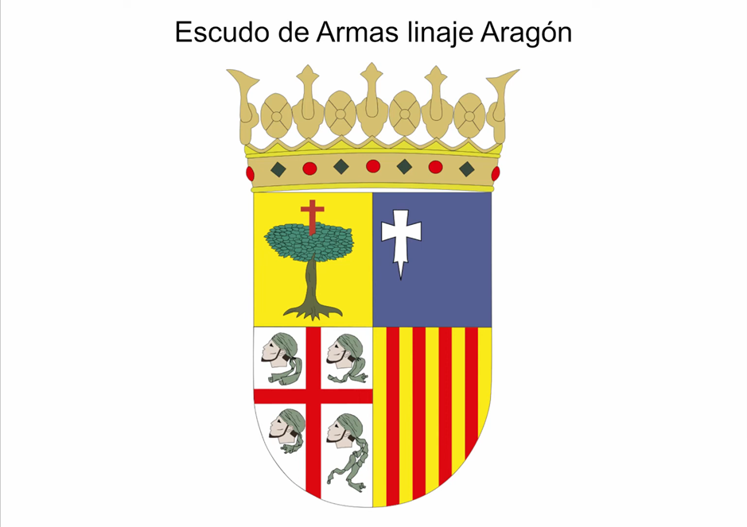

este complejo sistema de comunicación continúo desarrollándose con el correr de los siglos hasta la actualidad donde podemos encontrarlo y reconocerlo en escudos de fútbol banderas nacionales, banderas de universidades entre otros tantos.
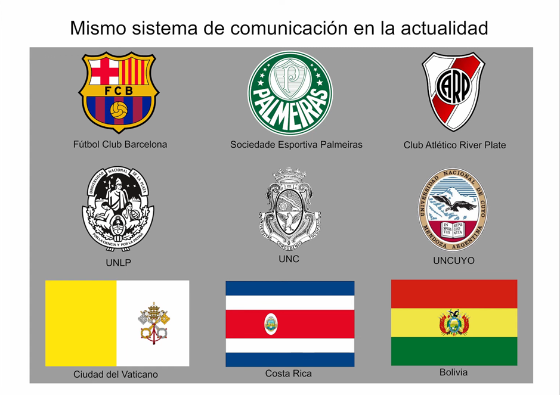
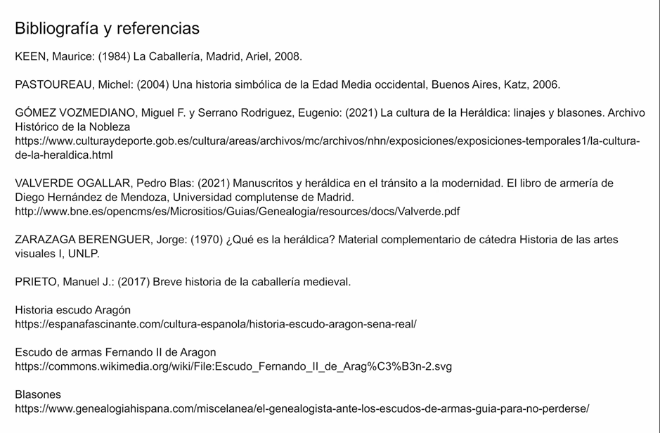