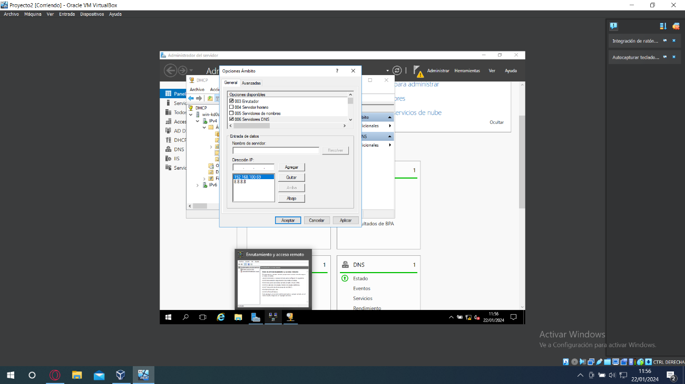
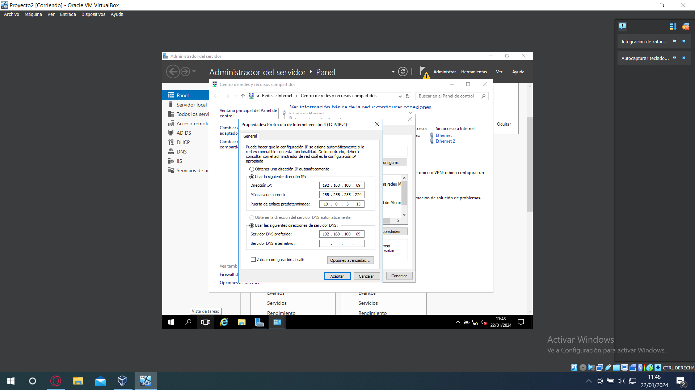
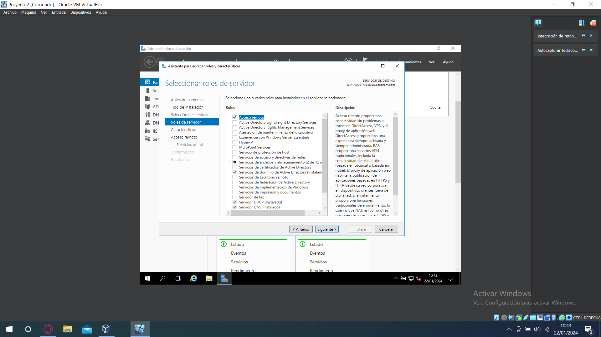
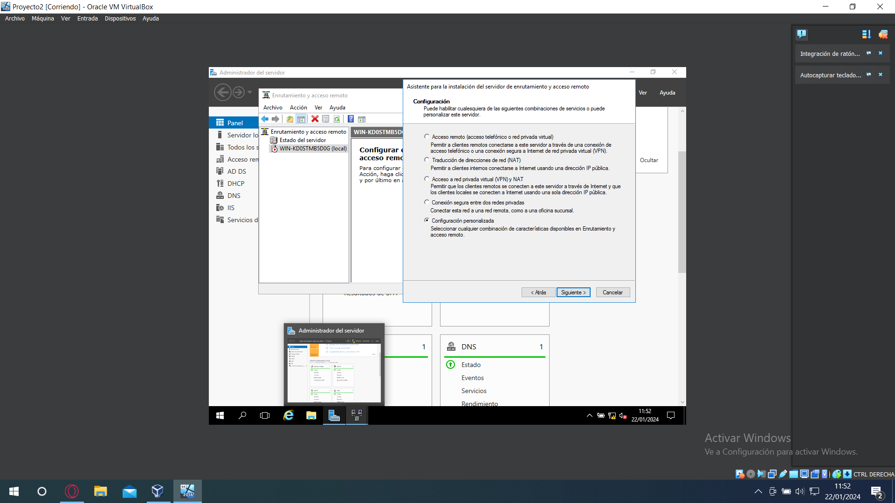
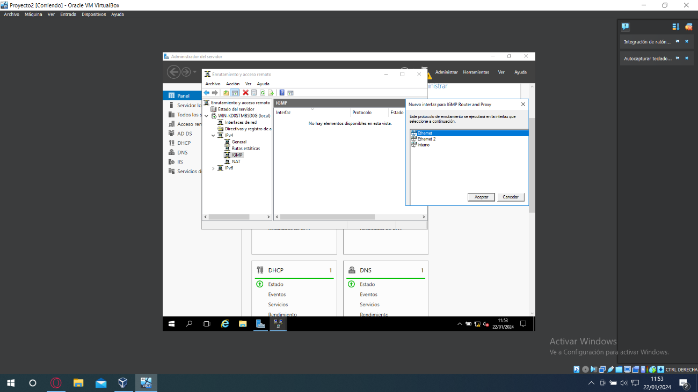
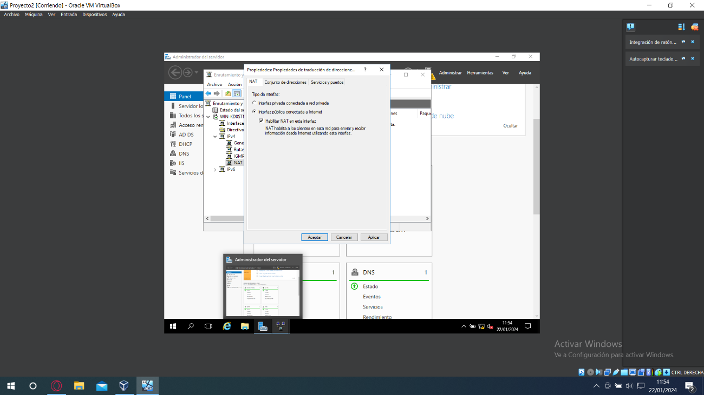
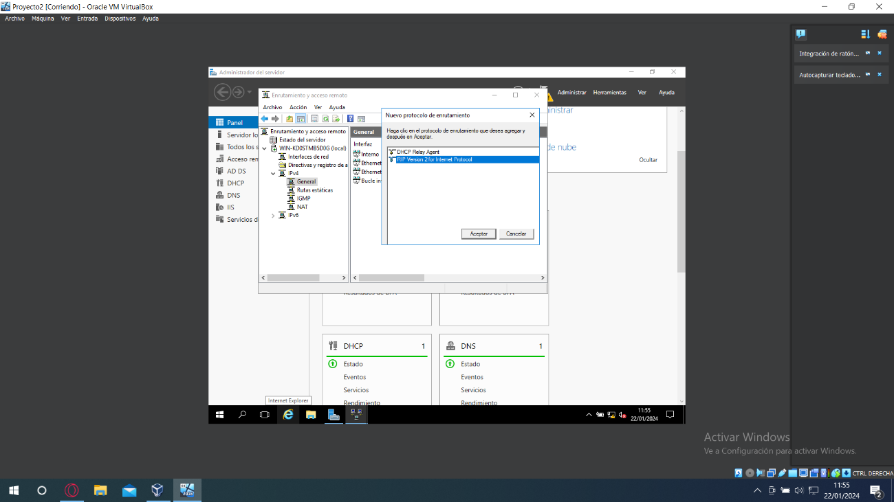
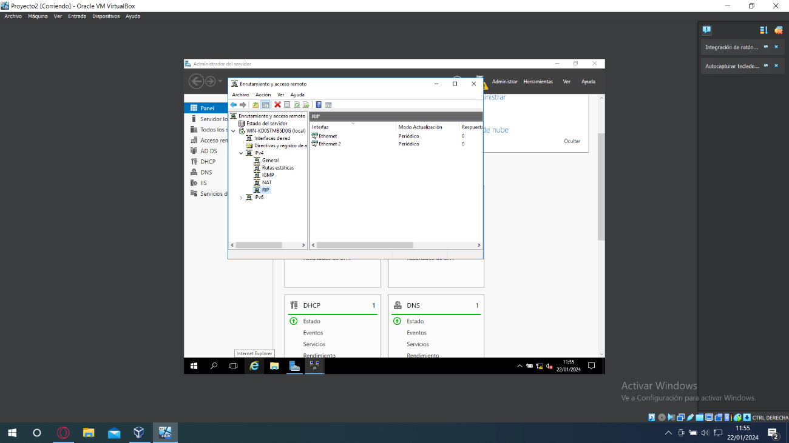
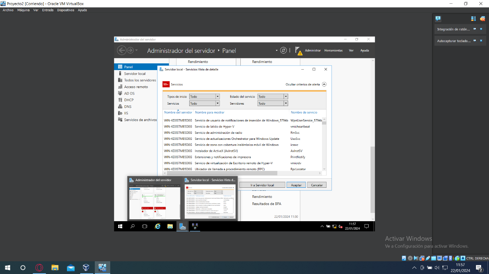

---
tags:
  - Informática
  - Wind-Server
---
# Documentación enrutamiento Windows server

Para empezar debemos tener dos tarjetas de red en el servidor, una en red interna para comunicarse con los clientes y otra en NAT para dar salida a internet

Antes de instalar el servicio de acceso remoto/enrutamiento debemos configurar en el servicio DHCP, dentro del ámbito que creamos previamente tenemos que ir a opciones del ámbito y en DNS añadir el DNS de google “8.8.8.8”, aparte deberemos asignarle un dirección IP estática
al servidor y establecer como puerta de enlace la dirección de la tarjeta de red que está en NAT

Una vez hemos configurado el DHCP, instalamos el servicio Acceso remoto con la característica Enrutamiento

Después de instalar el servicio de acceso remoto y reiniciar el equipo, vamos a herramientas y seleccionamos “Enrutamiento y acceso remoto”, en este panel hacemos clic derecho sobre el servidor y seleccionamos la una opción que dice algo asi como activar el enrutamiento

En el asistente de la instalación seleccionamos “Configuración personalizada”

Habilitamos los servicios NAT y Enrutamiento LAN y continuamos

Una vez hemos acabado el paso anterior, clicamos sobre IPV4 y hacemos clic derecho sobre “IGMP” y añadimos la interfaz de red de la tarjeta que está en red interna dejando las opciones por defecto y aceptando en todos los apartados

Sobre el apartado “NAT” hacemos lo mismo pero esta vez añadiendo la tarjeta de red que esta en “NAT” y seleccionado los apartados “Interfaz publica conectada a internet” y “Habilitar NAT en esta interfaz”

Después de añadir las tarjetas de red en sus apartados correspondientes, hacemos clic derecho sobre general y seleccionamos la opción “Nuevo protocolo de enrutamiento” y seleccionamos RIP

Una vez añadido el protocolo RIP, de las misma forma que antes deberemos añadir las interfaces de red, en este caso en el apartado RIP ambas interfaces, tanto la que esta en NAT como la que esta en red interna.

Después de configurar el enrutamiento/acceso remoto, se caerán los servicios del servidor y deberemos iniciarnos uno por uno para ello vamos al panel central donde están todos los servicios y en el apartado de servidor local clicamos sobre “servicios” y en el desplegable “Tipos
de inicio” seleccionamos la opción todo, esto nos mostrara todos los servicios, arriba en rojo nos saldrá el número de servicios caídos, para levantarlos hacemos clic derecho sobre ellos y pulsamos en iniciar, así con todos.

Para comprobar que el enrutamiento se está haciendo correctamente deberemos conectarnos con un cliente con conexión a la máquina y comprobar que el servidor le está dando acceso a internet, es posible que debamos reiniciar las maquinas, tened en cuenta que al reiniciar el servidor habrá que volver a levantar todos los servicios manualmente.
