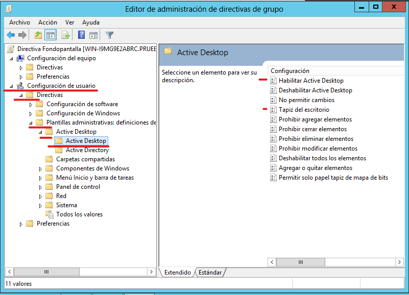

# **Active Directory**

Servicio que permite la gestión y administración de los recursos de nuestra red, dicha gestión va desde administrar y crear dominios, usuarios, grupos, bosques, directivas, dar de alta usuarios etc.

- **Servidor:** Administra el dominio, los recursos de nuestra red
- **Cliente:** se une al dominio y está sujeto a la configuración del servicio de AD

## **Estructura física de Active Directory**
Forma parte del subsistema de seguridad de Windows Server ejecutándose en modo usuario. Las aplicaciones que se ejecutan en este modo no tienen acceso directo al sistema operativo ni al hardware, sino que como medida de seguridad, las peticiones realizadas a estos deben pasar previamente por un subsistema de seguridad y posteriormente por la capa de servicios
ejecutivos:

El Directorio Activo posee una capa lógica que determina el modo en el que se gestiona y controla el acceso a la información almacenada en su base de datos. El Directorio Activo proporciona un espacio de nombres (namespace) para los dominios, catálogos de usuario, equipos, grupos,
directivas de seguridad, dispositivos de red, etc., controlado a partir de una base de datos jerárquica que se mantiene en el controlador de dominio y que además se replica en todos los controladores de dominio de la red.

El Directorio Activo utiliza una estructura arbolada jerárquica para organizar los objetos de la base de datos lo que simplifica enormemente las tareas de administración.

## **Objeto:** 
unidad básica dentro de mi dominio, usuarios, grupos etc.

- **Usuarios:** Las cuentas de usuario de Active Directory y las cuentas de equipo pueden representar una entidad física, como un equipo o una persona, o actuar como cuentas de servicio dedicadas para algunas aplicaciones

- **Grupos:** Son agrupaciones de cuentas/Usuarios bajo las mismas propiedades, como acceso a recursos, directivas, configuraciones etc.

- **Unidad organizativa:** en pocas palabras vendría a ser una carpeta en la que podemos almacenar dominios, grupos, usuarios etc. con el fin de administrar nuestro dominio

- **Equipos:**

- **Impresoras:**

## **Conceptos**

- **Dominio:** nombre que denomina una zona específica de la red, el propósito principal de los nombres de dominio y los sistemas de nombre de dominio es traducir las direcciones IP de cada activo de la red a términos memorizables y fáciles de encontrar

- **Directivas:** normas que podemos aplicar a nuestros dominios, usuarios, grupos etc.

- **Árbol:** conjunto de dominios

- **Bosque:** conjunto de árboles

- **GPO:** un objeto que almacena uno o más valores de configuración que aplican a un usuario o equipo, pudiéndose así mismo provisionar sobre conjuntos de más de un usuario o más de un equipo. básicamente es un contenedor de configuraciones, reglas y estados deseados

- **Nivel funcional**: determinan las funcionalidades disponibles de dominio de Active Directory y sistemas operativos Windows Server que se pueden ejecutar en los controladores de dominio del dominio o del bosque

- **Delegación DNS:** por así decirlo es la configuración DNS de nuestro servidor, si tenemos instalado Active Directory no podremos hacerla manualmente si no que será hecha por Active Directory

- **Nombre de dominio NetBIOS:** Por lo general el dominio NETBIOS: es el subdominio del nombre de dominio,
	- **Ejemplo:** Si el nombre de dominio es **prueba.com,** el nombre de **dominio NETBIOS** es **prueba**
	- Si el nombre de dominio es [**<u>www.prueba.com</u>**](http://www.prueba.com el nombre de domino **NETBIOS** es **www**

- **Catálogo global:** El catálogo global es el conjunto de todos los objetos de un bosque de los Servicios de dominio de Active Directory (AD DS). Un servidor de catálogo global es un controlador de dominio que almacena una copia completa de todos los objetos del directorio para su dominio host y una copia parcial de sólo lectura de todos los objetos del resto de dominios del bosque. Los servidores del catálogo global responden a las consultas del catálogo global.
