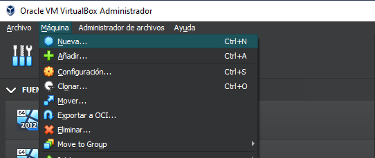
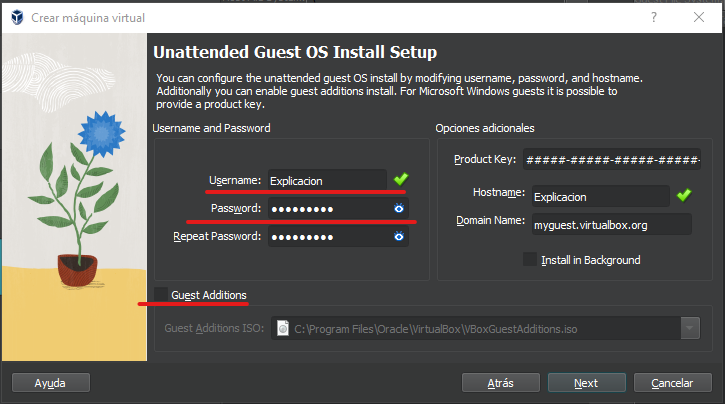
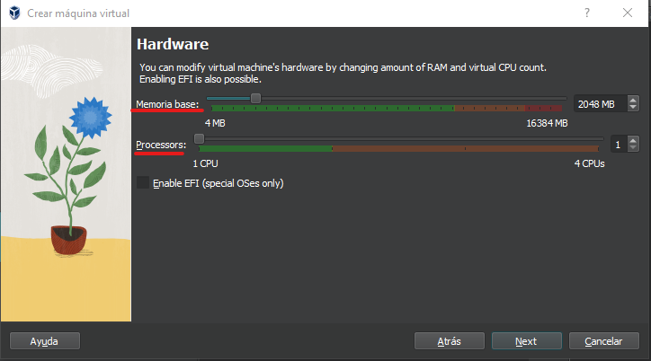

## **Visibilidad entre maquinas**

**Para que el servidor y el cliente puedan verse ambos deben de estar la
misma red, en nuestro caso lo haremos configurando la maquina servidor y
cliente en red interna desde la configuración de VirtualBox, para
acceder a la configuración de la maquina hacemos Ctrl+S seleccionando la
máquina, una vez dentro seleccionamos el apartado Red y en el
desplegable “Conectado a:” Seleccionamos Red Interna**

## **Posibles errores:**

- Las maquinas no están en la misma red, esto puede ser por que una este
  en red interna o NAT

- El cliente tiene un IP estática por lo que no se le puede asignar una
  dirección por DHCP, esto puede solucionarse configurando las opciones
  de red del cliente y seleccionar “Obtener una dirección IP
  automáticamente”

- El DHCP no asigna IPs a los clientes, puede ser por que no esté bien
  configurado, mi consejo es borrar el ámbito y comprobar que el
  direccionamiento esta bien calculado y la IP asignada al servidor es
  correcta

## **Instalar Guest Adittions**

Las Guest adittions son características adicionales que no tienen las
máquinas virtuales por defecto, tales como establecer pantalla completa,
crear carpetas compartidas, opciones de teclado etc.…

Para instalarlas debemos ir a la parte superior del hud de VirtualBox en
la sección **dispositivos** -\>” **Upgrade Guest Adittions**…”

Una vez hemos hecho el paso anterior nos descargara las guest adittions,
para instalarlas debemos darle al dispositivo creado en el equipo

Al darle nos abrirá el instalador

Seleccionamos donde queremos que se instale

Debemos elegir que componentes adicionales queremos instalar y
continuamos

Para terminar la instalación debemos reiniciar

## **Crear carpetas Compartidas**

**Las carpetas compartidas son ficheros a los que se puede acceder tanto
desde una máquina virtual como desde el ordenador real**

Para crear una carpeta compartida, vamos a la parte superior del hud de
VirtualBox en el apartado dispositivos -\> Carpetas compartidas -\>
Preferencias de carpetas compartidas

Esto nos abrirá el panel para crearlas, para ello le damos al icono de
la carpeta+

Esto nos abrirá la configuración para crear una carpeta compartida, en
la que debemos especificar la ruta del ordenador principal que vamos a
utilizar para hacer de nexo entre el ordenador y la maquina virtual,
nombre de la carpeta, y seleccionar las casillas Automontar y hacer
permanente, una vez rellenemos todo y tendremos la carpeta compartida
creada.

Para comprobar que se ha creado correctamente vamos a la ruta que hemos
creado y comprobamos que podemos acceder a los ficheros del ordenador
principal

