# **Instalación servicio DHCP**

**Para agregar el servicio DHCP en el servidor vamos a Administras -\> Agregar roles y características:**

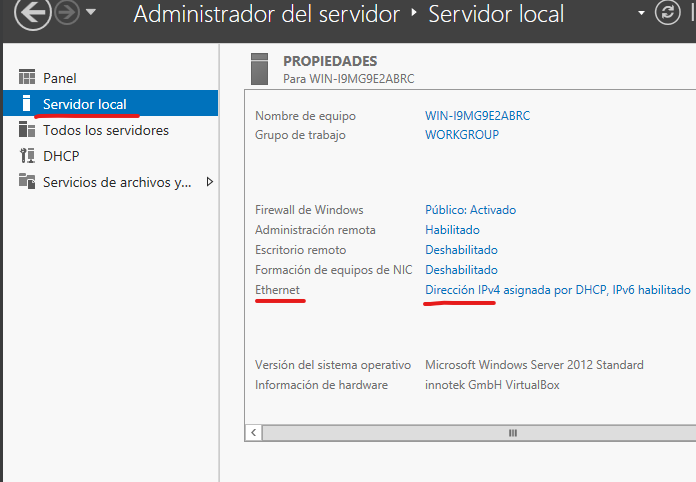

**Una vez dentro del panel seleccionamos Instalacion basada en roles y pulsamos siguiente:**

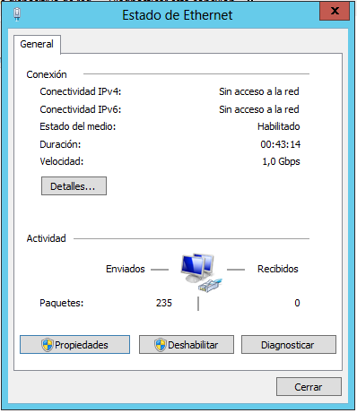

**Seleccionamos el servidor en el que lo queremos instalar y pulsamos en siguiente:**

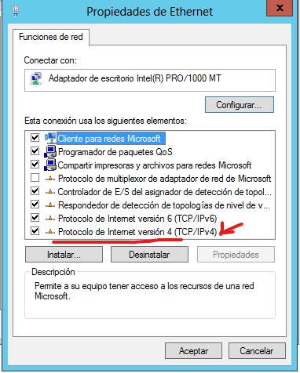

**Seleccionamos el servicio que queremos instalas, en este caso DHCP**

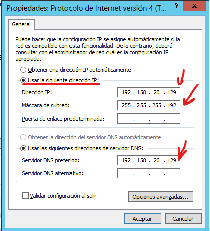

**Puede que nos salte un aviso que indique que la instalación requiere agregar características adicionales, las agregamos y pulsamos continuar**

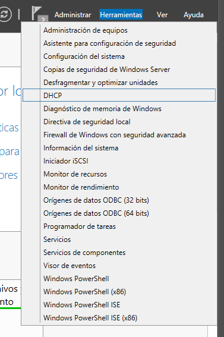

**En este caso no es necesario el apartado características, lo dejamos como esta y pulsamos continuar:**

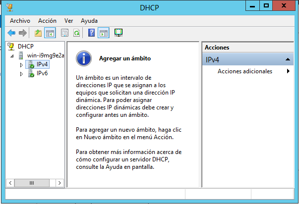

**El siguiente apartado únicamente nos explica el funcionamiento del servicio DHCP, lo leemos y pulsamos continuar**

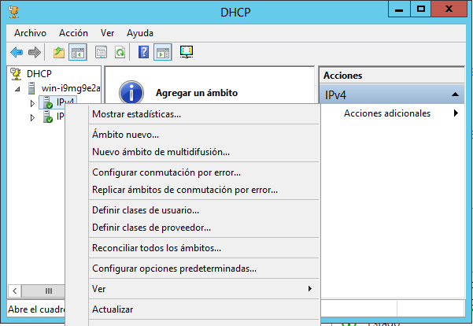

**El apartado confirmación nos muestra los datos de la instalación, nos pregunta si deseamos reiniciar en caso de ser necesario y por último una confirmación de la instalación**

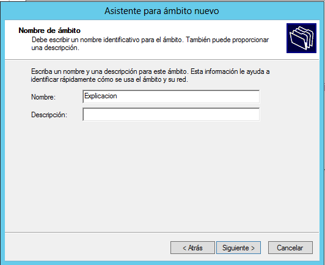

**Por último, el apartado Resultados nos muestra el progreso de la instalación**

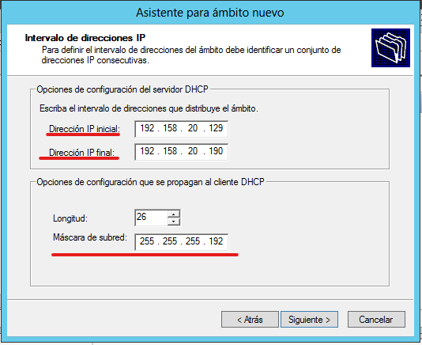

**Una vez terminada la instalación del servicio DHCP es posible que nos salga una notificación de que es necesario completar la configuración DHCP, Entramos en la notificación**

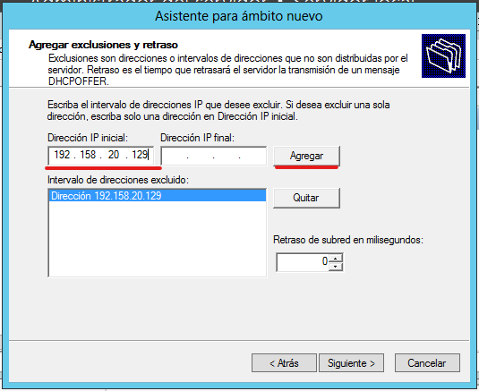

**Al acceder a la notificación esta nos redirigirá al asistente posterior a la configuración de DHCP, el cual nos dirá que es necesario crear usuarios y administradores de DHCP, Confirmamos y habremos acabado la instalación del servicio DHCP** 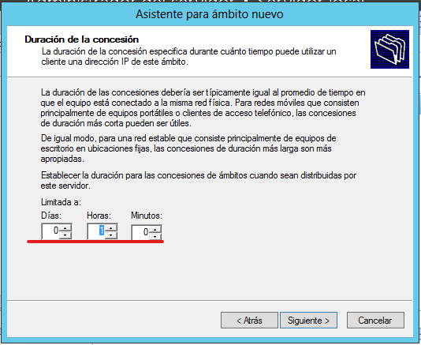
