# **Configuración Servicio DNS**

La configuración del servicio DNS en pocas palabras consiste en la creación de zonas directas, creación de zonas inversas, para después crear hosts dentro de ellas, la comprobación consiste en la utilización del comando nslookup para ver si el servidor esta resolviendo los dominios en sus respectivas IPs y viceversa

**Antes de configurar el servicio DNS debemos asignar un IP al servidor, para ello vamos al apartado: Servidor local -\> Ethernet -\> Ethernet -\> Protocolo IPv4**

**Y una vez dentro marcamos la casilla “Utilizar la siguiente dirección IP” para establecer una dirección IP de forma manual al servidor e introducimos la IP que le queremos asignar con su respectiva mascara de red, enrutador y DNS en caso de ser necesario y pulsamos en validar al
salir y aceptamos.**

**Es posible que salte un diagnóstico para detectar posibles problemas tras la configuración, cerramos y continuamos.**

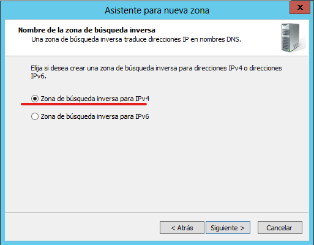

**Una vez instalado procedemos a su configuración desde el apartado herramientas -\> DNS**

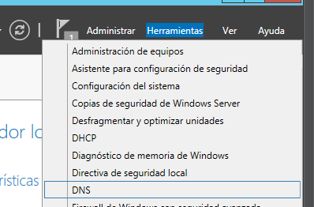

**Una vez dentro de la configuración DNS accedemos al servidor que queremos configurar y hacemos clic en el apartado “Zonas de búsqueda inversa” y seleccionamos “Zona nueva”**

**Esto nos abrirá el asistente para crear una zona nueva, Seleccionamos “Zona principal”**

**En este apartado debemos seleccionar IPv4**

**En este apartado debemos indicar la dirección de red que estamos utilizando en nuestro servidor**

**En este apartado debemos indicar si queremos utilizar un archivo existente de zona o crear otro**

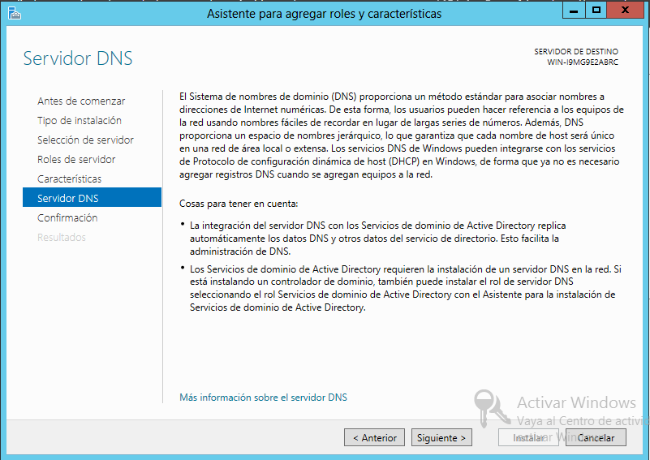

El apartado “Actualización dinámica” debemos indicar si queremos que la zona acepte o no actualizaciones de los registros

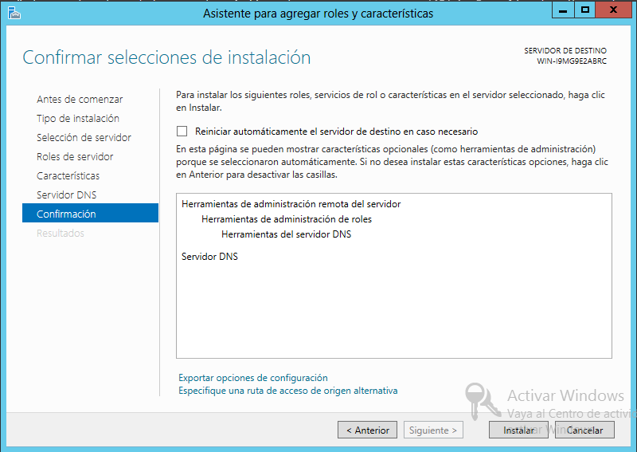

**Finalizamos y tendríamos la zona creada**

**Una vez dentro de la configuración DNS accedemos al servidor que queremos configurar y hacemos clic en el apartado “Zonas de búsqueda directa” y seleccionamos “Zona nueva”**

**Esto nos abrirá el asistente para crear una zona nueva, Seleccionamos “Zona principal”**

**En el apartado “Nombre de zona” debemos ponerle un nombre a la zona que queremos crear´**

**En el apartado “Archivo de zona” debemos indicar si queremos utilizar el archivo predeterminado para guardar la información, renombrarlo o utilizar otro distinto**

**Por lo general lo habitual es utilizar el predeterminado**

**El apartado “Actualización dinámica” debemos indicar si queremos que la zona acepte o no actualizaciones de los registros**

**Finalizamos y tendríamos la zona creada**

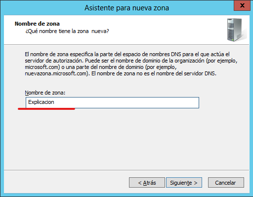

**Después de haberla creado accedemos a ella para crear host dentro**

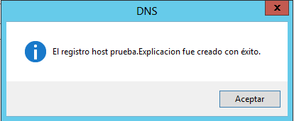

**En la configuración del Host debemos asignarle un nombre al mismo, una IP y marcar la casilla “Crear registro del puntero (PTR) asociado”**

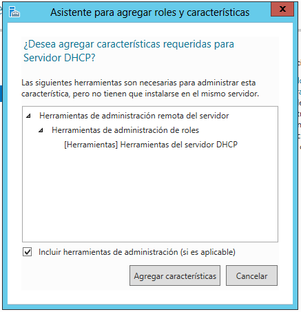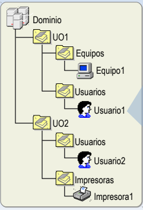

**Para comprobar que el host ha sido creado con éxito, necesitamos un cliente conectado al servidor**

**Para comprobar que el cliente tiene conectividad con el servidor utilizaremos el comando ping + “IP del servidor”**

**Para comprobar que el servicio de resolución de nombres de dominio funciona utilizaremos el comando nslookup + “nombre completo del dominio”/”IP del dominio”**

**Con este comando**  
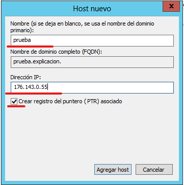

**Para crear un alias debemos ir a la zona en la que esta el host ya sea la directa o inversa, hacer clic derecho y seleccionar el apartado “Nuevo alias”**

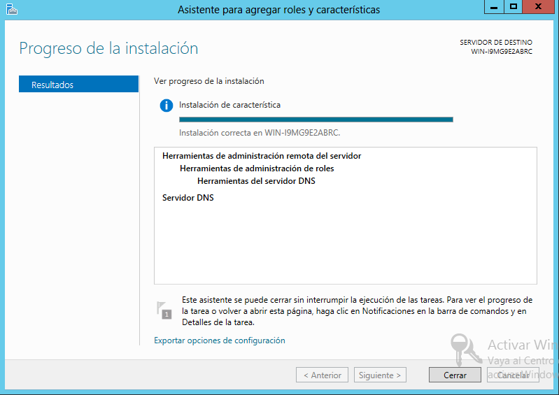

Esto nos abrirá un panel para crear un nuevo registro de alias, en el que debemos seleccionar el nombre que queremos asignar al dominio y el nombre completo del dominio

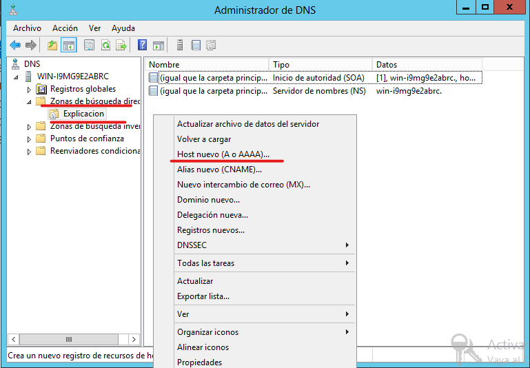
