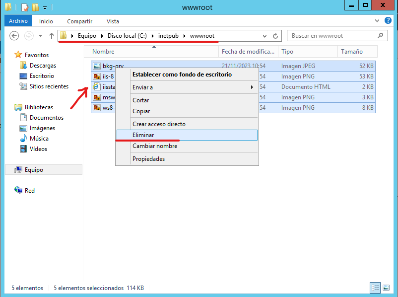
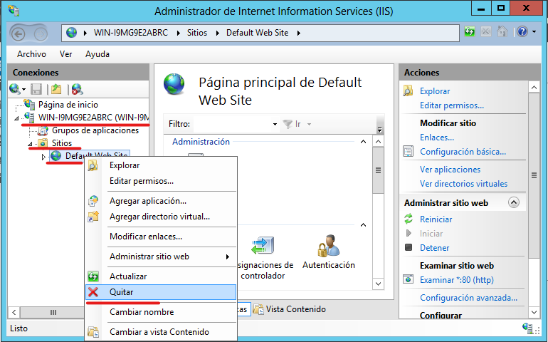
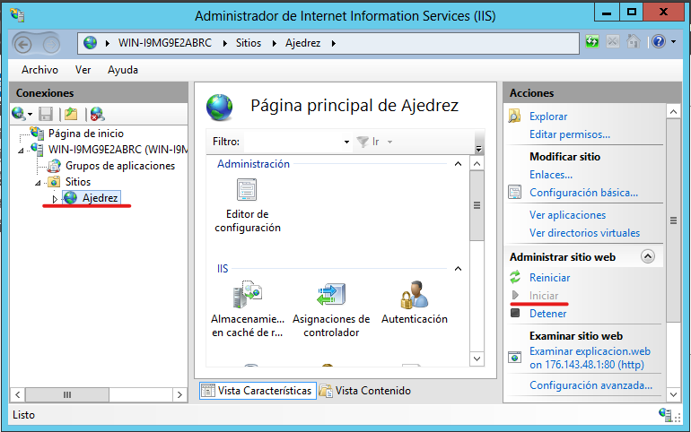
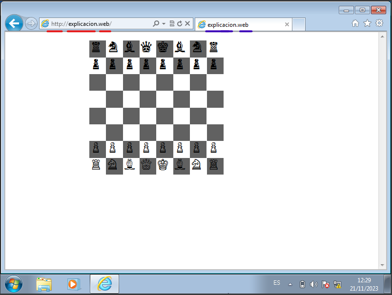

**Configuración del servicio WEB**

**La configuración del servicio web consiste en vincular un dominio a un
hipertexto almacenado en el servidor, para que cuando un cliente
introduzca el dominio en la barra de búsqueda del navegador, el servidor
le responda con el hipertexto vinculado al dominio y el navegador del
cliente lo interprete**

Primero reemplazaremos el archivo de hipertexto de ejemplo, que esta
ubicado en “C:\inetpub\wwwroot”, borraremos los archivos y pondremos
nuestro archivo de hipertexto.

Deberemos cambiar el nombre de nuestro hipertexto por Index

Ahora debemos crear un host para alojar nuestro servicio web, para ello
vamos al administrador de DNS, en este caso hemos creado la zona web y
el host explicación

Una vez hemos puesto nuestro archivo de hipertexto y hemos creado
nuestro host, vamos al administrador IIS para añadir nuestro sitio web

Una vez dentro del administrador eliminamos el sitio por defecto y
agregamos el nuestro

Agregamos nuestro sitio

En el panel para agregar un sitio web, debemos asignarle un nombre,
especificar la ruta física del archivo de hipertexto, En la parte de
“***Enlace***” debemos indicar por donde nos van allegar las peticiones,
el protocolo utilizado, las direcciones IPs del servidor a las que nos
van a llegar, el puerto/s por el que vamos a escuchar las peticiones y
nombre del host que hemos creado en la zona directa

Una vez hemos agregado nuestro sitio web debemos ir al apartado
“Documento predeterminado” seleccionamos el documento index.html y le
damos a la opción subir hasta que este arriba del todo

Es posible que debamos desactivar otros sitios web y activar el nuestro,
para ello nos fijamos en el panel derecho, seleccionamos nuestro sitio
web y seleccionamos iniciar en caso de ser necesario

Para comprobar que lo hemos configurado y el cliente puede acceder a
nuestro sitio web, debemos introducir el FQDN del host que aloja nuestro
sitio web, el que creamos en la zona directa, en este caso siendo
explicación.web, (explicación=host, web=zona) dentro de un navegador
desde nuestro cliente que interpretara nuestro archivo de hipertexto

**En rojo: la URL** (http://explicacion.web)

**Protocolo:** http

**Host/maquina:** explicación.web

**Fichero:** en este caso no hay

**En azul: el dominio/nombre del host** (explicacion.web)

**Host:** explicacion

**Dominio:** Web

