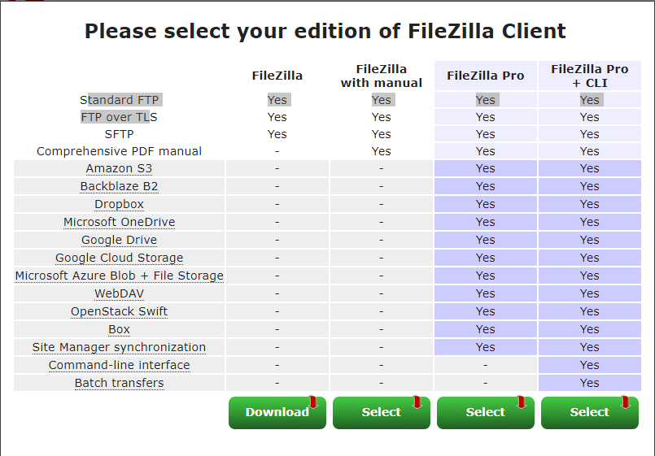
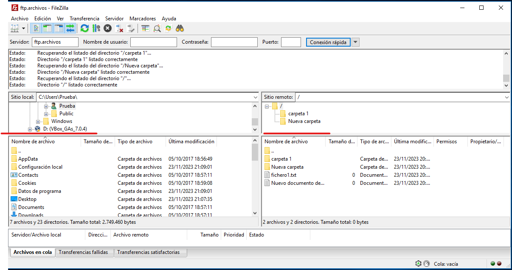

# **Acceder a un directorio remoto por su dominio y no su IP**

Necesitamos utilizar el servicio DNS, para ello crearemos un host y lo vincularemos a nuestro sitio ftp para que cuando el cliente busque el host introduciendo el **FQDN** del host el servidor le responda con el directorio asociado al sitio ftp que a su ver este asociado al host

## **El proceso es:**

- Asociamos un directorio a un sitio ftp
- Asociamos el sitio ftp a un host
- El cliente solicita acceso al host
- El servidor responde con el sitio ftp/directorio asociado al host

## **Configuración:**

Creamos el host dentro del servidor y zona que queramos, le asignamos un nombre y la dirección IP del servidor que lo contiene (“ftp” = host) (“archivos” = zona)

Creamos la carpeta que asociaremos al sito ftp

Creamos el sitio ftp

Asignamos un nombre al sitio ftp que estamos creando y especificamos la
ruta del directorio que estamos asociando

Especificamos la dirección IP y puerto por el que nos van a llegar las peticiones, si queremos iniciar automáticamente el sitio que estamos creando y si requiere el protocolo SSL

Elegimos el tipo de autentificación necesario para acceder al Sitio FTP y autorización y a quienes permitimos el acceso y que permisos les damos, finalizamos y tendremos creado el sitio

Para comprobar que hemos creado correctamente el sitio ftp asociado al directorio archivos_lucas, introducimos en el buscador el dominio de la zona en el que tenemos creado el host asociado al sitio ftp
En caso de no recordar el nombre del host podemos verlo haciendo clic sobre el desde el administrador DNS (ftp.archivos)

Desde el navegador o explorador de archivos introducimos el dominio y accederemos al directorio remoto

