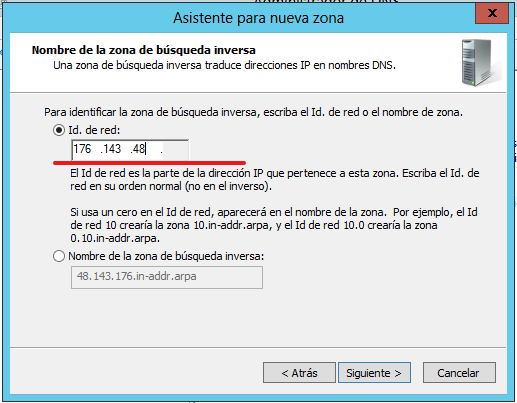
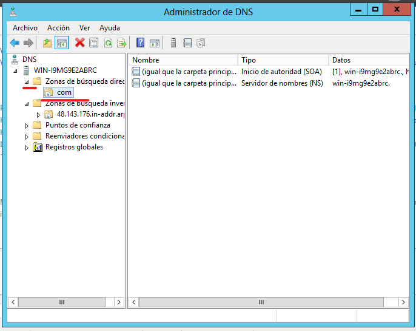
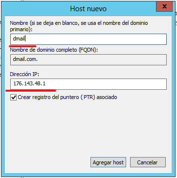
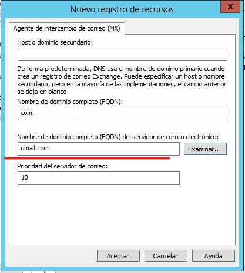

# Instalacion Thunderbird

La instalación de Thunderbird es bastante sencilla

Instalación estándar

Ruta de instalación y si queremos que se la aplicación de correo
predeterminada

Ejecutar y finalizar.

Abrimos la aplicación e iniciamos sesión con el usuario creado en
Mercury

