# **Configuración Servicio correo electrónico**

##### **Para la configuración del servidor de correo electrónico necesitamos:**

- Dos clientes (Linux y Windows) con conexión al servidor, ya sea DHCP/Estática
- Instalar el servicio DNS
- Instalar Mercury en el servidor
- Instalar Thunderbird en un cliente Windows y Linux

##### **La configuración va a consistir:**

- en la creación de una zona directa, y un host e intercambiador dentro de ella, esto será nuestro dominio
- Seleccionar el dominio en Mercury
- Crear dos cuentas de correo electrónico en Mercury
- Iniciar sesión en Thunderbird con las cuentas creadas en Mercury
- Enviar un email de una cuenta a otra y comprobar que funciona

##### **Configuración:**
Después de instalar el servicio DNS procedemos a configurarlo, creamos una zona inversa, el la que especificaremos la dirección de red sobre la que estamos trabajando.

Una vez creada la zona inversa, procedemos a crear nuestro dominio, para ello creamos una zona directa

Después creamos nuestro host dentro de nuestra zona, le asignamos un nombre y la dirección IP del servidor que contiene el host

Después de crear el Host, creamos un Intercambiador y los asociamos introduciendo el FQDN de este.

Después de crear nuestro dominio en DNS, vamos a configurar Mercury, para ello abrimos la aplicación y en la parte superior izquierda hacemos clic en configuración -\> Mercury Core Module
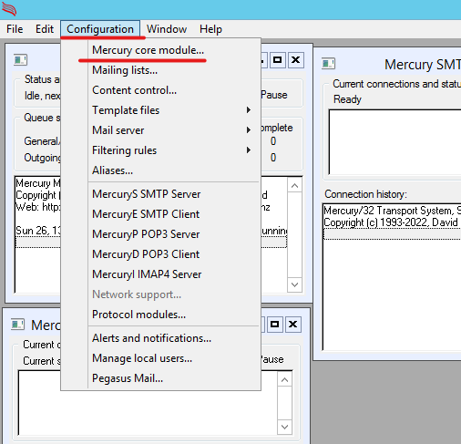

Una vez dentro vamos al apartado Local domains, en el que debemos introducir nuestro dominio y nuestro host, para ello hacemos clic en “Add new Domain” (*la primera vez aparecerán 2 dominios, debemos eliminarlos para ello los seleccionamos y le damos a “Remove entry”)*
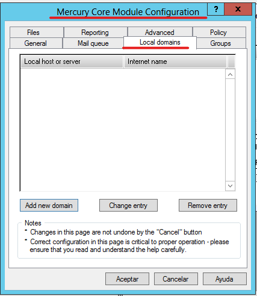

Introducimos el host y el dominio (FQDN), esto lo podemos ver desde el administrador de DNS, en la zona directa.
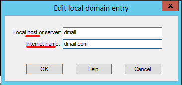

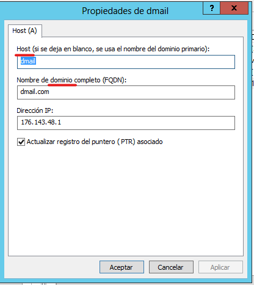

Además, deberemos introducir el host y dominio del intercambiador, en mi caso el host del intercambiador es el mismo que host normal y el dominio es la zona en la que esta creado,

De la misma forma podemos ver esta información en las propiedades del intercambiador

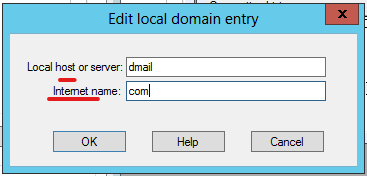

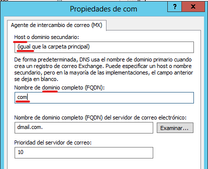

Así nos quedarían los dominios que hemos agregado:

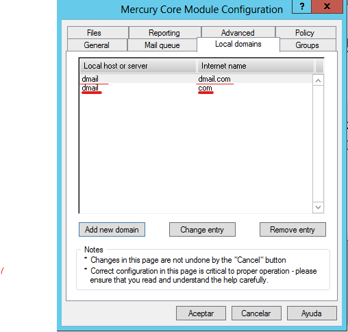

Después de añadir los dominios, vamos a crear las cuentas de correo electrónico, para ello vamos a Configuration -\> Manage local users.
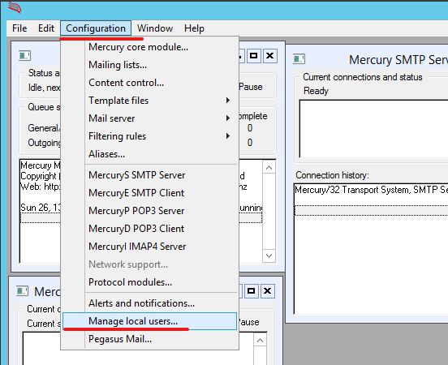

Una vez dentro para añadir pulsamos el botón “Add”
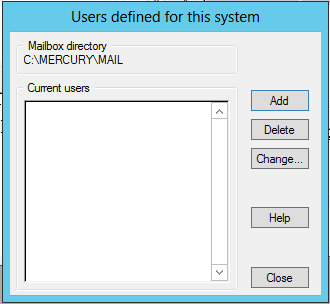

Para crear un usuario deberemos asignarle un nombre y una contraseña
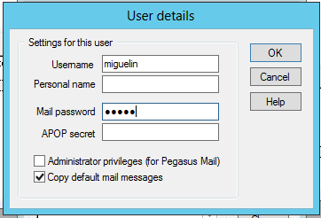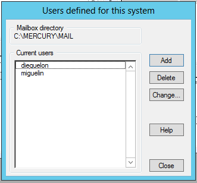

Después de crear el dominio, asignar el dominio en Mercury y crear usuarios dentro de Mercury,

Únicamente nos queda, iniciar sesión en el cliente desde Thunderbird con el usuario creado en Mercury.

- Para ello necesitamos dos clientes con Thunderbird instalado y conexión al servidor. (Configurar como DNS el servidor, IP en la misma red, Firewall desactivado, etc.)

- Las opciones para instalar Thunderbird o Mercury en las maquinas son o con carpetas compartidas o mediante un USB con el archivo que lo reconozca la máquina.

  - Los archivos están en el drive

Una vez dentro de Thunderbird debemos introducir el nombre del usuario con el que queremos iniciar sesión, la dirección de correo electrónico, (recordar usuario@dominio, en este caso <miguelin@dmail.com>) y la contraseña asociada a ese usuario.

Introducimos los datos y continuamos.
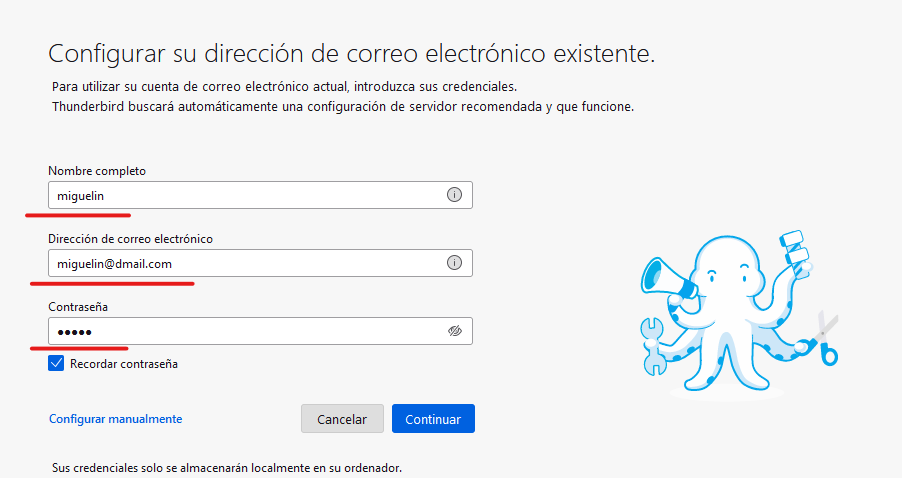

En caso de haber hecho todo bien, nos pedirá que seleccionemos el tipo de configuración que queremos aplicar, seleccionamos y continuamos.
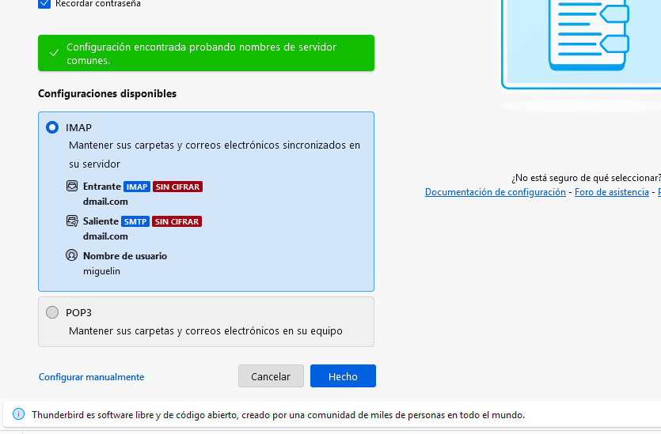

Nos saldrá una advertencia de que el servidor no utiliza cifrado de seguridad, marcamos la casilla “Entiendo los riesgos” y confirmamos.
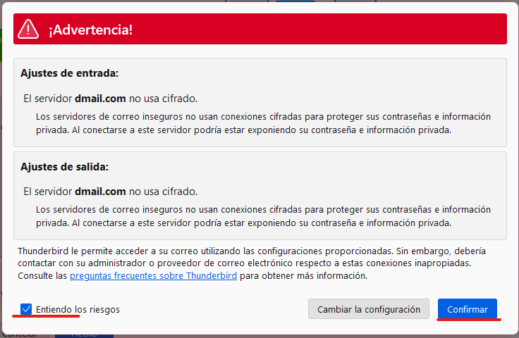

Nos da la opción de añadir servicios adicionales, no son necesarios, lo dejamos como esta y finalizamos.
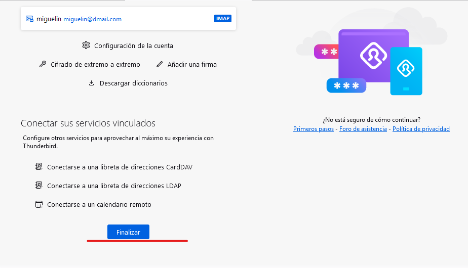

Una vez seleccionaremos “+Nuevo mensaje” para enviar un email a otra cuenta de correo electrónico.
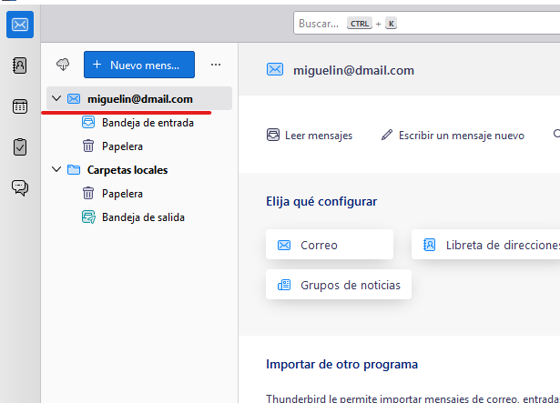

A la hora de redactar el email, deberemos introducir el destinatario (cuenta de correo), Asunto del email, y cuerpo del mensaje. Una vez hayamos redactado todo pulsamos en “Enviar” y Listo.

Ahora solo quedaría iniciar sesión en la cuenta del destinatario y comprobar que ha llegado correctamente.
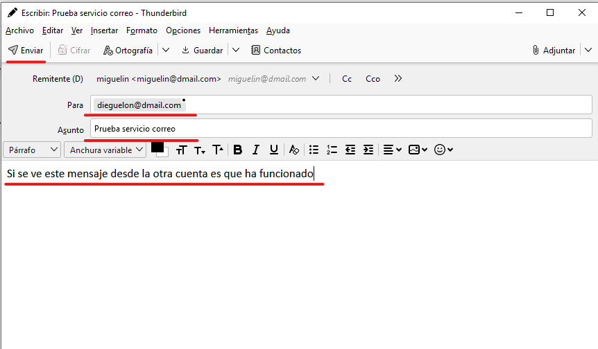

Iniciamos sesión en Thunderbird desde otra maquina con la otra cuenta, siguiendo el mismo procedimiento anterior.
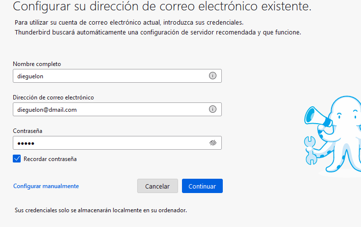

Nada mas entrar nos saltara la notificación del correo, también podremos verla desde la bandeja de entrada de la cuenta.
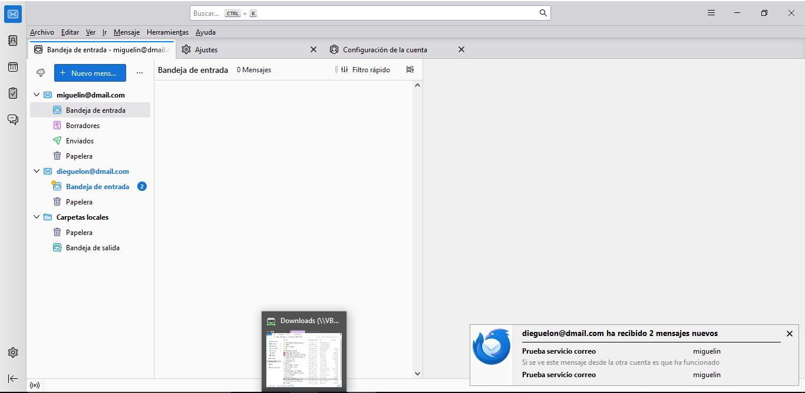

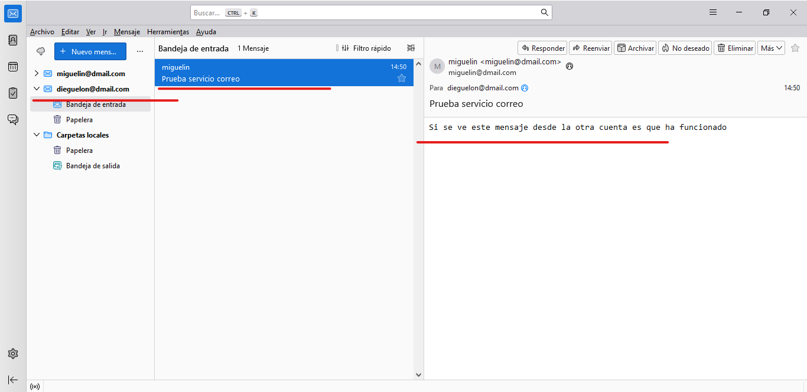

FIN.

**Infografía:**
**- Libro servicios**
**- Comunismo (ayudándonos hasta conseguirlo)**
**- YouTube:**

- [https://www.google.com/search?q=a%C3%B1adir+cuenta+de+correo+en+thunderbird&source=lmns&bih=619&biw=1366&hl=es&sa=X&ved=2ahUKEwjMjIjz5-GCAxUbnCcCHYGGAooQ0pQJKAB6BAgBEAI#fpstate=ive&vld=cid:3a7738a5,vid:-gqki9N9Mq8,st:0](https://www.google.com/search?q=a%C3%B1adir+cuenta+de+correo+en+thunderbird&source=lmns&bih=619&biw=1366&hl=es&sa=X&ved=2ahUKEwjMjIjz5-GCAxUbnCcCHYGGAooQ0pQJKAB6BAgBEAI%23fpstate=ive&vld=cid:3a7738a5,vid:-gqki9N9Mq8,st:0)

- <https://www.youtube.com/watch?si=RWCxjFt3h_0rSLbO&v=Poo7ynrObWg&feature=youtu.be&ab_channel=JavierT%C3%A1rrega>
