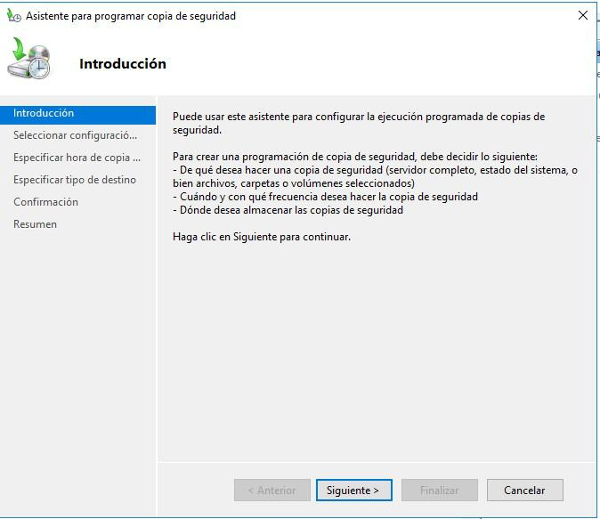

# TEMA 1:

## 1. Seguridad de la información:

Es el conjunto de medidas y procedimientos, tanto humanos como técnicos, que permiten proteger la integridad confidencialidad y disponibilidad de la información.

- Integridad: certifica que información y su procesado son exactos y completos.
- Confidencialidad: acceso a usuarios autorizados.
- Disponibilidad: información disponible a demanda.

Engloba medidas de seguridad que afectan a la información independientemente del itpo de esta, soporte en el que se almacene, forma en que se transmita, etc.

## 2. Seguridad informática:

Es una rama de la seguridad de la información que trata de proteger la información que utiliza una infraestructura informática y de telecomunicaciones para ser almacenada o transmitida.

Clasificación en función de lo que se quiere proteger:

- Seguridad física: protección física del sistema ante amenazas.
- Seguridad lógica: protección de datos, aplicaciones, sistemas operativos.

Clasificación en función del momento en que ocurre la protección:

- Seguridad activa: prevenir, detectar y evitar incidente antes de que se produzca (contraseñas).

- Seguridad pasiva: técnicas para minimizar consecuencias de incidente de seguridad (copias de seguridad).

## 3. Conceptos básicos:

### Activos:

Recursos del sistema (informático o no) necesarios para que la organización alcance los objetivos propuestos, es decir, todo aquello que tenga valor y que deba ser protegido frente a un eventual percance, ya sea intencionado o no.

La seguridad informática tiene como objetivo proteger dichos activos.

Principales activos de una empresa son:

- La información.
- El software.
- La infraestructura tecnológica.
- El personal que utilice esta infraestructura.

### Vulnerabilidades:

Se trata de cualquier debilidad de un archivo que puede repercutir de alguna forma sobre el correcto funcionamiento del sistema informático =\> “agujeros de seguridad”.

Es muy importante corregir cualquier vulnerabilidad detectada, porque constituye un peligro potencial para el sistema en general.

Para minimizarlas, los administradores de los sistemas informáticos deben revisar periódicamente el sistema, mantenerse informados en temas relacionados con la seguridad de los sistemas que administran, etc.

### Amenazas: 

Son cualquier entidad o circunstancia que atente contra el buen funcionamiento de un sistema informático.

En función de las acciones realizadas por el atacante, se dividen en:

- Amenazas pasivas (escuchas): su objetivo es obtener información relativa a una comunicación.
- Amenazas activas: tratan de realizar algún cambio no autorizado en el estado del sistema.

### Ataques:

Son acciones que tratan de aprovechar una vulnerabilidad de un sistema informático para provocar un impacto sobre él e incluso tomar el control del mismo.

Acciones tanto intencionadas como fortuitas.

Formalmente un ataque informático pasa por las siguientes fases:

- Reconocimiento: información sobre la víctima.
- Exploración: información sobre el sistema a atacar.
- Obtención de acceso: explotación de vulnerabilidad.
- Mantenimiento del acceso.
- Borrar las huellas del ataque.

### Riesgos:

Es la estimación del grado de exposición a que una amenaza se materialice sobre uno o más activos causando daños o perjuicios a la organización.

Es la probabilidad de que una amenaza se materialice aprovechando una vulnerabilidad y causando daño (impacto) en un proceso o sistema.

Se trata de una medida de la probabilidad de que se materialice una amenaza.

En el análisis de riesgos hay que tener en cuenta qué archivos hay que proteger, sus vulnerabilidades, amenazas, su probabilidad y su impacto. (Tiempo, esfuerzo, dinero).

### Impacto:

Una organización se ve afectada cuando se produce una situación que atenta contra su funcionamiento normal.

El impacto sería el alcance productivo o daño causado en caso de que una amenaza se materialice.

Hay que identificar los impactos para la organización en el caso de que se produzcan las amenazas.

### Desastres:

Un desastre es cualquier evento accidental, natural o malintencionado que interrumpe las operaciones o servicios habituales de una organización.

Puede destruir los activos de la empresa, tanto físicos como lógicos, por lo que podría ocasionar grandes pérdidas e incluso el cese de la actividad económica.

Las organizaciones deben estar preparadas ante cualquier tipo de desastre de manera que se reduzca el impacto que pueda ocasionar (Planes de contingencia).

## 4. Principios de seguridad informática:

Aunque no existe ningún sistema totalmente seguro e infalible al 100%, para considerar seguro un sistema se debe garantizar que se cumplen los requisitos básicos de seguridad informática:

- Integridad.
- Confidencialidad.
- Disponibilidad.
- Otras (No repudio y autenticación).

### Integridad:

Consiste en garantizar que la información solo pueda ser alterada por las personas autorizadas o usuarios legítimos, independientemente de su intencionalidad.

La vulneración de la integridad tiene distinto significado según se produzca en un equipo o en una red de comunicaciones:

- Equipo de trabajo: un usuario no legitimo modifica información del sistema sin autorización.

- Red de comunicaciones: el atacante actúa como intermediario (ataques man-in-the-middle). Solución: firma electrónica.

### Confidencialidad:

Garantiza que la información solo es accesible e interpretada por personas o sistemas autorizados.

La vulneración de la confidencialidad también afecta de forma diferente a equipos y redes:

- Equipo de trabajo: un atacante accede a un equipo sin autorización, controlando sus recursos.

- Red de comunicaciones: un atacante accede a los mensajes que circulan
  por ella sin tener autorización.  

Solución: cifrado de la información, protocolos seguros, etc.

### Disponibilidad:

Asegurar que la información es accesible en el momento adecuado para los usuarios legítimos.

La vulneración de la disponibilidad también afecta de forma diferente a equipos y redes:

- Equipo de trabajo: los usuarios autorizados no pueden acceder a él.
- Red de comunicaciones: un recurso de red deja de estar disponible (ataques de denegación del servicio).

### Otras características de un sistema seguro:

No repudio: probar la participación ambas partes en una comunicación. 2 clases:

- No repudio en origen: protege al destinatario del envío, ya que este recibe una prueba de que el emisor es quien dice ser.
- No repudio de destino: protege al emisor del envío, ya que el destinatario no puede negar haber recibido el mensaje del emisor.

Autenticación: permite comprobar la identidad de los participantes en una comunicación y garantizar que son quienes dicen ser.

## 5. Políticas de seguridad:

Se trata de una declaración de intenciones de alto nivel que cubre la seguridad de los sistemas informáticos y que proporciona las bases para definir y delimitar responsabilidades para las diversas actuaciones técnicas y organizativas que se requieran.

Objetivo: concienciar a los miembros de una organización sobre la importancia y sensibilidad de la información y servicios críticos.

Se puede decir que son una descripción de todo aquello que se quiere proteger.

Aspectos a tener en cuenta:

- Elaborar las reglas y procedimientos para los servicios críticos.
- Definir las acciones a ejecutar y el personal involucrado.
- Sensibilizar al personal del departamento encargado de la administración del sistema informático de los posibles problemas relacionados con la seguridad que pueden producirse.
- Establecer una clasificación de los activos a proteger en función de
  su nivel de criticidad.

## 6. Planes de contingencia:

Las políticas de seguridad contemplan la parte de prevención de un sistema, pero no hay que desechar la posibilidad de que, aun a pesar de las medidas tomadas, pueda ocasionarse un desastre. Ningún sistema es completamente seguro. Es en este caso cuando estarán en juego los planes de contingencia.

El plan de contingencia contiene medidas detalladas para conseguir la recuperación del sistema, es decir, creadas para ser utilizadas cuando el sistema falle. Su creación debe abarcar las siguientes fases:

- Evaluación: identificación de elementos críticos, analizar impacto, soluciones alternativas a los problemas que puedan surgir.
- Planificación: documentar y validar plan de cntingencia.
- Realización de pruebas: para comprobar viabilidad del plan.
- Ejecución del plan: para comprobar su efectividad.
- Recuperación: restablecimiento del orden tras el incidente o ataque.

El plan de contingencia deberá ser revisado periódicamente para que siempre pueda estar de acuerdo con las necesidades de la organización.

Entre las numerosas medidas que debe recoger, podemos indicar:

- Tener redundancia.
- Tener la información almacenada de manera distribuida.
- Tener un plan de recuperación.
- Tener al personal formado y preparado.

# TEMA 2:

## 1. Importancia de la seguridad:

Es el conjunto de medidas de prevención y protección destinadas a evitar los daños físicos a los sistemas informáticos y proteger así los datos almacenados.

### Riesgos externos y medidas preventivas:

Fenómenos naturales (inundaciones, terremotos…): Instalación de equipos en ubicaciones adecuadas con medidas de protección (ubicación segura, pararrayos, etc.).

Riesgos humanos (actos involuntarios, vandálicos, sabotajes…): Control de acceso a recintos, elaboración de perfiles psicológicos para empleados con acceso a datos confidenciales, formar a los usuarios en materia de seguridad.

## 2. Protección física de los equipos:

Protección física de los equipos de los usuarios, la de los servidores se etudiará más adelante.

- Entorno físico.
- Instalaciones.
- Sistemas de alimentación ininterrumpida.

### Entorno físico:

Es el lugar donde están ubicados los equipos y es uno de los elementos más importantes en la prevención.

Las condiciones físicas de la ubicación determinan los riesgos a los que están sujetos los equipos.

Dependiendo de los factores de riesgo, se tomarán las medidas preventivas oportunas.

Factores de riesgo:

- Espacio.
- Humedad.
- Luz solar.
- Temperatura ambiente.
- Particulas de polvo.
- Campos magnéticos.
- Vibraciones y golpes.
- Suelos.

### Instalaciones:

Son el conjunto de redes y equipos que permiten el suministro de los servicios propios para el mantenimiento de un edificio.

El estado de dichas instalaciones pueden ocasinar riegos en los equipos
informáticos.

- Instalación eléctrica adeuada.
- Instalación de red adecuada.
- Control de acceso.
- Protección frente a incendios.

Instalación eléctrica adecuada: los equipos informáticos funcionan gracias a la energía eléctrica (una instalación defectuosa =\> graves daños potenciales).

Medidas preventivas:

- Protecciones eléctricas adecuadas: los enchufes deben contar con toma de tierra. Corriente suministrada debe ser lo más estable posible.

- Mantenimiento del suministro eléctrico: Sistema de alimentación ininterrumpida (SAI) que proporcione corriente a los equipos en momentos de caídas de tensión, apagones, etc. De modo que de tiempo a que los equipos se apaguen de forma adecuada.

Instalación de red adecuada: los equipos estarán conectados a una red.
Una instalación adecuada optimizará el trabajo y evitará riesgos.

Medidas preventivas:

- Evitar acceso físico a la red y sus componentes.

- Vigilar que el tipo de cable es el correcto y su estado de conservación al entorno (controlar si hay humedad, radiaciones electromagnéticas etc).

Control de acceso: solo accederán al lugar donde está ubicado el equipo personas autorizadas. Se deben tomar medidas oportunas al respecto.

Medidas preventivas:

- Control de acceso autorizado a la sala: cualquier sistema físico o informático que restrinja el acceso (llave, tarjeta de identificación,  reconocimiento facial, etc).

- Control de acceso autorizado al equipo: establecimiento de claves.

Protección frente a incendios: se necesitan sistemas tanto de prevención como de protección.

- Sistemas de prevención: medidas encaminadas a evitar el incendio (detectores de humo, alarmas, etc).

- Sistemas de protección: protocolos de actuación una vez iniciado (colocación de barreras, salidas de emergencia, etc).

### Sistemas de alimentación ininterrumpida:

Uno de los principales factores de riesgo es la corriente eléctrica. Está cometida a anomalías: apagones, caídas, picos de tensión… que pueden ocasionar graves daños en los equipos.

Prevención del riesgo (uso del sistema de alimentación ininterrumpida SAI): es un dispositivo cuya finalidad es proporcionar suministro eléctrico a loes equipos conectados a él cuando se produce una anomalía en la corriente.

Funciones:

- Suministran corriente un tiempo determinado, el suficiente para que los equipos puedan ser apagados de forma correcta y sin pérdida de datos.
- Estabilizan la tensión eléctrica, filtrándola y reduciendo el efecto nocivo de los picos de tensión y el ruido eléctrico.
- Son imprescindibles en sistemas críticos como servidores, grandes bases de datos, hospitales, etc.

Tipos de SAI, dependiendo del modo de funcionamiento:

- Offline pasivos: se ponen en marcha cuando falla la alimentación. Se produce micro corte. Uso doméstico.
- Offline inter’activos: están conectados con la corriente eléctrica siempre se encuentran activos. Disponen de filtros de estabilización de la señal. Pequeñas empresas.
- Online: se colocan entre el suministro normal de corriente y los equipos a proteger. Disponen de filtrado y estabilización. Son los más caros y de mayor calidad. No hay corte en el suministro.

Bloques funcionales de un SAI:

- Batería y cargador: elementos que almacena la carga eléctrica que se usará en caso de necesidad.
- Filtro: elemento destinado a limpiar la señal.
- Conversor: transformador que convierte la tensión 12v de su batería en corriente continua.
- Inversor: convierte la corriente continua en corriente alterna a 220 voltios.
- Conmutador: elemento que permite cambiar entre el suministro proporcionado por la red eléctrica y el generado por la batería del SAI.

Características:

- Autonomía: tiempo que el SAI puede seguir alimentando a un equipo en caso de fallo eléctrico. Se mide en minutos.

- Potencia: mide el consumo de energía de un SAI y se expresa en dos unidades distintas:

- Vatios (W): es la potencia real consumida por el dispositivo.

  - Voltamperios (VA): es la potencia aparente, que se halla multiplicando la tensión en voltios por la intensidad en amperios.

  - Normalmente en las especificaciones la potencia estará expresada en voltamperios.

> La relación entre VA y W se denomina factor de potencia y su valor está entre 0 y 1 (normalmente 0,6).

Instalación y gestión de un SAI:

Independientemente del tipo, la instalación y gestión sigue un procedimiento similar.

- Buscar ubicación para funcionamiento óptimo: base estable, ventilación adecuada sin objetos encima o alrededor.
- Conexión. Requieren dos tipos:
- Conexión eléctrica a la red eléctrica y al equipo que protege (conexiones IEC320).
- Conexión de datos al ordenador por puerto serio o interfaz de red.

Esquemas de conexión de datos:

- Conexión monopuesto local: un único SAI conectado a un único ordenador local. Conexión a través de puertos serie: usb o RS-232C.
- Conexión de la batería del SAI a una LAN: La batería del SAI se conecta, a través de un switch a la red TCP/IP y se gestiona mediante un servidor de red o bien equipos remotos.
- Otras: dependiendo del tipo del SAI y la envergadura de la red pueden usarse otras conexiones. Seguir siempre las recomendaciones del fabricante.

Puesta en marcha y configuración:

- Una vez conectado y encendido el equipo, el sistema operativo puede que detecte el SAI, pero lo óptimo es usar los drivers del fabricante.

- El SAI puede configurarse según preferencias del usuario a través de programas específicos.

Se puede:

  - Definir prioridades de apagado entre todos los equipos conectados.
  - Programar la tarea de encendido y apagado de los equipos (mejor eficacia y ahorro energético).
  - Monitorizar la actividad del SAI.
  - Envío de mensajes de alerta e informes al administrador (vía sms, email, etc.).
  - Programar copias de determinados archivos antes del apagado de los equipos.

### Controles de presencia y acceso:

En términos de seguridad física el primer punto débil del sistema es la puerta de entrada al recinto o edificio. Se debe evitar que personal no autorizado tenga acceso a la sala dónde se encuentran los ordenadores. Un intruso podría: robar equipos, soportes de almacenamiento, sabotear
equipos o acceder a su información si dispone también de medios para hacerlo.

Los métodos de control de acceso se basan en tres posibles medidas:

- Lo que sé =\> contraseñas.
- Lo que tengo =\> tarjeta o dispositivo de acceso.
- Lo que soy =\> características biométricas.

Los métodos más seguras usan combinaciones de los tres.

## 3. Centro de procesos de datos:

Un centro de proceso de datos es un sistema, que centraliza grandes bases de datos, servicios de correo electrónico, gestión de usuarios, etc. y precisa instalaciones físicas y requerimientos hardware especiales.

Elementos del centro de proceso de datos:

- Servidores.
- Unidades de disco.
- Sistemas avanzados de comunicaciones.
- Equipos redundantes.
- Dispositivos para copias, etc.

Estos equipos disipan mucho calor y generan mucho ruido, necesitan ser confinados en espacios físicos diferenciados que dispongan de:

- Condiciones ambientales adecuadas.
- Aislamiento acústico y térmico apropiado.
- Medidas de seguridad especiales.

Contarán, por tanto, en sus instalaciones con equipos de climatización, sensores, etc. No requieren operarios en su interior, los equipos son controlados desde fuera de la sala y deben estar operativos las 24 horas del día.

### Características constructivas y de disposición:

Los CPD necesitan cumplir ciertos requisitos constructivos y de disposición de sus elementos que les permita llevar a cabo su función eficazmente y con seguridad.

Elementos a tener en cuenta para configurar un CDP:

- Tipos de datos.
- Número de equipos y tipología.

El CPD puede ocupar un edificio o una parte dentro de él.

Edificio dedicado:

- Se encuentra en la zona lo más segura posible frente a catástrofes naturales.
- Tiene escasa o nula actividad sísmica o cuenta con técnicas preparadas para ello.
- Todo el centro está rodeado de un encofrado que lo aísla de fenómenos ambientales externos y tiene propiedades ignífugas.

Ubicación del CPD en una sala dentro de un edificio. Requerimientos:

- Reforzamiento de la estructura arquitectónica, encofrado de hormigón, metal o ambos.
- La zona de ubicación debe soportar el peso, generalmente piso medio del edificio. Si se ubica en sótanos se debe hacer sabiendo y controlando los riesgos (humedad e inundaciones).
- Falso suelo para el cableado y el sistema de refrigeración, así como falso techo para sistemas de detección y extinción de incendios y conducciones sistemas de refrigeración.
- Accesos exteriores, salidas de emergencia, cercanía de material inflamable o peligroso etc.
- Dimensiones adecuadas y distribución de la sala.
- Zona libre de inundaciones.
- Equipos especiales de extracción de humedad si hay probabilidad de que ésta se dé.
- Sistemas de control de acceso y presencia.

El edificio debe contar con medidas de seguridad adecuadas:

- Sistemas contra incendios:

  - Medidas de protección: detectores, extintores, etc.
  - Material ignífugo:

  - Sistemas de agua nebulizada:
    - Agua como agente extintor y nitrógeno como impulsor.
    - Respetable con el medio ambiente.
    - Inocua para los equipos protegidos.
    - Sin riesgo para el personal de la sala.

> Solo elimina oxigeno en la zona en contacto con la llama.

Sistemas eléctricos:

- La instalación adecuada a la carga estimada.
- Buen diseño de las canalizaciones.
- Aislamiento de las líneas eléctricas.
- Servidores con fuentes de alimentación redundantes.
- Acometidas de potencias diferentes en cada rack (cada fuente conectada a una regleta distinta).
- Instalación de SAI.

### Climatización:

Los CPD deben contar con sistemas de climatización que garanticen las condiciones óptimas para su funcionamiento.

- Se necesita cuantificar y estimar la carga térmica de la sala para dimensionar bien el sistema de refrigeración.
- Se usan sistemas que inyectan aire libre de partículas y mantienen la temperatura entre 17-19 grados Celsius y la humedad relativa de 45% (+/- 5%).
- Se inyecta aire por el suelo o por el techo formando pasillos fríos.
- Las salidas de aire caliente de los equipos se disponen de forma que se puedan direccionar hacía un mismo sitio (pasillos calientes) para ser recogido por extractores de aire para su enfriamiento y filtrado.
- Los servidores llevan disipadores y turbinas y se diseñan de forma que las turbinas favorecen las corrientes de aire desde la parte frontal hacia la trasera atravesando los disipadores.

### Datos:

Los CPD deben contar con redes y equipos robustos y soportar sistemas de comunicación de alta velocidad.

En cuanto a los datos, es fundamental un cableado adecuado con las mismas medidas de seguridad y condicción que el cableado eléctrico.

- Cables de datos.
- Ethernet.
- Fibra óptica.
- Medidas de seguridad:
- Separarlos de los cables eléctricos para evitar interferencias electromagnéticas.
- Ocultarlos en falsos techos y suelos.
- Accesibilidad para manipulación y sustitución.
- Proteccioón de daños accidentales.

### Centros de respaldo:

Consideraciones generales:

- Separación física, unos 20-40 km.
- Dotación de equipamiento, no necesariamente igual.
- Estimación del tiempo de apoyo e inversión.

Topología de los CPD

- Cold site o sala fría: es un CPD externo a la organización con toda la infraestructura necesaria en cuanto a climatización, potencia eléctrica, etc. pero sin infraestructura de material informático. En caso de contingencia habrá que trasladar allí los servidores y reinstalar todo el sistema a partir de copias de seguridad.

- Hot site o sala caliente: es un CPD completo. En caso de contingencia sólo hay que restaurar los datos al último momento disponible en los backups.

- Mirror site o centro espejo: es una evolución de la sala caliente en la que los datos son replicados en tiempo real de un CPD a otro.

- Configuraciones activo-pasivo. El centro de respaldo sólo entra en funcionamiento cuando el CPD principal está caído.

- Configuraciones activo-activo: en este caso ambos centros están operativos continuamente aunque la carga de trabajo puede balancearse asimétricamente según las capacidades de cada centro.

#  TEMA 3:

## 1. Concepto de seguridad lógica;

Enorme interconexión existente entre los sistemas con implantación masiva de internet y las redes de datos. (Seguridad lógica =\> Foco de atención de las organizaciones). Esto es así porque los sistemas pueden ser comprometidos de forma remota por un atacante a través de una red
mal protegida o aprovechando un sistema sin los adecuados sistemas de seguridad.

La seguridad lógica es el conjunto de medidas destinadas a la protección de los datos y aplicaciones informáticas, así como a garantizar el acceso a la información únicamente por las personas autorizadas.

### Políticas de seguridad corporativa:

La primera medida de seguridad lógica que debe adoptar una empresa es establecer unas normas claras en las que se indique qué se puede y qué no se puede hacer al operar con un sistema informático.

El conjunto de normas que definen las medidas de seguridad y los protocolos de actuación a seguir en la operativa del sistema recibe el el nombre de políticas de seguridad corporativa en materia informática.

- Implicación de todos los departamentos.
- Medidas o mecanismos:
- Autenticación de usuarios: sistema que trata de evitar accesos indebidos a la información a través de un proceso de identificación de usuarios, que en muchos casos se realiza mediante un nombre de usuario y una contraseña.
- Listas de control de acceso: mecanismos que controlan qué usuarios, roles o grupos de usuarios pueden realizar qué cosas sobre los recursos del sistema operativo.
- Criptografía: técnica que consiste en transformar un mensaje comprensible en otro cifrado según algún algoritmo complejo para evitar que personas no autorizadas accedan o modifiquen la información.
- Certificados digitales: documentos digitales, identificados por un número de serie único y con un periodo de validez incluido en el propio certificado, mediante los cuales una autoridad de certificación acredita la identidad de su propietario vinculándolo con una clave pública.
- Firmas digitales: es el conjunto de datos, en forma electrónica, consignados junto a otros o asociados con ellos que pueden ser utilizados como medio de identificación del firmante (DNI electrónico).
- Cifrado de unidades de disco o sistemas de archivos: medidas que protegen la confidencialidad de la información.

## 2. Acceso a SSOO y aplicaciones:
Para acceder a la información almacenada en un sistema informático en primer lugar hay que superar las barreras físicas de acceso. Una vez superadas estas barreras, el siguiente paso en materia de seguridad será establecer unas barreras lógicas que impidan el acceso a nuestros datos.

### Contraseñas:
Una contraseña es un sistema de autenticación de usuarios compuesto por una combinación de símbolos (números, letras y otros signos).

Sistema multiusuario: cada persona debe tener usuario y contraseña.

Amenazas para las contraseñas: se ha de obligar a los usuarios a cumplir unas determinadas normas a la hora de seleccionar sus contraseñas para hacerlas lo más fuertes posibles. A pesar de ello, existen sistemas para tratar de averiguar contraseñas. Los más comunes son: sniffers,
keyloggers, ataques por fuerza bruta, ataques por diccionario y ataques por ingeniería social.

Mecanismos para averiguar contraseñas:

- Utilización de sniffers: programas que registran la actividad de un equipo informático y pueden interceptar las comunicaciones “escuchando” para obtener datos como las contraseñas.
- Uso de keyloggers: son programas o dispositivos cuyo fin es capturar las pulsaciones en un teclado, con lo que se pueden obtener las contraseñas que han sido escritas con ese teclado.
- Ataques por fuerza bruta: consisten en probar todas las combinaciones  posibles de caracteres hasta encontrar la clave que permite acceder al sistema. Por esto, cuanto mas larga sea la cadena de caracteres que tenga la clave más se dificulta el acceso, pues más tiempo requiere averiguar la contraseña.
- Ataques por diccionario: consisten en generar diccionarios con  términos relacionados con el usuario y probar todas esas palabras con contraseñas para acceder a ese sistema. Suelen ser más eficaces que los ataques por fuerza bruta, ya que los usuarios tienden a establecer
  como contraseñas palabras de su idioma, pues son más fáciles de recordar.
- Ataques por ingeniería social: consisten en engañar a los usuarios para que los proporcionen sus contraseñas a los intrusos, haciéndose estos pasar por amigos, empleados de un banco, técnicos, etc.

Es esencial que los usuarios y empresas establezcan unas políticas de
seguridad relativas a las contraseñas.

- Establecimiento de contraseñas: elegir contraseñas en función de su  idoneidad para proteger la información, no en función de su facilidad para ser recordadas por el usuario =\> Normas para la elección de contraseñas que dificulten los ataques por diccionario o por fuerza
  bruta. Cambiarlas.
- Comunicación de contraseñas: vigilar la comunicación de las contraseñas por parte del usuario. ¡Ojo con correos de restablecimiento de contraseñas o números de tarjeta o PIN! Cuidado
  con WIFI’s abiertas. Encriptar.
- Almacenamiento de contraseñas: recomendable uso de programas gestores de contraseñas. =\> Seguridad física y lógica van de la mano.
- Panel del administrador: medidas adicionales que fuercen al usuario a obedecer las normas de seguridad. Compromiso entre la facilidad de gestión y el nivel de seguridad requerido.

### Listas de control de acceso:

Puede ser necesario realizar un ajuste más riguroso para restringir el acceso a los recursos del sistema =\> utilizar las listas de control de acceso o ACL.

Las ACL son una herramienta que permite controlar qué usuarios pueden acceder a las distintas aplicaciones, sistemas, recursos, dispositivos, etc. También se aplican masivamente en servicios básicos de red tales como proxy, servidores DNS, servidores de correo electrónico, etc.

Una ACL está compuesta por varias entradas, cada una de las cuales especificar los permisos de acceso a un recurso para un usuario o un grupo, utilizando una combinación de los permisos tradicionales de lectura (r), escritura (w) y ejecución (x).

## 3. Acceso a aplicaciones por internet:

Es importante garantizar y proteger la identidad de los usuarios cuando se identifican en una página web. Las páginas web se deben configurar de modo que la transferencia de datos con los usuarios sea segura, especialmente, si estos datos son sensibles.

Existen unas normas generales aplicables a todas las aplicaciones que ponen especial énfasis en el eslabón más débil de la cadena a efectos de seguridad:

- Mantener actualizados tanto el sistema operativo como el navegador y,  el antivirus.
- Hacer una correcta administración de nombres de usuario y contraseñas.
- Desconfiar de las web que introduciendo un nuevo correo te devuelven una contraseña olvidada.
- Acceder a las distintas aplicaciones de datos muy sensibles desde un ordenador seguro.
- No facilitar ni modificar las contraseñas por vía telefónica o por correo electrónico.
- No acceder a través de enlaces: evitar el Phising.
- Cerrar sesión correctamente.

## 4. Otras alternativas de gestión de identidades:

Dos conceptos básicos:

- Autenticación: es lo que permite identificar al usuario (mediante usuario y clave, certificado, etc).
- Autorización: es el mecanismo que decide a qué recursos puede acceder  un usuario una vez autenticado.

### Autenticación de usuarios:

Existen otros métodos de autenticación diferentes a los ya vistos de usuario y contraseña, como por ejemplo:

- Contraseñas de un solo uso: se utilizan normalmente en entornos con  elevados requerimientos de seguridad. Cada vez que se quiere acceder  al sistema se utilizara una contraseña nueva, que tiene un periodo de validez muy corto (como los bancos).

- Security token: es un pequeño dispositivo hardware que autentica al usuario que lo lleva y permite, por ejemplo, su acceso a una red. Se autentifica al usuario por dos factores: su PIN personal y el número que proporciona el token.

- Identificación biométrica: se trata del uso de sistemas que permiten la autenticación de usuarios mediante características personales inalterables.

En la operativa habitual de un sistema informático, cada aplicación realiza la autorización de sus usuarios de una manera (por roles, grupos de usuarios, etc). Cuando se intenta centralizar la autenticación y la autorización de todas las aplicaciones en un único sistema se recurre a
los sistemas de Single-Sing-On (SSO):

- Single Sing-On (SSO): existe una única base de datos centralizada con todos los usuarios/contraseñas.

- Web Single Sing-on (Web-SSO): la mayor parte de las aplicaciones que se desarrollan están pensadas para que el usuario acceda a estas mediante su navegador. Debido a esto, se han generalizado los sistemas de tipo web-SSO, que siguen un sistema semejante al SSO, con la
  diferencia de que solo sirven para acceso a aplicaciones vía navegador, ya que el tiket se intercambia entre el servidor web-SSO y el navegador del cliente, que guarda los datos relativos al ticket en cookies.

- Identidad federada: consiste en establecer relaciones de confianza entre los distintos sistemas de SSO de forma que los usuarios puedan acceder a las aplicaciones a las que estén autorizados con las mismas credenciales en todas las sedes.

# TEMA 4:

## 1. Introducción a la criptografía:

Seguridad:

- Medidas destinadas a prevenir infecciones o accesos no autorizados.

- También otro tipo de medidas =\> en hacer que los datos sean indescifrables para las personas que acceden a ellos indebidamente.

Criptografía: disciplina científica que trata el estudio de los criptosistemas.

Criptosistema: conjunto de claves y equipos de cifrado que, utilizados coordinadamente, ofrecen un medio para cifrar y descifrar.

La criptografía tiene dos áreas principales de estudio:

- Criptografía: es el arte de escribir con clave secreta o modo enigmático.

- Criptoanálisis: ciencia que descifra criptogramas rompiendo la clave utilizada para descubrir el contenido del mensaje.

Algoritmos de cifrado: métodos utilizados para ocultar el contenido del mensaje.

La criptografía moderna se basa en el USO DE LAS MATEMÁTICAS y en la utilización de mecanismos de cifrado (COMPUTADORAS).
