Después de terminar la instalación del servidor procedo a instalar todos los servicios (menos Correo y LDAP, correo lo instalare después de configurar los servicios anteriores)

## **Instalación de los servicios**

DHCP
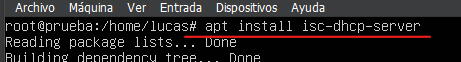

DNS
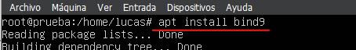

WEB
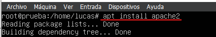

FTP
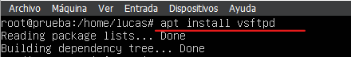

Después de instalar los servicios pongo la maquina en red interna, modifico la configuración del archivo que esta en netplan y empiezo a configurar los servicios uno a uno

## **Configuración de red**
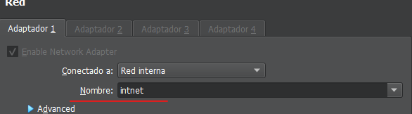

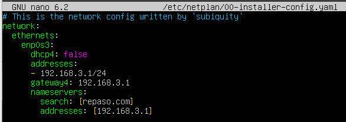

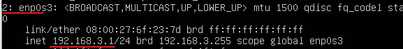

## **Configuración de los servicios:**

**DHCP**
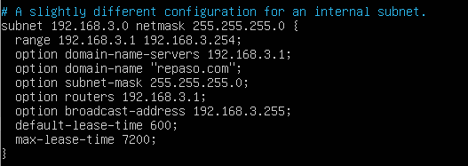

**DNS**
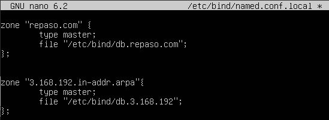

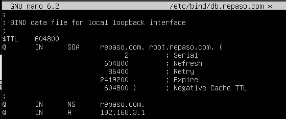

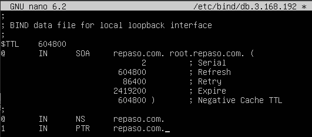

**Web**
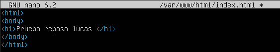

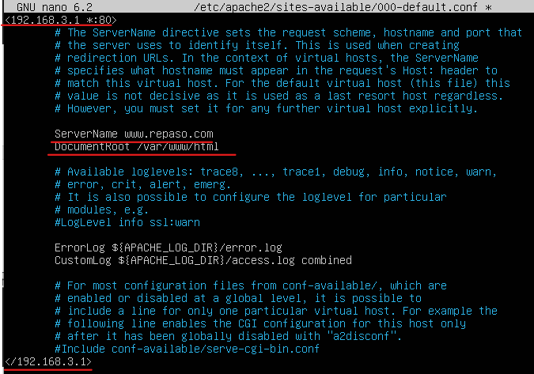

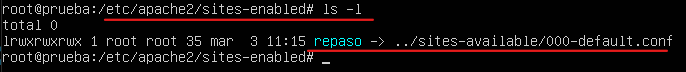

**FTP**
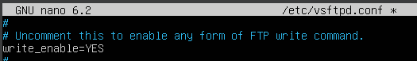

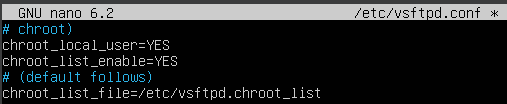

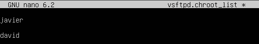

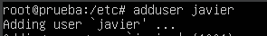

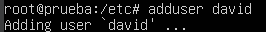

**Correo**
Pongo la máquina en NAT y cambio la configuración del archivo que esta en Netplan, para poder instalar los paquetes necesarios del servicio de correo

Comprobamos o cambiamos el nombre del servidor con el comando hostname, debe ser nuestro nombre de dominio
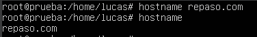

## **Instalamos Postfix**
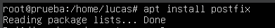

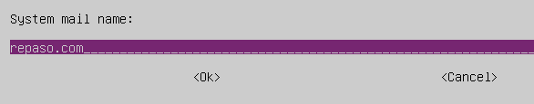

Después de terminar la instalación, debemos configurar Postfix, para ello vamos al archivo “/etc/Postfix/main.cf”, debemos modificar este archivo, debemos asegurarnos que en la línea mydestination, esta nuestro dominio y en la línea mynetworks, deberemos indicar nuestra dirección de red añadiendo 2 líneas adicionales, “home_mailbox = Maildir/” y “mailbox_command = ”
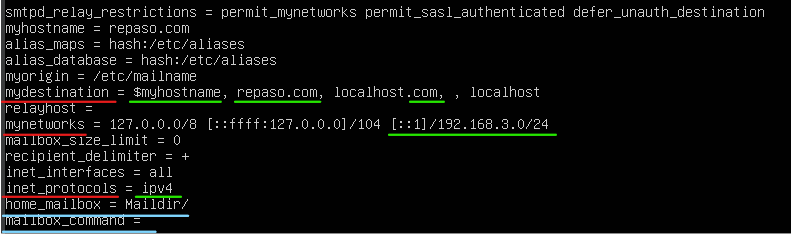

## **Ahora instalamos Dovecot**
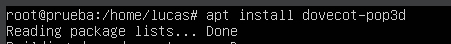

Modificamos el archivo “/etc/Dovecot/conf.d/**10-auth.conf**” y
modificamos la siguiente línea cambiando el “yes” por “no”
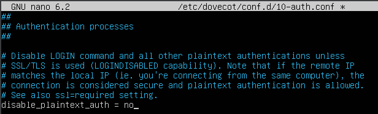

Ahora debemos modificar el archivo “/etc/dovecot/conf-d/**10-mail.conf**”, este archivo debemos modificarlo ya que previamente modificamos la ubicación del maildir, así que descomentamos la línea en verde y comentamos la línea en rojo
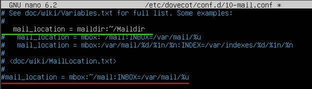

Ahora deberemos configurar el DNS para especificar el intercambiador de correo y configurar las direcciones smtp y pop3 para que los clientes puedan resolver correctamente

**Empezamos modificando la zona directa**

**Añadimos:**

- pop3 IN CNAME “IP del servidor”
- smtp IN CNAME “IP del servidor”
- “dominio” IN MX correo.”dominio”

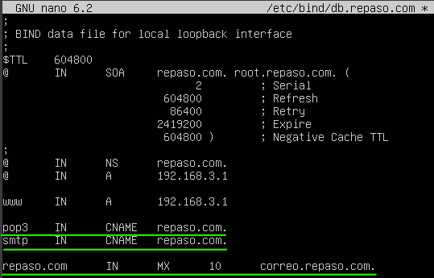

Reiniciamos el servicio DNS y comprobamos desde el cliente que los host y el intercambiador de correo resuelven bien
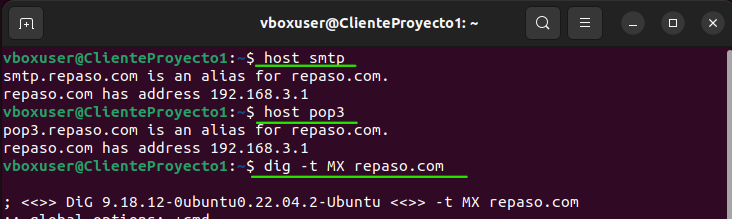

## **Instalamos dovecot-imapd**
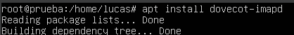

Ahora simplemente iniciamos sesión en Thunderbird desde el cliente y probamos a enviar un correo a otro usuario
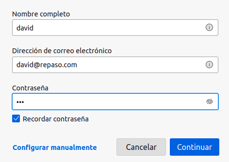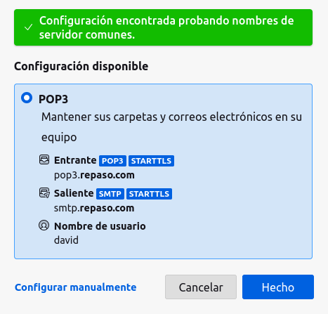

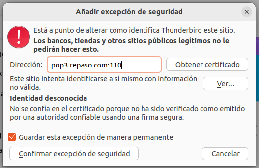

Prueba de mensaje
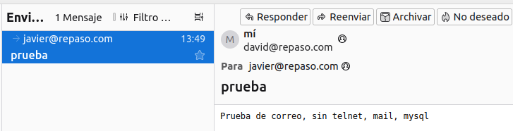

Recibido desde el destinatario
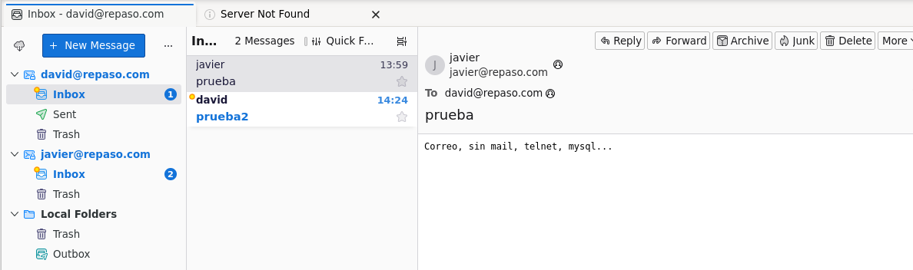
