# **Instalación Ubuntu Server + Entorno gráfico**

**Seleccionamos la imagen ISO del sistema que queremos instalar y le asignamos un nombre a la máquina**
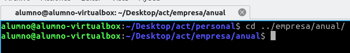

**Asignamos un nombre de usuario y contraseña al usuario primario del sistema, además,**

**aunque es adicional podemos asignar un nombre al host y dominio del servidor**
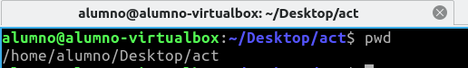

**Le asignamos la cantidad de memoria RAM y capacidad de procesamiento que deseemos y continuamos**
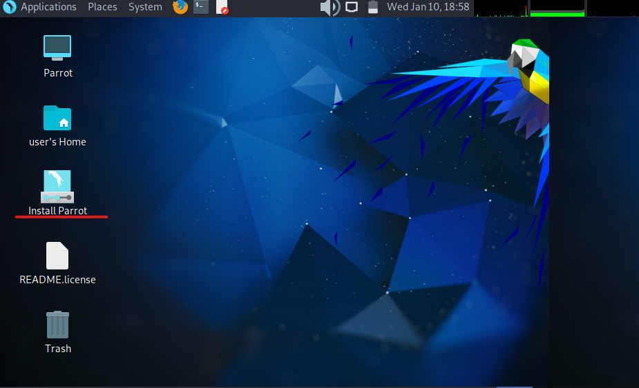

**Establecemos la configuración de almacenamiento que deseemos, en este caso, crearemos un disco virtual y le asignamos capacidad de almacenamiento**
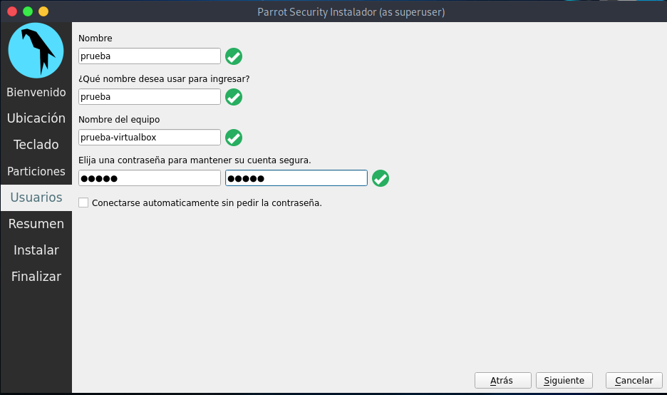

**Confirmamos que la configuración está bien y terminamos con ella**
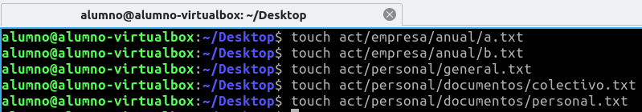

**Una vez terminada la configuración iniciamos la máquina, esperamos un momento hasta que nos salga la siguiente pantalla y para seleccionar el idioma nos movemos con las flechas del teclado y pulsamos la barra espaciadora para continuar**

**Continuamos sin instalar, no es estrictamente necesario, pero está la
opción**

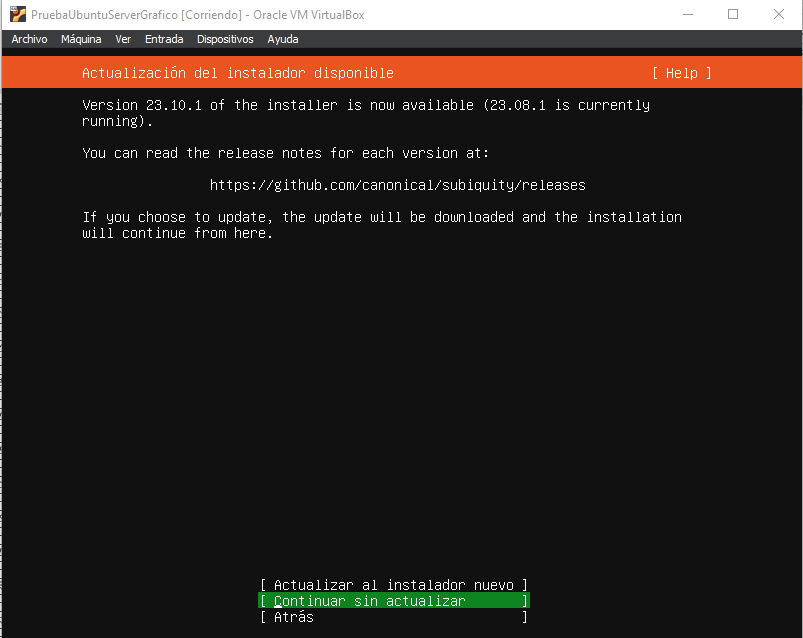

**Seleccionamos el modelo y distribución del teclado que queramos**

**Marcamos la casilla Ubuntu server y continuamos**
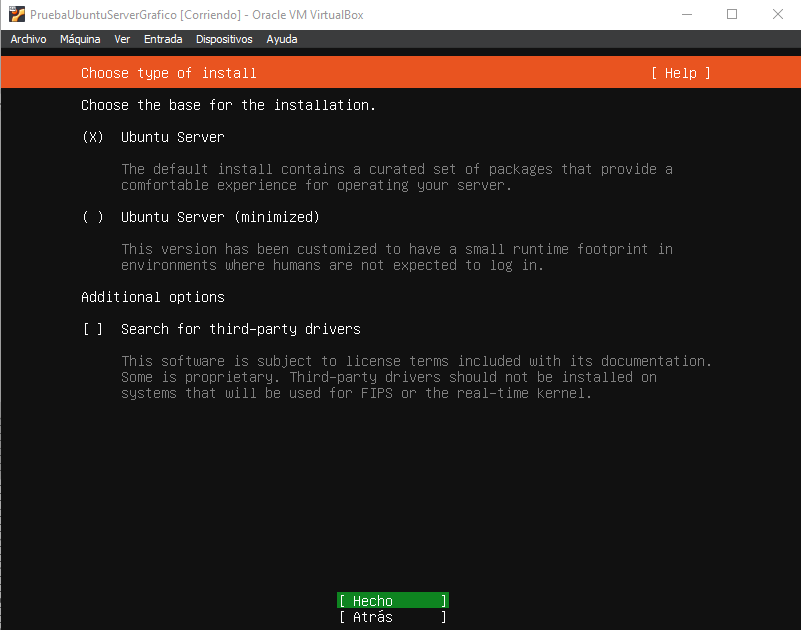

**Configuramos la configuración de red del servidor con las flechas y la barra espaciadora y continuamos**
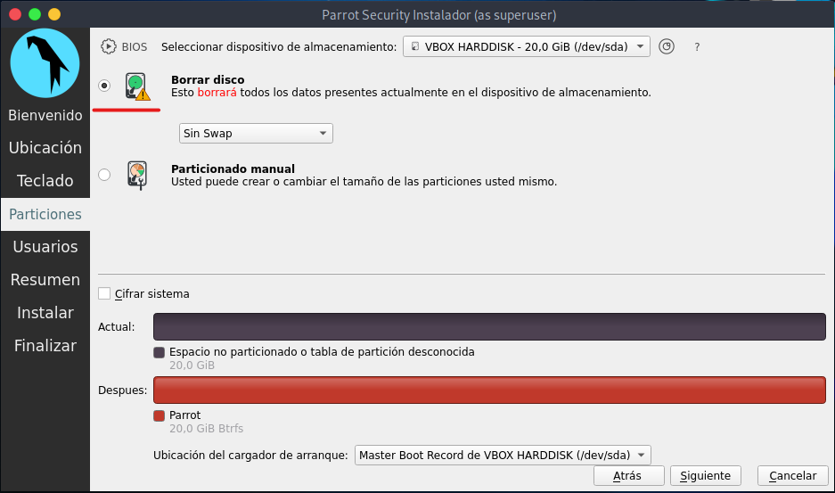

**Seleccionamos el mirror (repositorio donde bajará los paquetes para la instalación)**

**Configuramos las opciones de almacenamiento, encriptarlo o no, usar la totalidad del disco o modificar la distribución del almacenamiento.**
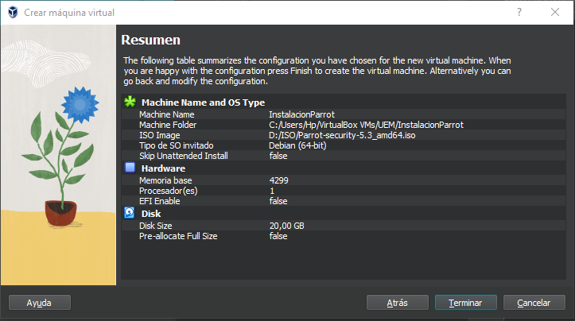

**Revisamos la configuración de almacenamiento y modificamos lo que creamos conveniente**
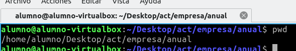

**La siguiente ventana nos informa de que al continuar no podremos volver atrás en la configuración, aseguraros de que estáis conformes con las configuraciones anteriores y seleccionar “continuar”**
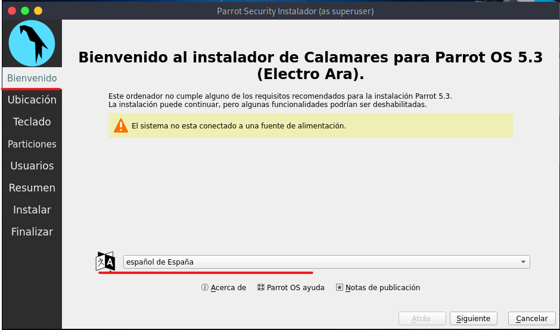

**Seleccionamos un nombre, nombre de usuario, nombre de servidor y
contraseña para acceder al sistema.**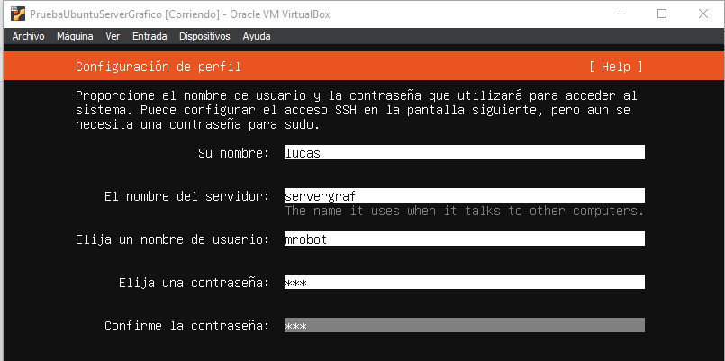

**La siguiente pantalla nos pregunta si queremos upgradear el sistema a Ubuntu pro, para obtener características de seguridad, no saltamos esta parte y continuamos.**
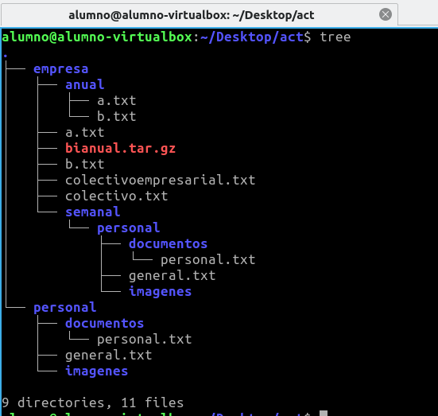

**Podemos seleccionar si instalar el servicio ssh (acceso remoto seguro) ahora, en caso de no hacerlo en este momento podemos hacerlo más tarde como instalaríamos cualquier otro servicio o protocolo**
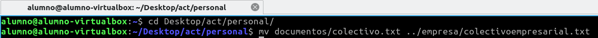

**La siguiente pantalla nos muestra algunas de las principales aplicaciones y características utilizadas en entornos de servidores Linux, en caso de querer instalar algunas la marcamos y continuamos.**
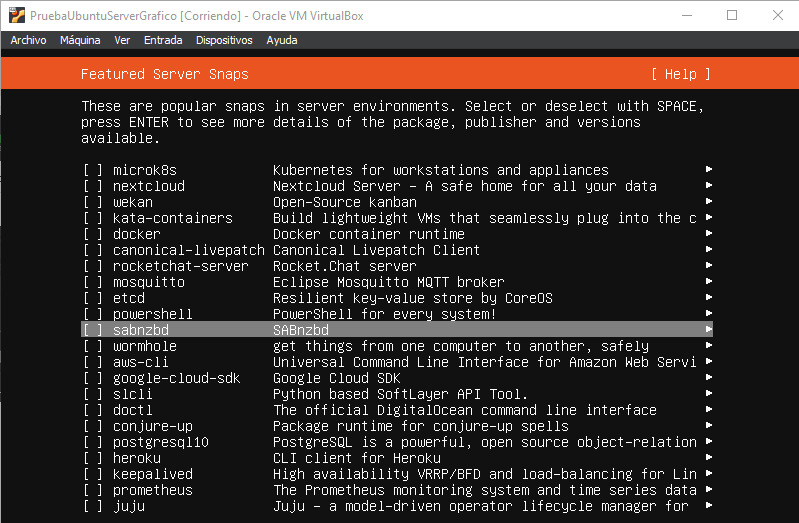

**Una vez empiece la instalación y actualización, si la instalación se ha hecho correctamente deberemos esperar hasta que acabe y seleccionamos la opción reiniciar ahora**
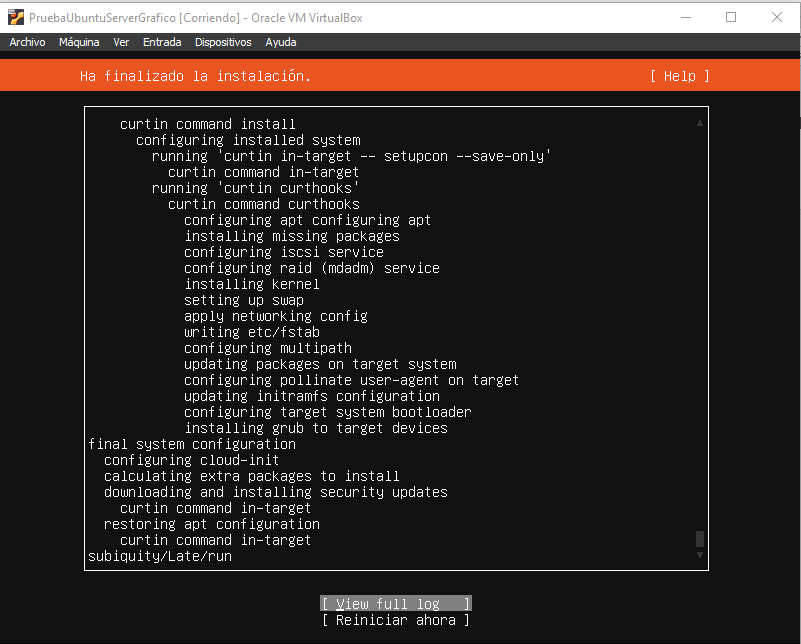

**Introducimos el usuario y contraseña que configuramos durante la configuración**
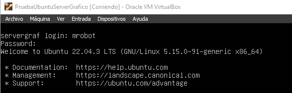

**Lo primero que debemos hacer después de la instalación es actualizar el sistema, para ello utilizaremos el comando sudo apt update**
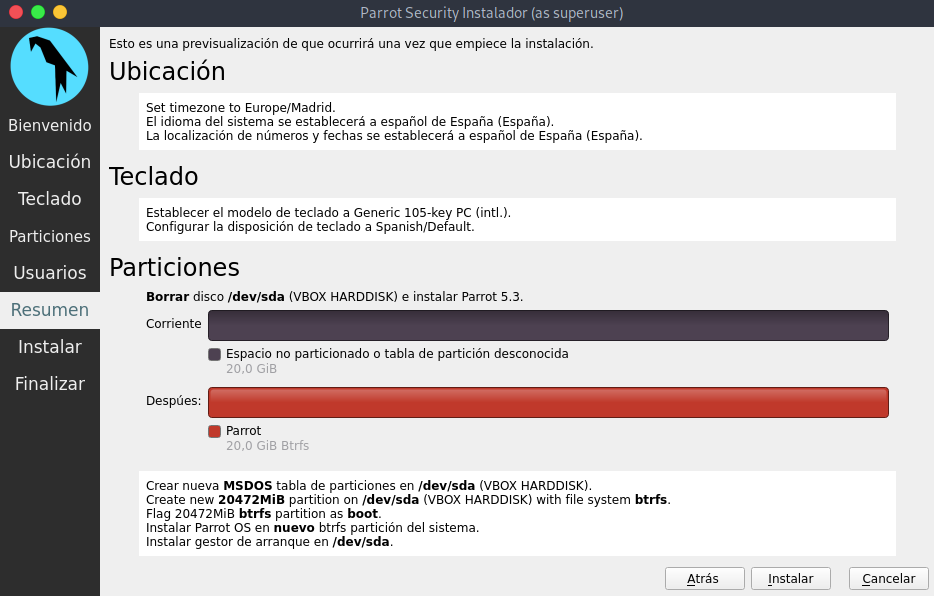

**Para actualizar/instalar los paquetes descargados con el comando anterior utilizamos el comando**

**“sudo apt upgrade”**

**una vez acabada la actualización de los paquetes del sistema es probable que nos muestre un menú para instalar algunos servicios para el sistemas, marcamos los que queramos y pulsamos enter**
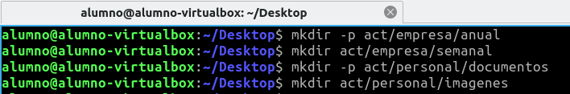

**Para instalar la interfaz gráfica utilizaremos el comando**

**“sudo apt install tasksel”,**

**En este ejemplo utilizaremos el entorno tasksel pero podemos utilizar otros sin problema.**

**Al instalar tasksel nos mostrará un menú para reiniciar algunos servicios, en caso de ser necesario márcalos y continua, para este caso no es necesario**

**Para iniciar tasksell utilizaremos el comando: “sudo tasksell”**

**Seleccionamos el entorno de escritorio Gnome y continuamos**
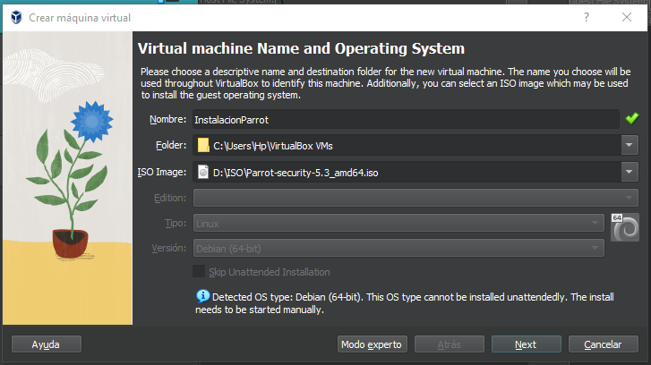

**Para acceder al nuevo entorno ejecuta el comando “startx”**
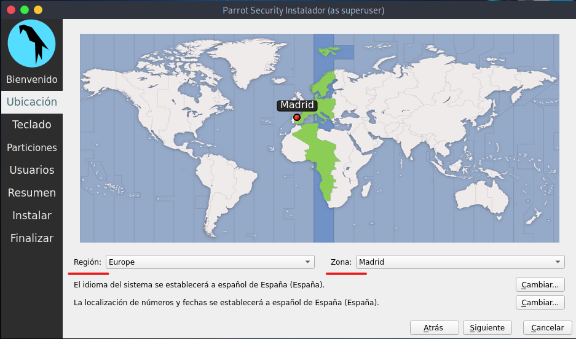

Resumen
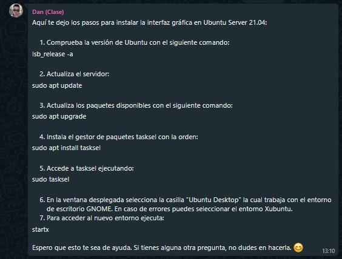
