# **Instalación y configuración DHCP en Ubuntu**

**Para instalar y configurar el servicio DHCP en Ubuntu, debemos tener una máquina con la tarjeta de red en NAT, para poder actualizar, upgradear el servidor e instalar el servicio DHCP, después de esto deberemos cambiar la configuración de la máquina a red interna,**

**En caso de que la máquina esté recién instalada debemos utilizar los comandos:**

1.  sudo apt-get update (para actualizar los paquetes del sistema)
2.  sudo apt-get upgrade (para actualizar los paquetes según los instalados antes)

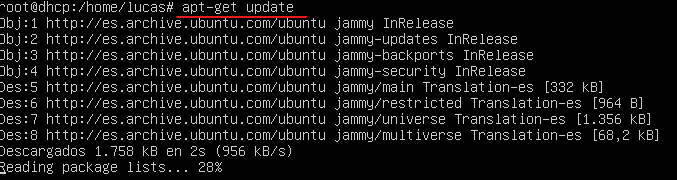

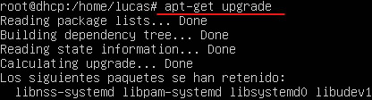

**Para instalar el servicio dhcp debemos utilizar el comando:**
- sudo apt-get install isc-dhcp-server
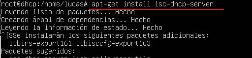

**Después de actualizar el sistema e instalar el servicio DHCP, debemos
poner la tarjeta de red en red interna.**
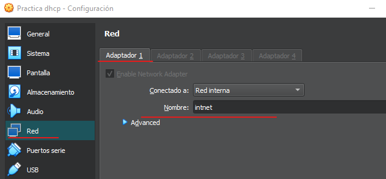

**Ahora debemos asignar una dirección IP estática al servidor, para ello vamos a la ruta “/etc/netplan” y modificamos el archivo .yaml, antes de modificarlo en recomendable copiarlo por si cometemos cualquier error, para modificarlo utilizamos el comando:**
- sudo nano 00-installer-config-yaml”
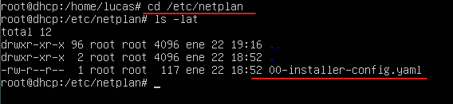

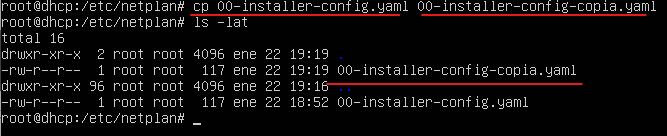

**dentro de este archivo modificamos de la siguiente manera, exactamente igual, no utilices tabulaciones, utiliza espacios en su lugar, copia exactamente el siguiente formato, con el mismo número de espacios y todo.**
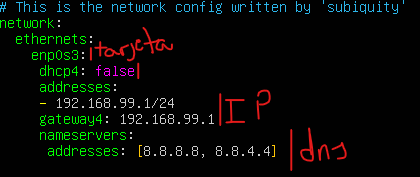

**Pulsa, (ctrl+o) y enter para guardar y (crtl+x) para salir.**

**Después deberás utilizar el siguiente comando para aplicar la configuración anterior:**
- sudo netplan apply

**Para comprobar que la dirección IP del servidor se ha cambiado correctamente utiliza el siguiente comando:**
- ip a
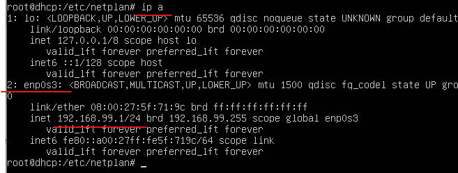

**Después de establecer una dirección IP estática al servidor, vamos a configurar el DHCP, para ello vamos a la ruta /etc/dhcp y antes de modificar el archivo “dhcpd.conf” hacemos una copia por si acaso.**
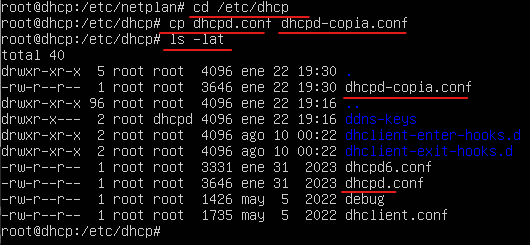

**Después de hacer la copia ahora si, modificamos el archivo “dhcpd.conf” con el siguiente comando:**
- nano dhcpd.conf

**dentro del archivo buscamos la siguiente línea y quitamos los asteriscos y modificamos los valores por la configuración que queramos aplicar**
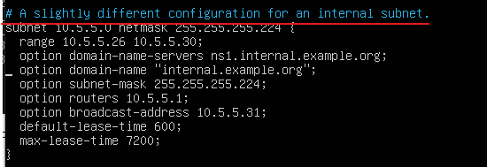

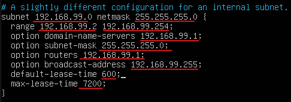

**Para crear la reserva buscamos la siguiente línea, eliminamos los asteriscos y cambiamos los valores según la configuración que queremos hacer, introduciendo la dirección MAC del cliente y la dirección IP que queremos asignarle.**
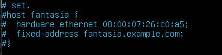

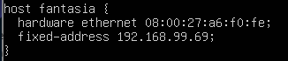

**Guardamos y salimos**
**Ahora debemos iniciar el servicio dhcp con el siguiente comando:**
- service isc-dhcp-server start

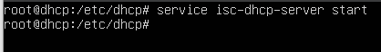

**Para comprobar el estado del servicio utilizamos el siguiente comando:**
- Service isc-dhcp-server status
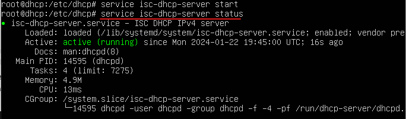

**Ahora vamos al cliente al cual le hemos hecho la reserva y comprobamos que está recibiendo IP, y la asignada**
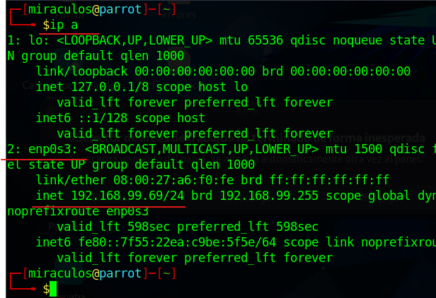

**Interpretar archivo “dhcpd.conf”**
- **Subnet:** dirección de red y máscara
- **Range:** rango de IPs que queremos asignar
- **Option Routers:** puerta de enlace
- **Option Domain names servers:** DNS
- **Default lease time:** duración de la concesión
- **Host fantasía** = host de la reserva IP
- **Fixed Address:** dirección IP que le vamos a asignar en la reserva
