**Instalación y configuración servidor web con apache**

**Para la instalación y configuración del servicio WEB en Ubuntu server,
debemos tener una máquina previamente actualizada, upgradeada y con los
servicios DHCP y DNS configurados.**

**Es posible que el firewall de problemas, así que puedes desactivarlo
con el comando:**

- ufw disable

**Para instalar el servicio WEB, utilizaremos el comando:**

- apt-get install apache2

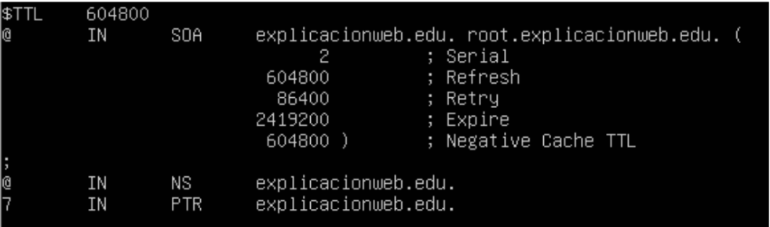

**Después de haber instalado el servicio ponemos la maquina en red
interna**

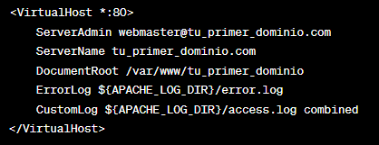

**Configuración de red del servidor:**

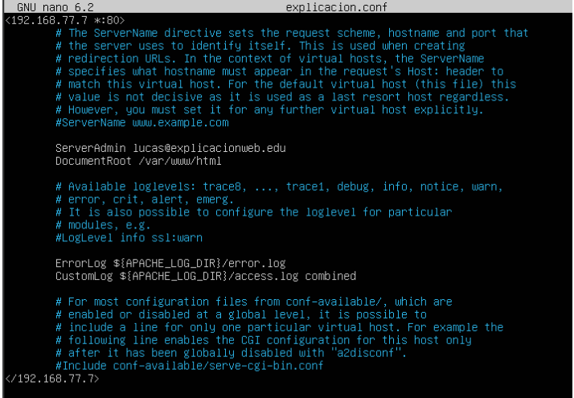

**Configuración DHCP**

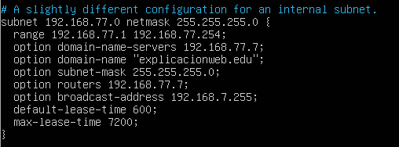

**Configuración DNS**

Named.conf.local

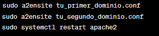

db.explicacionesweb (aquí he creado el host www para la página web)

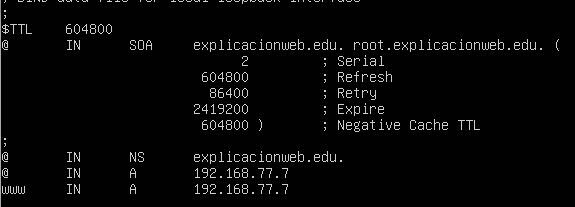

db.77.168.192

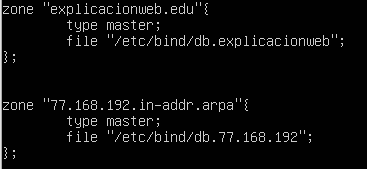**DHCP y DNS habiendo creado
el host www, procedemos a la configuración del servicio web**

**Una vez nos hemos asegurado que toda la configuración de red del
servidor, la configuración**

**Para ello vamos a la ruta “/var/www/html”, en ella estará el archivo
html por defecto que viene al instalar el servicio apache, tenemos
varias opciones, eliminarlo y crear uno nuevo, copiar una página que ya
tengamos creada o simplemente modificar el contenido con el comando
nano, en mi caso eliminare el archivo y creare uno nuevo.**

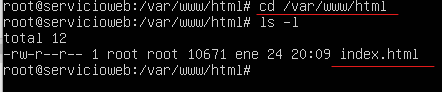

En esta foto muestro como lo elimino

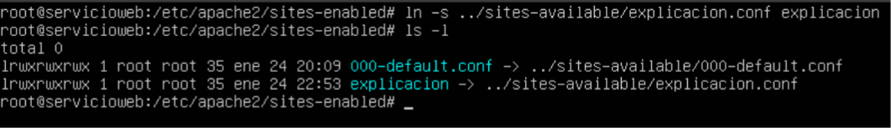

**Aquí muestro como creo otro con el comando nano**

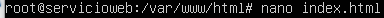

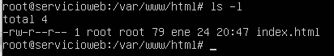

**Una vez hemos configurado las página web que va a proveer el servidor
seguimos con la configuración para ello vamos a la ruta
“/etc/apache2/”**

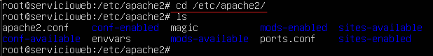

**Vamos al directorio “sites-available” y hacemos una copia del archivo
000-default.conf”, para utilizarlo como plantilla y configurarlo
nosotros**

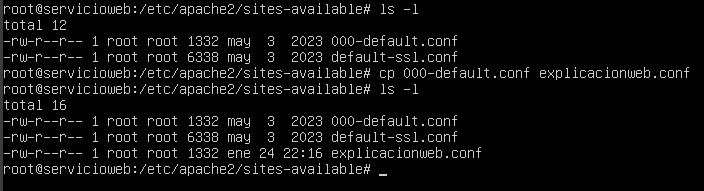

**Lo editaremos con nano y dentro de él tendremos que reemplazar los
apartados “virtualhost” con la IP de nuestro servidor, y en
“DocumentRoot” la ruta donde esta el archivo index de la página web**

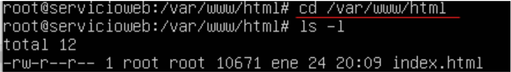

**Después de configurar los archivos de configuración de la/s página/s
web de nuestro servidor en el paso anterior, vamos a la ruta
“/etc/apache2/sites-enabled” y creamos un link simbólico al archivo que
creamos anteriormente con el comando:**

- ln -s ../sites-avialable/archivo.conf” “nombre del enlace”

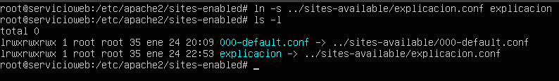

**Ahora para evitar posibles errores hacemos un restart y status en los
servicios para comprobar que funcionan**

**DHCP**

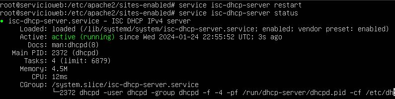

**DNS**

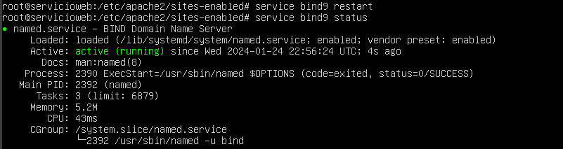

**Apache2**

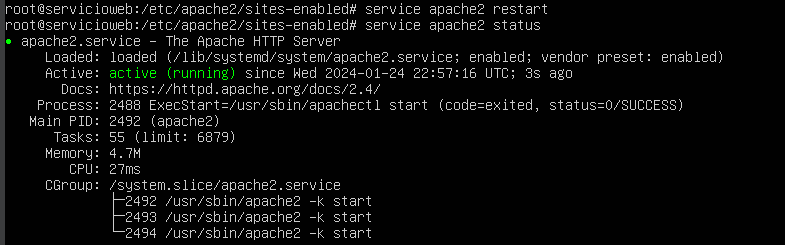

**Ahora por último comprobamos desde un cliente que podemos acceder a la
página web del servidor por el dominio utilizando la resolución de
nombres, para ello introduciremos en el navegador el host que creamos
para el servicio “www” + el dominio del servidor “explicacionweb.edu”**

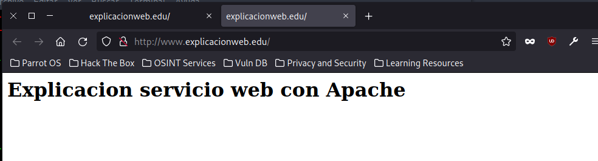
