# **Configuración e instalación de FTP en Ubuntu server**

**Para instalar y configurar el servicio FTP en Ubuntu server, debemos tener una máquina con la tarjeta de red en NAT, para poder actualizar, upgradear el servidor e instalar el servicio DNS y DHCP para poder tener conexión con los clientes y que estos puedan resolver el nombre de dominio del servidor y crear un host para el servicio FTP, después de esto deberemos cambiar la configuración de la máquina a red interna,**

**Para instalar el servicio FTP utilizamos el comando**
- apt-get install vsftpd

**Una vez instalado el servicio ponemos en red interna la máquina**
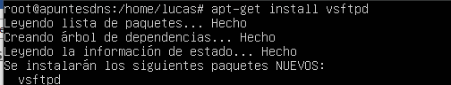

**Ahora para configurar el servicio vamos a la ruta (/etc/) en ella está el archivo “vsftpd.conf”**
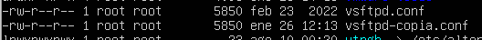

**antes de modificar este archivo hacemos una copia de seguridad por si acaso**

**Lo modificamos con el comando nano**
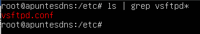

**Buscamos la siguiente línea y la descomentamos para permitir la escritura desde los clientes**
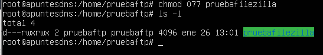

Lo mismo con estas líneas, en ellas estamos configurando que permita la conexión ftp a usuarios locales y a los usuarios que estén en el listado “chroot list” file también,
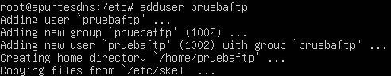

**Después de descomentar las líneas debemos crear el archivo con el mismo nombre que aparece en el anterior archivo, en este caso “/etc/vsftpd.chroot_list” pero podría ser otro siempre que lo especifiquemos**

**Creamos el archivo con nano**

**En el debemos crear añadir usuarios de nuestro dominio que queramos permitir la conexión ftp**
**Podemos crear usuarios con el comando**
- adduser
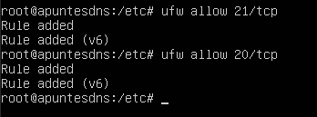

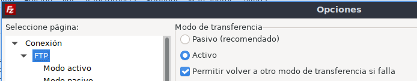

Ahora debemos reiniciar el servicio para aplicar los cambios con el comando:
- Service vsftpd restart
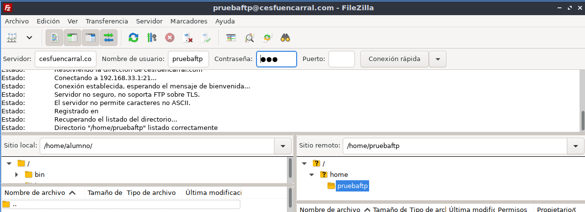

**Ahora para comprobar que el servicio está bien configurado vamos a un cliente con FileZilla e introducimos el dominio/IP del servidor y las credenciales del usuario al que queremos acceder**

**Es posible que el firewall del servidor de problemas, para evitarlo podemos deshabilitar completamente con el comando:**
- ufw disable

**O permitir los puertos que nosotros queramos, en este caso necesitamos los puerto 20 y 21:**
- ufw allow 20/tcp
- ufw allow 21/tcp
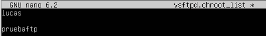

**Con el comando ufw status podemos ver la configuración y estado del firewall**
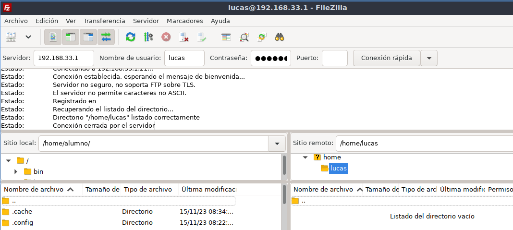

**En FileZilla es posible que tarde en sincronizar con el servidor y no el tiempo de espera haga que no se conecte con el servidor, para ello vamos al apartado Edición\>FTP y lo ponemos en modo activo**
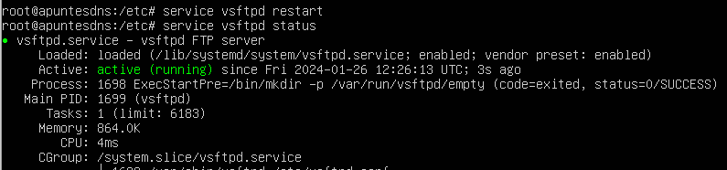

**Una vez tenemos todo configurado vamos a FileZilla e introducimos la IP/dominio del servidor y las credenciales del usuario al que queremos acceder, Usuario Lucas con la IP:**
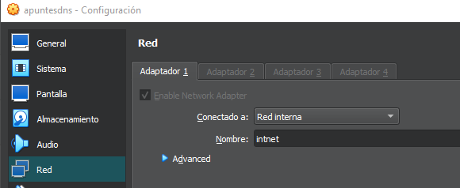

Usuario pruebaftp, con el nombre de dominio:
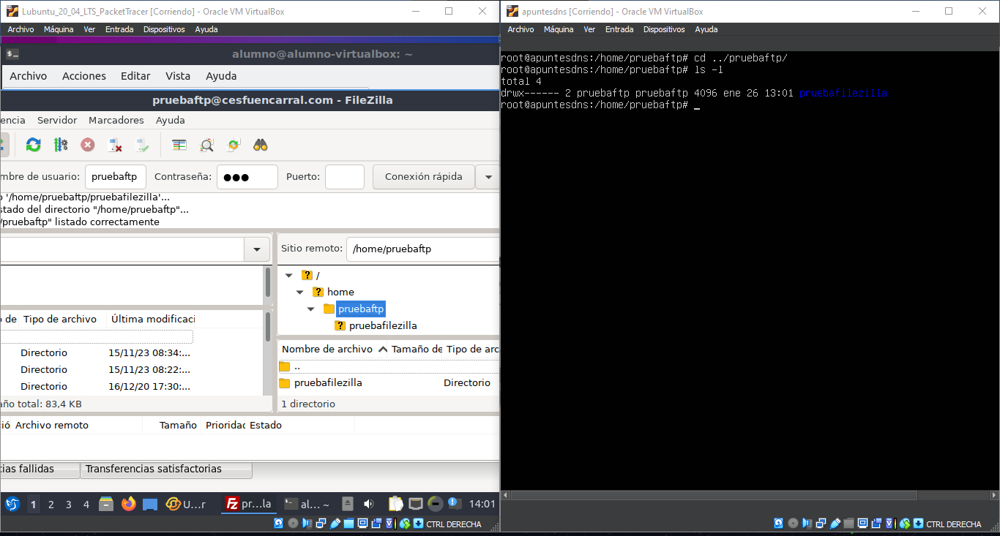

**Comprobamos que podemos interactuar con los archivos y que se ven reflejados en ambas partes y listo.**
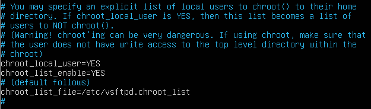 

**Después de esto podríamos modificar los permisos de escritura/lectura/ejecución del sistema de archivos para tener más control**
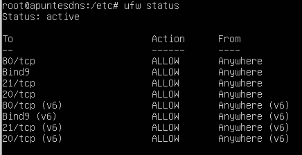
