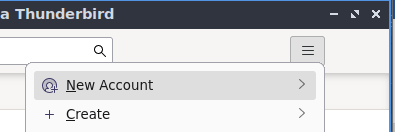

# **Correo electrónico** (resumen abajo)
El servicio de correo electrónico es el **equivalente al servicio postal en la red** y de la misma forma necesitamos un mensaje y una infraestructura para enviarlo hasta su destinatario.

**Cuentas:** A los **usuarios de este servicio** les asignamos una cuenta de correo electrónico para identificarlos, la cual se divide en dos partes separadas por una arroba **“usuario @ dominio”.**

**Gestor:** A la **infraestructura para la transferencia** entre estos la denominamos servicio o gestor de correo electrónico

**Email:** A cada **mensaje transferido** por un servicio de correo electrónico se le llama email.

## **Servidores / gestores de correo electrónico:** 
Son las aplicaciones o servicios que nos proporcionan herramientas para transferir y gestionar y visualizar, e-mails, cuentas de correo. Utilizan los protocolos IMAP, POP, SMTP

- Actualmente hay **dos tipos de correo electrónico**, los basados en **POP3, IMAP y SMTP**, y los basados en **Exchange de Microsoft** (usado en entornos corporativos) “Hotmail”.

- Hay dos servidores diferentes, uno que se encarga de **enviar los correos, SMTP**, y otro que se encarga de **recibirlos y guardarlos en el buzón**, al que nos conectaremos a través de **POP3 y IMAP**

## **Agentes del servicio:** 
Elementos que participan en la transferencia de email:

**MUA: (Mail User Agent) Thunderbird/RoundCube/mailx**
Software encargado de **componer, enviar y recibir emails del lado delcliente**, Utiliza SMTP para el envió y POP/IMAP para larecepción/lectura.

**MTA: (Mail Transfer Agent) postfix**
Sistema encargado de **recibir emails**, el cual **analiza** para determinar a donde va dirigido y así **redirigirlo** al MTA del receptor o MDA en caso de que el receptor se encuentre en el mismo dominio.

**MDA: (Mail Delivery Agent) pop3/imap/smtp**
Sistema que **recibe** email

### **Proceso:**

- **El usuario envía un email a través de un email desde un software (MUA).**
- **El MTA lo recibe analiza y redirige hasta el sistema receptor (MDA)**
- **El usuario recibe el mensaje y visualiza desde el MUA**

### **Protocolos:**

**POP: (Post Office Protocol)** Protocolo básico de lectura de correos electrónicos, descarga los emails en el cliente y los muestra en el buzón del gestor de correo, por lo tanto, una vez descargados serán accesibles sin necesidad de conexión a la red

**IMAP: (Internet Message Access Protocol)** Protocolo más elaborado que POP para la lectura de correos, permite leer los correos a través de la conexión a internet sin necesidad de descargarlos en el cliente,

Gracias a este diseño es posible acceder al correo a través de cualquier equipo conectado a la red, permitiendo así compartir buzones.

**SMTP: (Simple Mail Transfer Protocol)** Protocolo empleado para el envío de correos electrónicos entre equipos

## **Software de correo electrónico:**

**Dovecot: (Servidor de correo)**
- Con el gestionaremos el acceso a los buzones de correo de nuestro dominio

**Thunderbird: (Cliente de correo)**

- Software gestor de correo electrónico del lado cliente, que nos **permite enviar y recibir y gestionar emails**, es parecido a otros como Gmail y Outlook

- Deberemos iniciar sesión con las cuentas creadas en Mercury y podremos
  enviar y recibir e-mails a otras cuentas de correo.

## Resumen de la práctica en Ubuntu server

Resumiendo bastante la práctica, consiste en <u>instalar y configurar
postfix</u> (el servicio de correo electrónico), <u>comprobar</u> que funciona localmente <u>instalando mailx</u> (cliente de correo), despues
<u>instalar y configurar Dovecot</u> (gestor de correo) <u>para
gestionar los buzones de los usuarios</u> en el servidor ,<u>crear los
alias de POP3 y SMTP</u> y el <u>intercambiador de correo en la zona
directa</u> del DNS de nuestro dominio, <u>instalar IMAP para gestionar
el acceso a los buzones de los usuarios</u> desde los clientes de correo, pero para ello <u>primero deberemos instalar MySQL</u> para gestionar la base de datos de los buzones y usuarios de correo, para finalmente <u>iniciar sesión con nuestro usuarios en thunderbird</u> (cliente de correo) para comprobar que pueden acceder y enviarse mensajes correctamente entre ellos.

### **Índice.**
- Configurar el hostname
- Instalar Postfix
- Instalar bsd-mailx
- Instalar y configurar Dovecot-pop3
- Configurar DNS
- Instalar MySQL
- Instalar Imap
- Comprobar en Thunderbird
