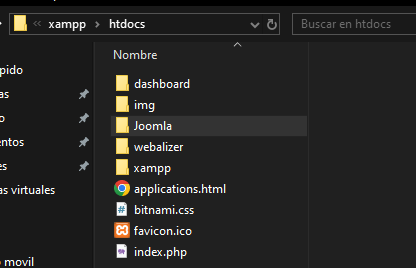
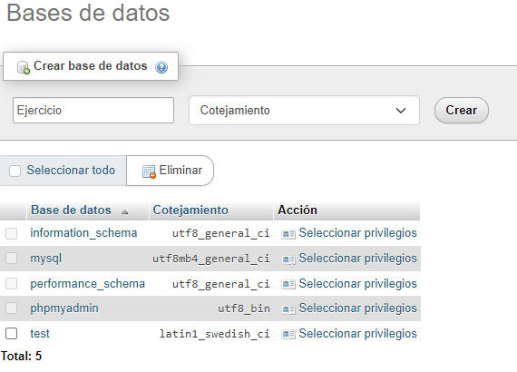
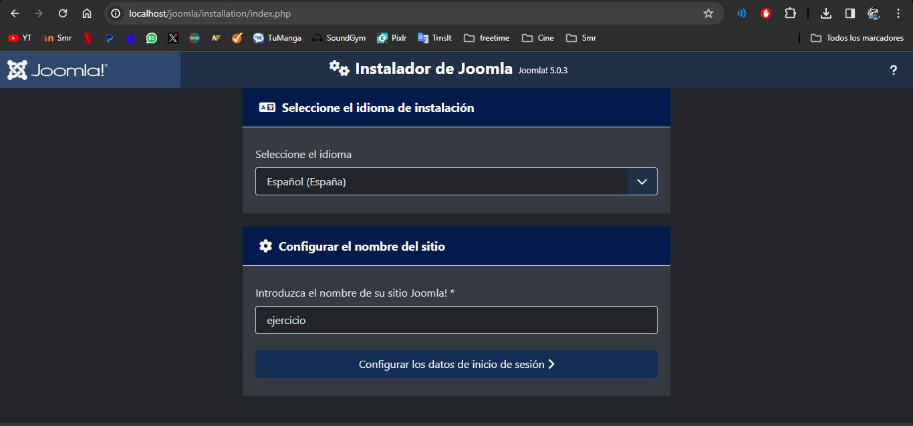
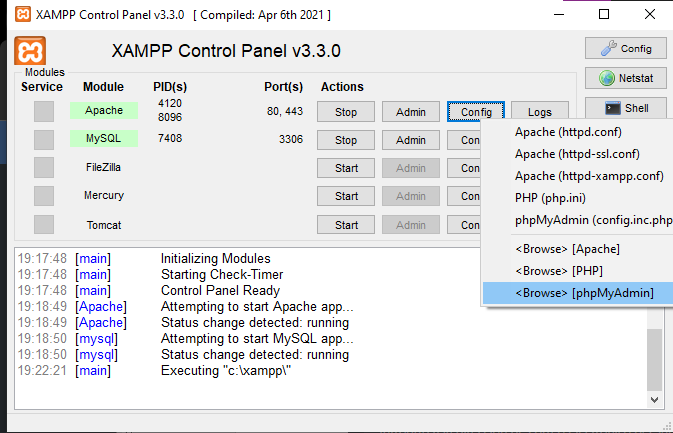
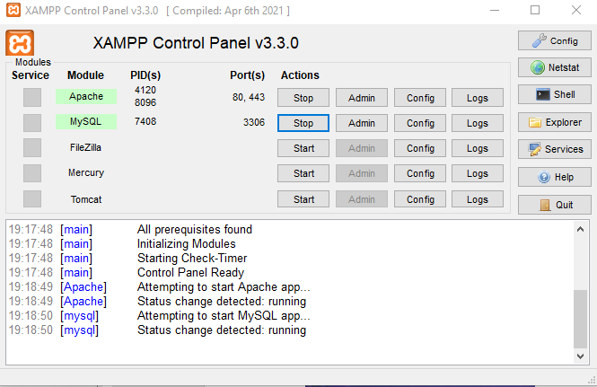
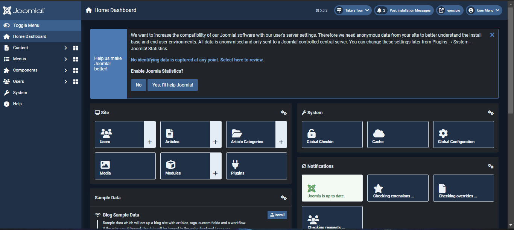

Instalacion XAMPP, para ello debemos ir a la página oficial y después de descargar el instalador debemos darle permisos de ejecución y ejecutarlo con sudo

Instalamos XAMPP

Instalamos Joomla

Extraemos los paquetes de Joomla

Iniciamos los MySQL y APACHE en XAMPP

Introducimos la dirección “localhost/phpmyadmin/index.php” en el navegados para entrar en el administrador del servidor local y creamos una base de datos, asignándole un nombre y la opción cotejamiento

Después de crear la base de datos, copiamos los archivos de Joomla que extrajimos previamente y los copiamos en la ruta lampp/htdocs, podemos acceder a ellas dándole a explorer en XAMPP, deberemos asignar los permisos correspondientes para Joomla que puedan acceder a los archivos

Ahora para acceder al asistente de instalación de Joomla introducimos la dirección “localhost/Joomla” en el navegador y crear nuestro sitio web asignándole un nombre y un usuario administrador con su contraseña y email.

Ahora ya tendríamos acceso al administrador de paginad de Joomla

