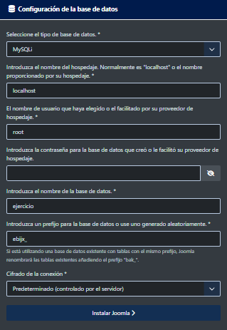

**\#Webgrafía:**

[<u>https://youtu.be/lzadvoron4I?si=XxcwUQOO7Rk-xUDB</u>](https://youtu.be/lzadvoron4I?si=XxcwUQOO7Rk-xUDB)

**Resumen:**

Primero instalamos XAMPP y después Joomla, después extraemos los paquetes de Joomla, Abrimos XAMPP e iniciamos los servicios APACHE y MYSQL y buscamos la dirección “localhost/phpmyadmin” en el navegador para acceder al panel de administración de XAMPP y creamos una base de datos, después de crear la base de datos, copiamos los archivos que
instalamos previamente de Joomla en la ruta “xampp/htdocs”, después de copiar los archivos, vamos al navegador e introducimos la dirección “localhost/Joomla” e introducimos la información necesaria para la instalación.

Instalo XAMPP

Instalo Joomla

Extraigo los ficheros y renombro el directorio como Joomla

Abro XAMPP y inicio apache y MSQL

Introduzco la dirección: “http://localhost/phpmyadmin/index.php” en el navegador, hago clic en nueva y creo una base de datos y selecciono la opción cotejamiento

Después de crear la base de datos, copiamos los archivos de Joomla que extrajimos previamente y los copiamos en la ruta XAMPP/htdocs, podemos acceder a ellas dándole a explorer en XAMPP

Ahora para acceder al asistente de instalación de Joomla introducimos la dirección “localhost/Joomla” en el navegador y crear nuestro sitio web asignándole un nombre y un usuario administrador con su contraseña y email

Durante la instalación deberemos introducir un usuario, este usuario debe estar en la base de datos, para verla podemos ir a XAMPP, seleccionar inspeccionar “phomyadmin” en la configuración de apache2, aquí deberemos abrir el archivo config.inc con un editor de texto

Tras finalizar la instalación podemos acceder directamente al sitio web, o al panel de administración

http://localhost/joomla/administrator/index.php

http://localhost/joomla/

