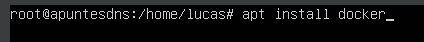
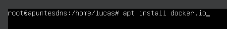
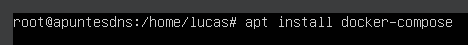
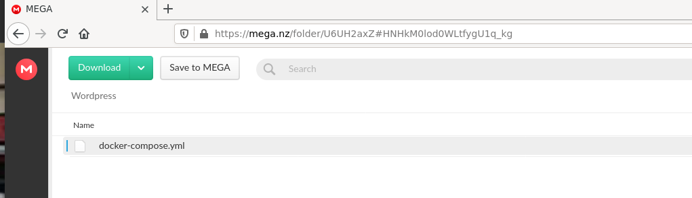
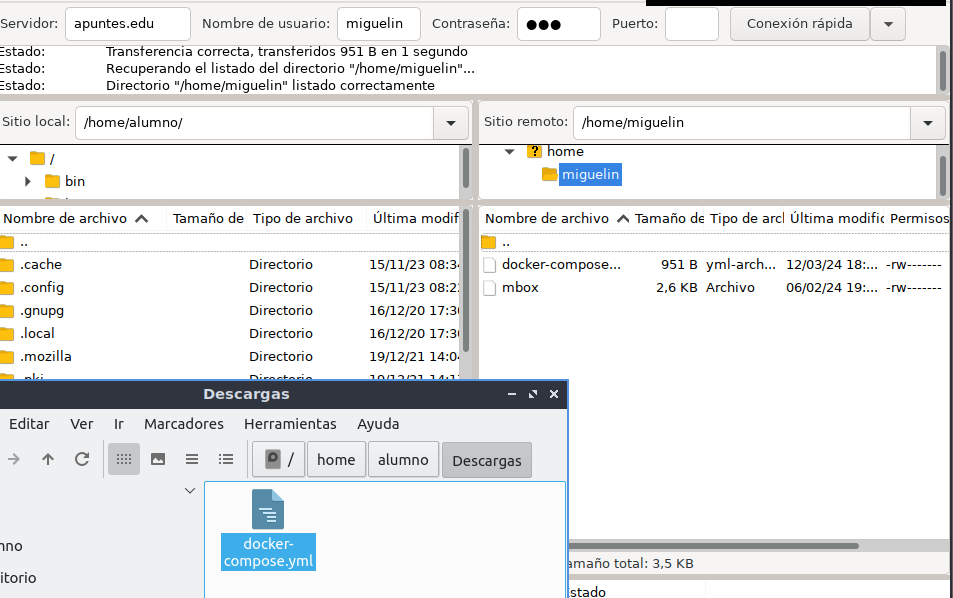
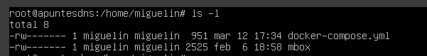
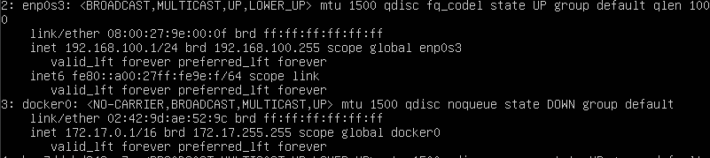
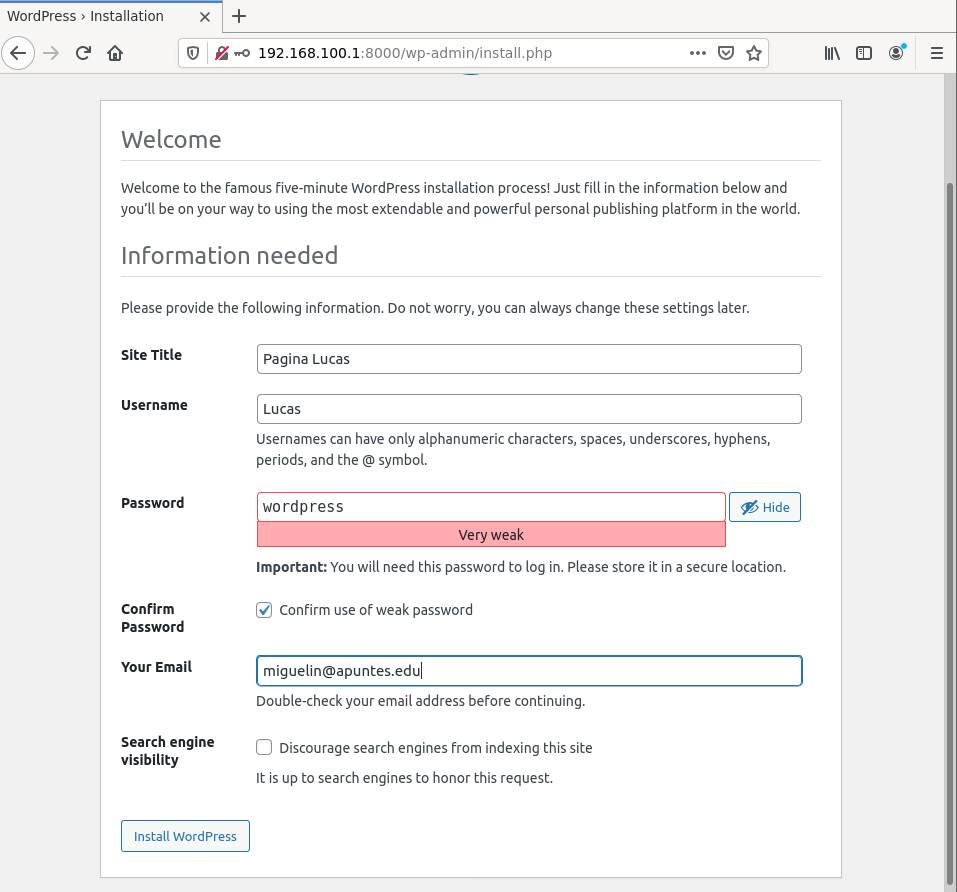
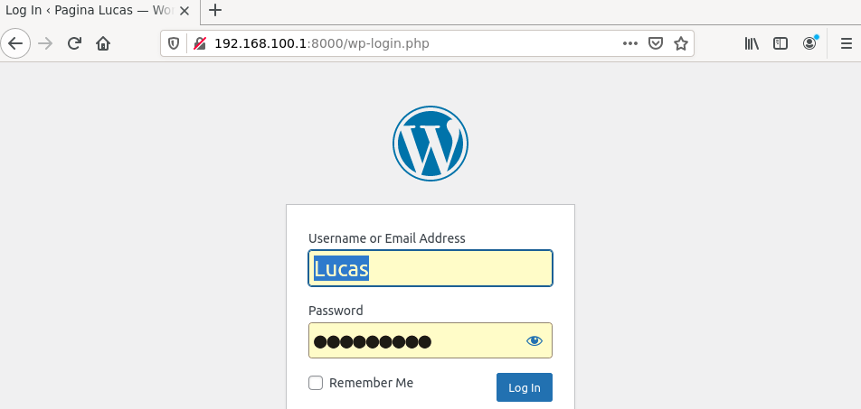
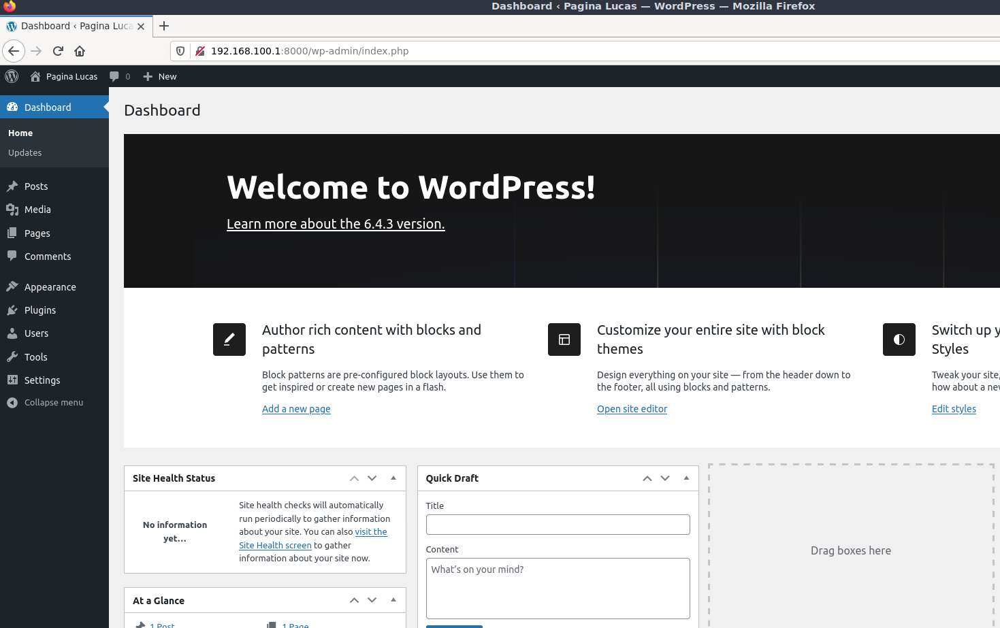

**Webgrafía:**

https://youtu.be/gj7D9SuPZZg?si=JBY67SpqDsGK2r5f

**Resumen:**

En mi caso he instalado WordPress con Docker en un Ubuntu server, para ello primero he instalado algunos paquetes de Docker necesarios y el archivo yaml de WordPress, el archivo yaml lo he instalado desde un cliente y lo he pasado al servidor con FileZilla, después de pasar el
archivo de WordPress e instalado las librerías necesarias y al finalizar la instalación ya podía acceder al panel de instalación y administración desde el cliente introduciendo la dirección del servidor y el puerto 8000

*Aclarar que para instalar los paquetes de Docker necesitas salida a internet en el servidor, después de tendrás que estar en la misma red que el cliente para poder conectarte desde FileZilla para pasar el archivo Yaml, después de tener el archivo deberás tener salida a internet de nuevo para instalar WordPress y por ultimo deberás estar en la misma red que el cliente para acceder al panel de instalación.*

Instalo Docker

Instalo el archivo de Docker en el cliente

Paso el archivo desde el cliente al servidor a través de FileZilla

Compruebo que se ha pasado correctamente

Ahora instalo las librerías de Docker necesarias para acceder a WordPress

Busco en el navegador del cliente la dirección y puerto de WordPress

Aquí ya estaría en el panel de administración de WordPress

