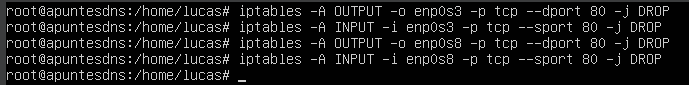
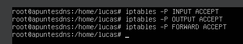
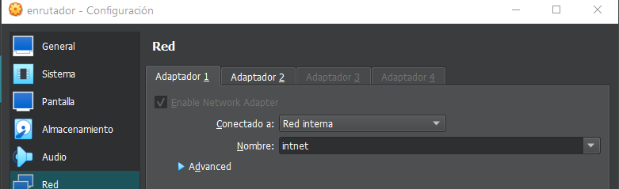
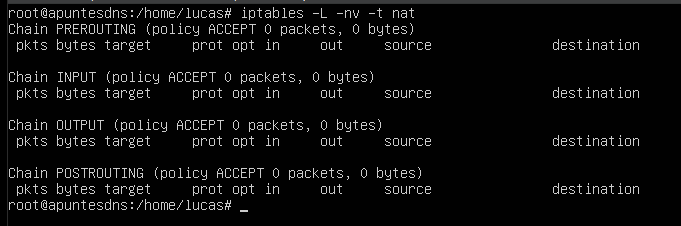

**Repaso seguridad informática**

**Seguridad informática**

Conjunto de medidas y procedimientos para proteger la integridad,
confidencialidad y disponibilidad de la información:

**Integridad:** Garantiza que la información no se altera, pierde o
destruye.

**Confidencialidad**: Acceso solo a usuarios autorizados

**Disponibilidad:** Información disponible a las demandas

**Seguridad física:**

Conjunto de medidas de protección y prevención, destinadas a evitar los
daños físicos a los equipos informáticos y a la información almacenada
en ellos.

**Ejemplo:**

> Candados, termostatos, instalaciones eléctricas, prevención contra
> fenómenos meteorológicos como terremotos e inundaciones

**Seguridad lógica:**

Conjunto de medidas de protección de datos y aplicaciones informáticas
así como garantizar el acceso solo a los usuarios autorizados

**Ejemplos:**

Contraseñas, Firewalls, cifrado de archivos, certificados digitales,
etcétera.

**Criptografía:**

Técnica que consiste en codificar la información mediante una clave,
para que solo sean capaces de descodificarlas aquellos que conozcan la
calve utilizada para el cifrado.

**Algoritmos/Métodos de cifrado:**

**Excítala:**

Primer sistema criptográfico conocido

Consiste en dos varas del mismo grosor, una para el emisor y otra para
el receptor

Cuando el emisor quiere codificar un mensaje enrolla una cinta en su
vara sobre la que escribirá el mensaje de tal forma que al desenrollar
la cinta será ilegible a menos que se tenga una vara del mismo grosor
para enrollar la cinta y leer el mensaje

**Cesar:**

Cifrado de sustitución monoalfabética

Consiste en desplazar el alfabeto un determinado número de posiciones de
tal forma que al alinearlo con el alfabeto se obtiene una relación entre
las letras

**Vigenere:**

Está basado en diferentes series de caracteres del cifrado César,
formando estos valores una tabla llamada Vigenere, que se usa como clave

El cifrado de Vigenère es un cifrado de sustitución simple poli
alfabético.

1.  Se basa en la tabla de la diapositiva siguiente

2.  Por ejemplo, para cifrar el mensaje "EJEMPLO CIFRADO" con la clave
    "CLAVE", ponemos la clave encima del texto a cifrar repitiendo la
    clave tantas veces como haga falta hasta cubrir completamente el
    texto a cifrar, de la siguiente manera.

3.  Y ahora para obtener el texto cifrado sólo queda sustituir cada
    carácter del texto a cifrar por el carácter de la tabla anterior que
    se encuentra en la intersección entre la columna que corresponde al
    carácter a cifrar y la fila correspondiente al carácter de la clave
    que está justo encima

**Elementos de un criptosistema:**

- Mensajes sin cifrar, texto plano o texto nativo (m): documentos
  originales

- Mensajes cifrados o criptogramas (C)

- Conjunto de claves (k)

- Transformaciones de cifrado (E): una diferente por cada clave

- Transformaciones de descifrado (D)

**Proceso:**

1.  Emisor codifica su texto plano (m) con una clave (k) obteniendo un
    texto cifrado (c)

2.  Receptor recibe el mensaje cifrado (c) y lo descifra con la clave
    utilizada para cifrarlo (k) y obtiene el texto plano (m)

**Tipos de criptosistemas**

**Simétricos o de clave secreta:**

Existe una clave única secreta que conocen y comparten emisor y receptor
para codificar y descodificar los mensajes que se mandan entre ellos

**Asimétricos o de clave publica:**

Cada usuario crea dos claves inversas una privada y una pública, es
decir, el emisor utiliza una clave para el cifrado y el receptor utiliza
una inversa para descifrarlo. La seguridad está en la dificultad está en
averiguar la clave privada a partir de la clave pública

**Algoritmos de cifrado simétrico**

- Sistemas de cifrado antiguos, como César, ...

- AES (Advanced Encryption Standard)

- RC5 (Rivest Cipher)

- IDEA (International Data Encryption Algorithm)

**Algoritmos de cifrado asimétrico**

- RSA (Rivest-Shamin-Adelman)

- DSA (Digital Signature Algorithm)

- ElGamal

**Malware o Software malicioso**

es cualquier tipo de software malintencionado diseñado con finalidad de
realizar acciones dañinas en un sistema informático o al usuario sin
conocimiento por parte de este, aprovechando vulnerabilidades o agujeros
de seguridad de los sistemas informáticos

**¿Qué tipos hay?**

En la mayoría de los casos por no decir siempre el malware no es un solo
tipo, si no que se combinan, según el método, finalidad, etcétera.,
pudiendo haber por ejemplo un malware malicioso y oculto
simultáneamente.

**Infeccioso:**

Fragmento de código que necesita de un software anfitrión que lo aloje

- **Virus:**

infecta archivos ejecutables o los sustituye para causar el mal
funcionamiento

del equipo o borrar datos, dentro de los virus existen variantes

- **Gusano:**

> Similar a los virus, pero lo que hacen es hacer copias de si mismos o
> partes de sí mismos replicándose en el sistema pudiendo propagarse por
> sí solos sin intervención externa

**Ocultos:**

Software autónomo que se camufla en aplicaciones, como aplicaciones o
ficheros normales

**Ejemplos:** Backdoor, Troyanos, Rootkit, etcétera.

**Crimeware:**

Software que ha sido diseñado específicamente para la ejecución de
delitos.

**Ejemplos:** Spyware, Botnet, Hijacking, etcetera.

*Revisar el docmuneto de malware!!*
