### **Implementa un servicio de firewall usando tres máquinas virtuales Linux**

**Maquina 1:** Monta un servidor web apache para realizar las pruebas desde la máquina 2

**Maquina 2:** Servirá para comprobar mediante un navegador web si el puerto 80 está bloqueado hacia la máquina 1 y para comprobar si el acceso a la máquina 1 se ha bloqueado por completo mediante ping, cuando se aplique cada uno de los dos escenarios descritos.

**Maquina 3:** se habilitará en ella el parámetro ip forward, para que enrute el tráfico entre la máquina 1 y la máquina 2, y también de firewall para bloquear el acceso web al servidor (solo puerto 80) pero permitirá el resto del tráfico, y en otro caso bloquear por completo el acceso al
servidor (no ping). Comprobar previamente que del cliente al servidor existe conectividad total al habilitar el enrutamiento (ipforward) ping ok = web ok

## **Introducción**

IP tables es el cortafuegos integrado en Linux, el cual entre otras funciones como NAT (enrutar el tráfico de la red) podemos utilizarlo como firewall para filtrar el tráfico entrante y saliente de nuestra red definiéndolo mediante reglas

Las reglas son el conjunto de normas filtrado que actúan sobre los paquetes que atraviesan el cortafuegos, hay tres tipos de cadenas/reglas:

- De entrada (input)
- De salida (output)
- De reenvío (forward)

Las de entrada analizan el tráfico exterior dirigido a nuestra red o equipo

Las de salida analizan el tráfico generado en nuestra red o equipo dirigido al exterior

Las de reenvío analizan el tráfico que atraviesa un equipo, pero está dirigido a otro

**Índice:**

1.  **Enrutamiento**
2.  **Firewall**
    1.  **Caso 1**
    2.  **Caso 2**

**La primera parte va a consistir en configurar las tarjetas de red de los tres equipos y el enrutamiento NAT, vamos a realizar esta arquitectura de red**

**La configuración del cliente y del servidor son relativamente sencillas.**

**En el cliente deberemos tener una única tarjeta de red la cual estará en red interna y tendrá una IP asignada de forma manual:**

**Cliente:**
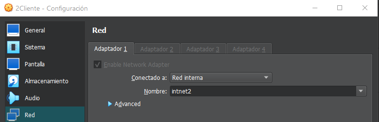

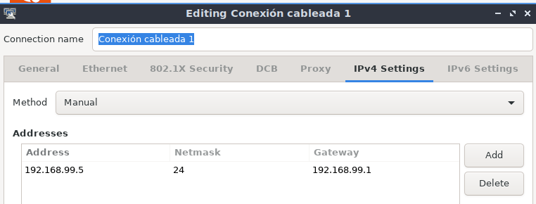

**En el servidor web deberemos tener una única tarjeta de red que estará en una red interna diferente a la que utilizan el cliente y el enrutador para comunicarse y una dirección IP configurada manualmente.**
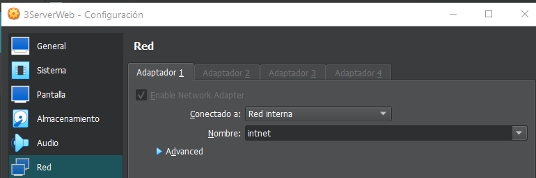

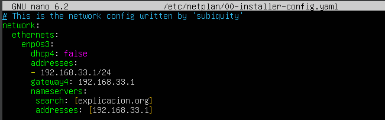

**La configuración de red del enrutador es la mas compleja ya que debemos tener don tarjetas de red una en cada red interna para poder comunicarse con el cliente por una independiente de la que utilizara para comunicarse con el servidor web.**

**Tarjeta de red que se comunica con el cliente(enp0s8)**

**Tarjeta de red que se comunica con el servidor(enp0s3)**

**En la siguiente imagen se puede ver que la tarjeta de red que se comunica con el servidor tiene el DHCP habilitado para que este le asigne una IP automáticamente y tiene como enrutador la dirección del servidor.**

**Y la que se comunica con el cliente tiene una dirección IP asignada manualmente y esta en la misma red que el cliente**
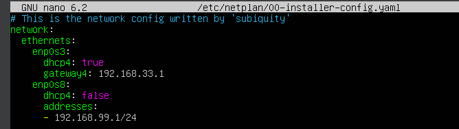

Podemos comprobar cuál es el Gateway con el comando
- ip route
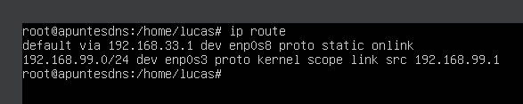

**Enrutamiento**

**Después de configurar las interfaces de red tenemos que habilitar el forward (reenvío de paquetes) para ello vamos a la ruta /proc/sys/net/ipv4/ y modificamos el archivo ip_forward con el comando nano poniendo un 1 en lugar de un 0, con esto lo activamos**
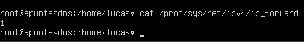

**Hay un inconveniente, y es que cada vez que se reinicie se restablecerá la configuración volviendo el valor a 0 para que esto no sea así debemos ir al siguiente archivo y modificarlo con el comando nano des-comentando la siguiente línea**
- nano /etc/sysctl.conf
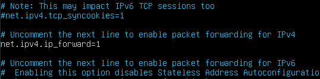

**Después de modificar este archivo para aplicar los cambios debemos utilizar el comando**
- sysctl -p /etc/sysctl.conf
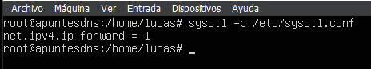

**Después de configurar las interfaces del enrutador y habilitar el reenvío de paquetes vamos a configurar con IPtables, para ver la configuración actual de IPtables utilizamos el comando**
- iptables -L
- 
En esta imagen se puede ver que por ahora no hay ninguna restricción del firewall ni ninguna regla de entrada/salida/reenvío

**Para ver la configuración de IPtables de NAT utilizamos el comando**
- iptables -L -nv -t nat

**En esta foto se puede ver que no hay ninguna configuración de enrutamiento por ahora**

**Para que cada vez que la máquina cliente envié un paquete al servidor web, el enrutador que está en medio del proceso deberá cambiar la dirección de origen por la del enrutador, este al estar en DHCP con el servidor puede que su dirección cambie, para ello debemos activar SNAT**

**Para ello utilizamos el comando:**
- iptables -t nat -A POSTROUTING -o enp0s3 -j MASQUERADE

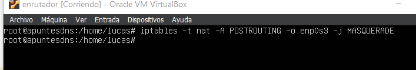

Con este comando he habilitado SNAT en la interfaz de red que esta en DHCP

**Después de añadir esta configuración NAT comprobamos que se ha aplicado en las IP tables con el comando que utilizamos anteriormente:**
- iptables -L -nv -t nat

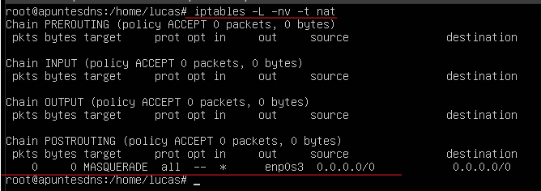

**Con esto habríamos terminado la parte del enrutamiento y podríamos hacer ping al servidor desde el cliente y acceder a la página web**

*(Esta configuración está centrada únicamente al enrutamiento y no implementa resolución de nombres desde el cliente al servidor, aunque si desde el enrutador al servidor, pero para esta práctica es más que suficiente)*
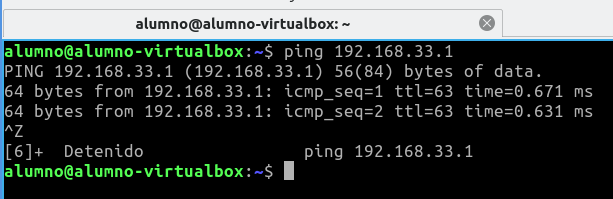

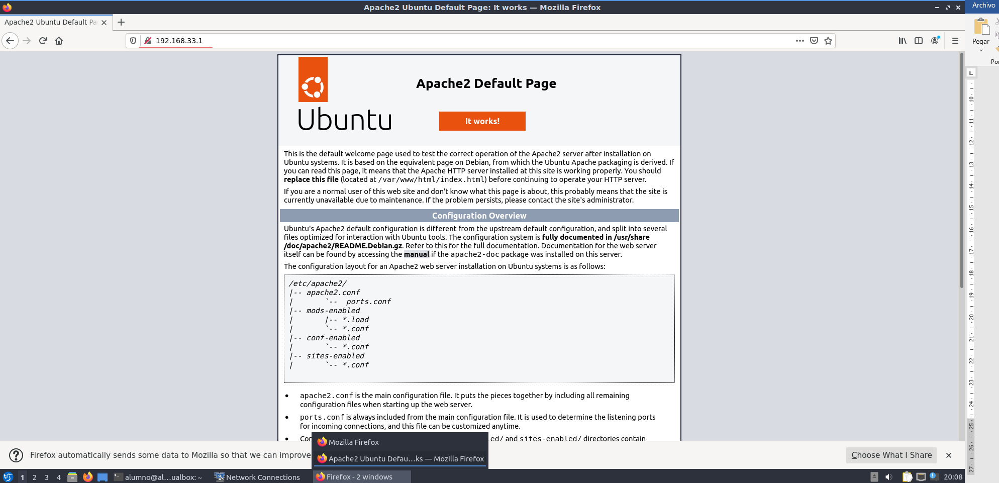

**Una vez hemos implementado la arquitectura de red, vamos a implementar los siguientes casos:**
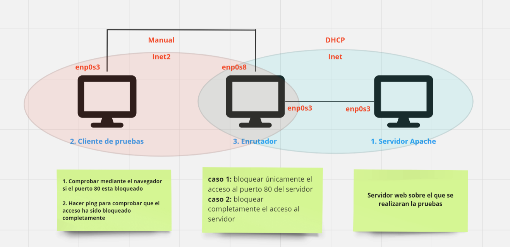

### **Caso 1:**
Debemos bloquear el acceso al puerto 80 del servidor desde el enrutador y comprobar desde el navegador del cliente que ya no puede acceder

**Caso 2:**
Debemos bloquear completamente el acceso al servidor desde el enrutador y comprobarlo haciendo un ping desde el cliente

**Caso 1:**
**Para eliminar las posibles reglas de IP tables del firewall y de NAT podemos hacerlo con el comando: (siempre que no especifiquemos en comandos IPtables nos referiremos al firewall)**

- iptables -F
- iptables -t nat -F (no usar o borraras la configuración de enrutamiento)
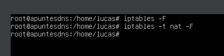

**Para aceptar todo el tráfico de entrada, salida y enrutamiento utilizamos los comandos:**

- iptables -P INPUT ACCEPT
- iptables -P OUTPUT ACCEPT
- iptables -P FORWARD ACCEPT

**Para ver las reglas que tenemos establecidas utilizamos el comando:**
- iptables -L -nv –line-numbers

**Para ver los puertos que tenemos abiertos utilizamos el comando:**
- ss -ituna

**Para bloquear el puerto 80 tanto de entrada/salida utilizamos los siguientes comandos**
- iptables -A INPUT -i enp0s8 -p tcp –sport 80 -j DROP
- iptables -A OUTPUT -o enp0s8 -p tcp –dport 80 -j DROP

**Guardamos la regla con el comando**
- iptables-save
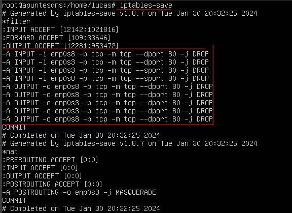

**Revisamos los protocolos de nuevo con el comando**
- iptables -L -nv –line-numbers

**Ahora comprobamos en el cliente que no podemos acceder a la web** (en mi caso, pese ha hacerlo igual que en multitud de sitios seguía teniendo acceso, lo mirare y actualizare)

**Eliminamos las reglas y comprobamos**

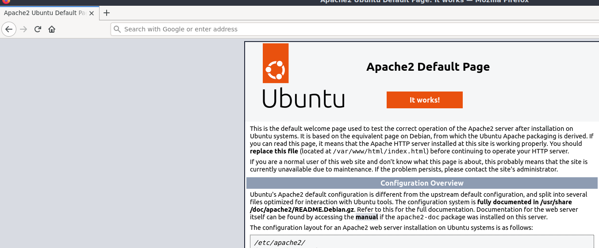

### **Caso 2:**

**Para bloquear todo el tráfico utilizamos los comandos**

- iptables -P INPUT DROP
- iptables -P OUTPUT DROP
- iptables -P FORWARD DROP

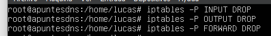

**Guardamos con:**
- Iptables-save
- 
**Comprobamos haciendo ping al servidor desde el cliente:**

#### Webgrafía:

- [<u>https://www.youtube.com/watch?v=PeMBfZ7ummg&list=TLPQMzAwMTIwMjSfLYUV0AxrIQ&index=2&ab_channel=RedesPlus</u>](https://www.youtube.com/watch?v=PeMBfZ7ummg&list=TLPQMzAwMTIwMjSfLYUV0AxrIQ&index=2&ab_channel=RedesPlus)

- [<u>https://www.youtube.com/watch?v=HeUyUDV697E&list=TLPQMzAwMTIwMjSfLYUV0AxrIQ&index=4&ab_channel=RedesPlus</u>](https://www.youtube.com/watch?v=HeUyUDV697E&list=TLPQMzAwMTIwMjSfLYUV0AxrIQ&index=4&ab_channel=RedesPlus)
